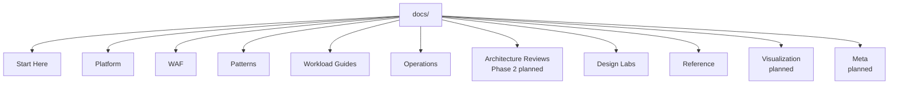

---
content_sources:
  diagrams:
    - id: start-here-repository-map-diagram-1
      type: flowchart
      source: self-generated
      justification: "Repository structure map synthesized from the current MkDocs navigation and repository layout."
      based_on:
        - https://learn.microsoft.com/en-us/azure/architecture/
---
# Repository Map

This page shows how the published Phase 1 documentation is organized in the current MkDocs navigation so readers can move quickly between platform fundamentals, patterns, workloads, and operational guidance.

## High-level structure

<!-- diagram-id: start-here-repository-map-diagram-1 -->

## Current section counts

The counts below reflect the current published Phase 1 `mkdocs.yml` navigation structure.

| Section | Published nav entries | Role in the guide |
|---|---:|---|
| Home | 1 | Main landing page |
| Start Here (including About) | 7 | Orientation, onboarding, and project background |
| Platform | 12 | Azure foundation decisions |
| Well-Architected Framework | 9 | Evaluation lens and pillar trade-offs |
| Architecture Patterns | 14 | Reusable decision patterns |
| Workload Guides | 28 | Scenario baselines and anti-patterns |
| Operations | 9 | Governance and runtime practices |
| Design Labs | 5 | Guided architecture exercises |
| Reference | 10 | Cheatsheets and validation status |
| Architecture Reviews *(Phase 2 planned)* | — | Review methods, cards, and playbooks |
| Visualization *(planned)* | — | Graph and map views |
| Meta *(planned)* | — | Contribution and content policy |

## How to navigate efficiently

- [Inferred] Start Here is the orientation layer.
- [Documented] Platform is the foundation layer because it establishes Azure resource, identity, network, and resilience boundaries.
- [Inferred] WAF and Patterns form the decision layer.
- [Inferred] Workload Guides and Operations form the application layer for current Phase 1 readers.
- [Inferred] Reference supports maintenance and reuse for the published site.
- [Assumed] Architecture Reviews, Visualization, and Meta are useful future expansions, but they are not part of the current published nav.

## Cross-section connections

| From | To | Why the connection matters |
|---|---|---|
| Platform | WAF | Foundational choices must be evaluated against cost, reliability, security, performance, and operations |
| WAF | Patterns | Pillar trade-offs become reusable design patterns |
| Patterns | Workload Guides | Workloads are assembled from multiple patterns under concrete constraints |
| Workload Guides | Design Labs | Design exercises use practical baseline expectations |
| Operations | Design Labs | Operational maturity is part of architecture quality |
| Reference | Every section | Common terminology and decision matrices reduce ambiguity |
| Workload Guides | Architecture Reviews *(Phase 2 planned)* | Future review content should build on the published baselines |
| Operations | Architecture Reviews *(Phase 2 planned)* | Future review content should evaluate operational maturity |

## Maintainer notes

!!! note
    Keep the navigation tree architecture-first. Add new content under an existing decision boundary before creating a new top-level category.

Good signals that a new page belongs in an existing section:

- it elaborates a platform, pattern, or review question already present
- it deepens a workload baseline instead of adding a new content type
- it helps validate architecture assumptions with clearer evidence

Signals that a page likely belongs elsewhere:

- [Observed] it mainly describes one service's configuration steps
- [Observed] it is a troubleshooting article with little architecture relevance
- [Inferred] it duplicates existing Microsoft Learn tutorial content

## Source and governance reminders

[Documented] Platform pages should stay traceable to Microsoft Learn.

[Inferred] Cross-cutting pages can synthesize multiple sources, but should still declare diagram provenance and use evidence tags for important claims.

## Microsoft Learn anchor

- [Azure Architecture Center](https://learn.microsoft.com/en-us/azure/architecture/)

## Takeaway

[Inferred] The published Phase 1 repository is organized to move readers from fundamentals to patterns, workloads, operations, and design labs.

When in doubt, ask where the page sits in that flow: orientation, foundation, decision pattern, workload application, operation, design lab, or planned future review content.
