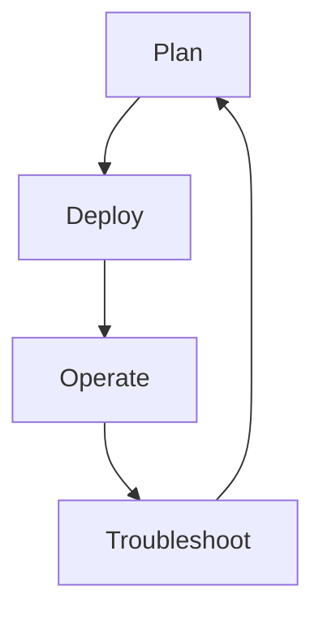

# Scenario Router

Use this page when you have a specific architectural situation and want to jump straight to the page that answers it. This is a breadth-first index across four lifecycle phases — Plan (design), Deploy (build), Operate, and Troubleshoot (review) — that complements the depth-first [Learning Paths](learning-paths.md). Unlike a service guide, this repository treats *troubleshooting* as design review that feeds back into planning, which is why the lifecycle below is circular rather than linear.

!!! tip "Start with Learning Paths if you're new to Azure architecture"
    This page assumes you already know what architectural question you're asking. If you're still deciding what to learn first, start with [Learning Paths](learning-paths.md) — it sequences a role-based tour of the guide. Use this Scenario Router when you have a specific situation and want to jump to the exact page that answers it.

## How to Use This Router

- Pick the table for the lifecycle phase you're in — Plan (design), Deploy (build), Operate, or Troubleshoot (review).
- Scan the left column for the situation that matches yours; open the destination on the right.
- If two rows fit, prefer the row from the phase you're actually in — the same architectural concept often appears in more than one phase.
- If your situation spans two phases (a design choice today that will surface in a review later), check [Cross-Phase Scenarios](#cross-phase-scenarios) first.
- Every destination is a real page in this guide, not an external link and not an aspirational page.
- Rows are intentionally short. Follow the link for the depth; this table is a switchboard, not a summary.
- If your situation is missing, [open an issue](https://github.com/yeongseon/azure-architecture-practical-guide/issues) — the router is meant to grow.

## Lifecycle Overview

<!-- diagram-id: arch-scenario-router-lifecycle -->

## I'm Planning

| Situation | Where to go |
|---|---|
| I'm choosing which learning path to follow | [Learning Paths](learning-paths.md) — role-based reading paths |
| I want to understand the architecture building blocks | [Platform Hub](../platform/index.md) — Azure architecture foundations |
| I'm deciding whether this guide fits my problem versus a service-specific guide | [Architecture vs Service Guides](architecture-vs-service-guides.md) — scope positioning |
| I have to pick the right Azure compute service | [Compute Selection Basics](../platform/compute-selection-basics.md) — VMs, App Service, AKS, Container Apps, Functions |
| I'm designing landing zones and subscription structure | [Landing Zones Basics](../platform/landing-zones-basics.md) — subscription, management group, and platform separation |
| I need to pick a data platform (SQL, Cosmos, Storage, or beyond) | [Data Selection Basics](../platform/data-selection-basics.md) — data platform trade-offs |
| I want to evaluate a design against the Well-Architected Framework | [WAF Hub](../waf/index.md) — pillar-based evaluation |
| I need a workload-specific baseline (public web, private app, event-driven) | [Workload Guides Hub](../workload-guides/index.md) — end-to-end workload baselines |

## I'm Deploying

| Situation | Where to go |
|---|---|
| I want to run a structured design exercise before writing IaC | [Design Labs Methodology](../design-labs/methodology.md) — step-by-step design lab process |
| I'm building a public web + API baseline | [Lab 01: Public Web Baseline](../design-labs/lab-01-public-web-baseline.md) — reference design walkthrough |
| I'm building a private internal application | [Lab 02: Private Internal App](../design-labs/lab-02-private-internal-app.md) — private ingress and identity design |
| I'm building an event-driven order-processing system | [Lab 03: Event-Driven Orders](../design-labs/lab-03-event-driven-orders.md) — async messaging design |
| I need to translate the design into infrastructure-as-code and environment promotion | [IaC and Environment Promotion](../operations/infrastructure-as-code-and-environment-promotion.md) — Bicep/Terraform plus promotion patterns |
| I need to capture design decisions so they survive team turnover | [ADR Process](../operations/adr-process.md) — Architecture Decision Records |

## I'm Operating in Production

| Situation | Where to go |
|---|---|
| I need day-2 architectural procedures | [Operations Hub](../operations/index.md) — architecture-level runbooks |
| I want to follow production best practices for the whole architecture | [WAF Hub](../waf/index.md) — pillar-based hardening guidance |
| I'm defining SLOs and picking the right observability signals | [Observability and SLOs](../operations/observability-and-slos.md) — SLI/SLO framework for architectures |
| I need to put governance guardrails in place with Azure Policy | [Policy and Governance Guardrails](../operations/policy-and-governance-guardrails.md) — policy-as-code and enforcement patterns |
| I'm managing cloud cost across a portfolio (FinOps) | [Cost Management and FinOps](../operations/cost-management-and-finops.md) — portfolio-level cost control |
| I'm running BCDR drills and validating recovery paths | [Business Continuity and Drills](../operations/business-continuity-and-drills.md) — DR drill playbooks |
| I need to divide responsibility between platform and app teams | [Platform Team vs App Team Responsibilities](../operations/platform-team-vs-app-team-responsibilities.md) — org boundary model |
| I want to plan the long-term architecture lifecycle | [Architecture Lifecycle](../operations/architecture-lifecycle.md) — evolution, deprecation, and modernization |

## I'm Troubleshooting

In architecture work, "troubleshooting" means *reviewing an existing design* — auditing a running architecture against reliability, cost, security, and operational-excellence expectations rather than debugging a single incident. Feed findings from this phase back into Planning. If you need service-specific incident response, open the matching service guide's Troubleshooting hub.

| Situation | Where to go |
|---|---|
| I need a systematic architecture review methodology | [Architecture Reviews Hub](../architecture-reviews/index.md) — review methodology and playbooks |
| I want to score an architecture against the WAF pillars | [Architecture Assessment Checklist](../waf/architecture-assessment-checklist.md) — pillar-by-pillar rubric |
| I need to evaluate a specific trade-off between pillars | [Pillar Trade-offs](../waf/pillar-trade-offs.md) — cost vs reliability vs performance decisions |
| I'm spot-checking a design decision against the reference matrix | [Architecture Decision Matrix](../reference/architecture-decision-matrix.md) — decision reference table |
| I want to apply the Well-Architected Framework end-to-end | [Using WAF in This Guide](../waf/using-waf-in-this-guide.md) — WAF workflow for this repository |

## Cross-Phase Scenarios

Some situations straddle two phases — the design decision you make today determines the review finding you'll face months later. These rows link the two together so you can see the pattern *and* the review lens in one place.

| Situation | Where to go |
|---|---|
| I'm designing a workload baseline and want to see the review checklist before I commit | [Workload Guides Hub](../workload-guides/index.md) then [Architecture Assessment Checklist](../waf/architecture-assessment-checklist.md) — design + review lens |
| I'm capturing an ADR that I know will get audited in a WAF review | [ADR Process](../operations/adr-process.md) then [Architecture Reviews Hub](../architecture-reviews/index.md) — record + audit path |
| I'm making a cost vs reliability trade-off and want to know how it will be scored | [Pillar Trade-offs](../waf/pillar-trade-offs.md) then [Architecture Decision Matrix](../reference/architecture-decision-matrix.md) — trade-off pattern + decision reference |

## When This Router Isn't the Right Entry Point

- You're brand new to Azure architecture → start with [Learning Paths](learning-paths.md) instead.
- You're evaluating whether the architecture guide applies or you should read a service-specific guide → use [Architecture vs Service Guides](architecture-vs-service-guides.md).
- You need service-specific incident troubleshooting (a running Container Apps incident, an AKS pod failure) → open the matching service guide's Troubleshooting hub; this guide covers architectural review, not incident response.

## See Also

- [Learning Paths](learning-paths.md) — depth-first, role-based reading order
- [Overview](overview.md) — what this guide is and who it's for
- [Repository Map](repository-map.md) — full section map
- [Architecture vs Service Guides](architecture-vs-service-guides.md) — when to use this guide versus a service guide
- [Platform Hub](../platform/index.md) — Azure architecture building blocks
- [WAF Hub](../waf/index.md) — Well-Architected Framework pillars
- [Patterns Hub](../patterns/index.md) — reusable architecture patterns
- [Workload Guides Hub](../workload-guides/index.md) — workload-specific baselines
- [Architecture Reviews Hub](../architecture-reviews/index.md) — review methodology
