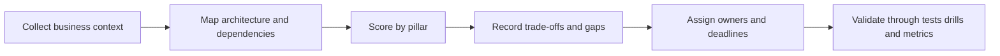

---
content_sources:
  diagrams:
    - id: waf-assessment-diagram-1
      type: flowchart
      source: mslearn-adapted
      mslearn_url: https://learn.microsoft.com/en-us/azure/well-architected/
---
# Architecture Assessment Checklist

This checklist combines all five Azure Well-Architected pillars into one repeatable review workflow. Use it for new designs, major architecture changes, production-readiness reviews, and post-incident reassessments.

## Review workflow

<!-- diagram-id: waf-assessment-diagram-1 -->

## Scoring approach

Use a 0 to 4 scale for each checkpoint:

| Score | Meaning |
|---|---|
| 0 | Absent or unknown |
| 1 | Planned but weakly implemented |
| 2 | Partially implemented |
| 3 | Implemented and operationalized |
| 4 | Implemented, measured, and validated |

[Inferred] Do not average scores into a false sense of safety. A single low score in an essential control path can dominate workload risk.

## Core review inputs

- Current architecture and dependency diagrams.
- Business criticality, regulatory needs, and service expectations.
- RTO, RPO, SLO, and budget assumptions.
- Recent incidents, cost anomalies, and performance regressions.
- Existing ADRs, policies, and operating procedures.

## Reliability checklist

- [Documented] Critical user journeys and dependencies are identified.
- [Documented] RTO and RPO targets are defined.
- [Observed] Failure domains and shared dependencies are understood.
- [Measured] Recovery times and failover behavior are captured.
- [Validated] Restore and failover drills have been run.

## Security checklist

- [Documented] Trust boundaries, identity flows, and privileged roles are mapped.
- [Observed] Secrets and credentials follow managed patterns.
- [Measured] Security logs and control changes are retained and reviewable.
- [Validated] Access reviews and policy checks occur regularly.
- [Unknown] Undocumented access paths are listed as risk.

## Cost optimization checklist

- [Documented] Cost allocation tags and budgets exist.
- [Observed] Non-production environments have lifecycle controls.
- [Measured] Major services have utilization or consumption visibility.
- [Correlated] Cost spikes can be linked to topology, traffic, or release changes.
- [Validated] Reservation or savings assumptions were tested against actual use.

## Operational excellence checklist

- [Documented] Provisioning and policy are managed as code.
- [Observed] Alerts support diagnosis and action.
- [Measured] Change failure rate and restoration time are tracked.
- [Validated] Rollback or compensating deployment paths are rehearsed.
- [Inferred] Shared-service ownership and escalation are clear.

## Performance efficiency checklist

- [Documented] Latency, throughput, and concurrency goals are known.
- [Observed] Bottlenecks and saturation signals are visible.
- [Measured] Testing reflects realistic peak and dependency behavior.
- [Validated] Scaling and partitioning strategies were stress tested.
- [Correlated] Cache, queue, and dependency metrics are reviewed together.

## Conducting a WAF review

1. Start with business context and what failure matters most.
2. Review architecture topology and dependencies before debating services.
3. Score each pillar using evidence, not preference.
4. Record trade-offs and unresolved assumptions.
5. Assign owners for remediation and validation.
6. Schedule revisit triggers tied to incidents, growth, compliance, or platform change.

## Typical outputs

- A scored review summary by pillar.
- A short risk register with owner and due date.
- ADR updates for major trade-offs.
- Validation tasks such as load tests, failover drills, or access reviews.
- A list of [Unknown] items requiring evidence.

## Common review mistakes

- Reviewing only the application and not platform dependencies.
- Treating platform defaults as proof of workload readiness.
- Ignoring operational ownership gaps.
- Confusing documentation presence with validation.
- Closing reviews without revisit triggers.

## Azure WAF Assessment tool

Use the official assessment as a structured complement to human review, not a substitute for it:

- [Azure Well-Architected Framework](https://learn.microsoft.com/en-us/azure/well-architected/)
- [Azure Architecture Review assessment](https://learn.microsoft.com/en-us/assessments/azure-architecture-review/)

## Takeaway

[Validated] A strong architecture review produces clear evidence, named owners, and validation plans across all five pillars instead of a generic statement that the design is "well architected."
