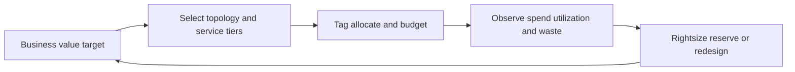

---
content_sources:
  diagrams:
    - id: waf-cost-diagram-1
      type: flowchart
      source: mslearn-adapted
      mslearn_url: https://learn.microsoft.com/en-us/azure/well-architected/cost-optimization/
---
# Cost Optimization

Cost Optimization in the Azure Well-Architected Framework is about aligning technical design with business value. It is not simply spending less. It is making sure the workload uses the right level of redundancy, automation, and performance for the outcomes the business actually needs.

## Design principles

[Documented] Microsoft Learn frames cost optimization around planning, monitoring, and eliminating waste. For architecture work, that translates into these design principles:

1. Design for business demand, not theoretical maximum demand.
2. Prefer managed operational models when they reduce hidden labor cost.
3. Scale independently so expensive tiers are used only where value exists.
4. Use elasticity, automation, and reservations intentionally.
5. Make cost ownership visible through tags, budgets, and workload boundaries.

## Decision areas

| Decision area | Architecture question | Typical trade-off |
|---|---|---|
| Region strategy | Does the business need multi-region from day one? | Reliability vs baseline spend |
| Compute model | Is fixed capacity or burst elasticity the better fit? | Predictability vs flexibility |
| Data platform | Is premium storage justified by latency or durability needs? | Performance vs spend |
| Network topology | Are private paths and centralized inspection required everywhere? | Security and control vs complexity and cost |
| Operations model | Will managed services reduce toil enough to offset service pricing? | Unit cost vs labor cost |

## Cost architecture loop

<!-- diagram-id: waf-cost-diagram-1 -->

## Common anti-patterns

- Overbuilding resilience for workloads without corresponding business need.
- Running all environments at production scale all the time.
- Using premium tiers to compensate for poor application design.
- Centralizing shared services without chargeback visibility.
- Treating cost spikes as a finance issue instead of an architecture signal.

## Failure modes

[Observed] Cost problems usually emerge as architecture symptoms:

- Idle capacity due to monolithic scaling boundaries.
- Data egress surprises caused by region or service placement decisions.
- Operational toil because low-cost components require heavy manual care.
- Excess retention, duplicate telemetry, or overcollection of logs.
- Premium networking or security controls applied indiscriminately.

## Trade-offs to make explicit

- [Inferred] Higher reliability often means duplicate resources, more replication, and more testing cost.
- [Inferred] Stronger security often adds inspection, encryption, and private connectivity costs.
- [Correlated] Performance tuning through caching or premium compute can lower unit cost at scale while increasing baseline cost.
- [Assumed] Reservation strategies help only when demand is stable enough to justify commitment.

## Ownership model

Cost optimization should be shared:

- Product owners define acceptable spend relative to value.
- Architects choose patterns that avoid structural waste.
- Platform teams enforce tagging, policy, and visibility.
- FinOps teams identify trends, anomalies, and optimization opportunities.
- Application teams own workload-level consumption behavior.

## Validation questions

- What business event justifies premium service tiers or multi-region spend?
- Can components scale independently?
- Which environments may be ephemeral or time-boxed?
- Are telemetry and data retention policies proportional to actual need?
- What part of spend is fixed, variable, and unallocated?

## Cost optimization checklist

- Workload and environment tags support allocation.
- Budgets and anomaly reviews exist for subscriptions or management groups.
- [Observed] Peak, average, and idle utilization are known for major components.
- [Validated] Reservation or savings plan assumptions have been compared to usage patterns.
- [Observed] Non-production environments have shutdown or reduced-capacity strategies.
- [Correlated] High-cost services are mapped to concrete user or business outcomes.
- [Inferred] Premium features are used where they reduce larger downstream risk or labor.
- [Unknown] Any unowned spend category is explicitly flagged for review.

## Practical guidance for reviews

Ask whether the architecture can degrade gracefully in cost as well as scale gracefully in demand. Good designs let teams lower spend without rewriting the workload. That usually means modular scaling boundaries, intentional telemetry retention, clear environment strategy, and visible service ownership.

## Microsoft Learn references

- [Cost Optimization pillar](https://learn.microsoft.com/en-us/azure/well-architected/cost-optimization/)
- [Azure Cost Management and Billing documentation](https://learn.microsoft.com/en-us/azure/cost-management-billing/)

## Takeaway

[Validated] A cost-optimized Azure architecture is one where spend follows value, waste is visible, and expensive reliability or performance choices are deliberate rather than accidental.
