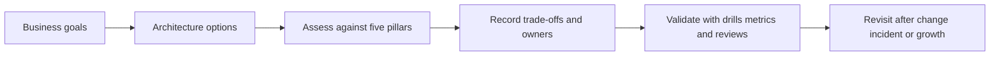

---
content_sources:
  diagrams:
    - id: waf-index-diagram-1
      type: flowchart
      source: mslearn-adapted
      mslearn_url: https://learn.microsoft.com/en-us/azure/well-architected/
---
# Well-Architected Framework

The Azure Well-Architected Framework (WAF) is the decision lens used throughout this guide to judge whether an architecture is safe to run, affordable to sustain, and realistic to operate. It is not a product checklist. It is a method for testing design choices against five pillars: Reliability, Security, Cost Optimization, Operational Excellence, and Performance Efficiency.

[Documented] Microsoft positions the framework as guidance for improving workload quality over time, not as a one-time certification event. In this guide, each architecture topic ties back to those pillars so teams can explain *why* a design was chosen, *what risks were accepted*, and *when the decision should be revisited*.

## How to use this section

Use these pages in three ways:

1. Before design reviews, to frame architecture options and constraints.
2. During architecture reviews, to identify gaps, trade-offs, and failure modes.
3. After production incidents, to trace whether weak pillar decisions caused operational pain.

This section emphasizes decision quality, ownership, and validation over service tutorials. If a topic drifts into feature enablement steps, it belongs in a sibling service guide rather than here.

## Pillars at a glance

| Pillar | Core question | Typical ownership | Common tension |
|---|---|---|---|
| Reliability | Will the workload continue meeting user expectations during failure and change? | Architecture, SRE, platform, app teams | Cost and delivery speed |
| Security | Is access controlled, monitored, and limited by design? | Security, platform, app teams | Performance and developer friction |
| Cost Optimization | Are resources and operating models aligned to business value? | Architecture, FinOps, platform, product | Reliability and flexibility |
| Operational Excellence | Can the system be changed safely and run predictably? | Platform, DevOps, app teams | Initial delivery speed |
| Performance Efficiency | Can the workload meet demand efficiently as usage changes? | Architecture, app, data teams | Cost and operational simplicity |

## Guide workflow

<!-- diagram-id: waf-index-diagram-1 -->

## What good looks like

- [Documented] Every major architecture decision names affected pillars.
- [Observed] Review conversations distinguish symptoms from root design causes.
- [Measured] SLOs, budget thresholds, and recovery targets are defined before scale events.
- [Validated] Failover drills, security reviews, and deployment rehearsals confirm assumptions.
- [Correlated] Cost spikes, latency regressions, and incident trends are tied to design changes.
- [Inferred] Teams understand that pillar optimization is contextual, not absolute.

## Failure modes when teams skip WAF thinking

- Architects choose services by popularity instead of workload fit.
- Reliability is assumed from regional redundancy without testing failover paths.
- Security controls are bolted on late, causing exceptions and bypasses.
- Cost optimization becomes reactive cleanup after production overspend.
- Operational burden is hidden because ownership boundaries were never documented.

## Ownership model

The most effective WAF usage model is shared:

- Enterprise or platform teams provide guardrails, landing zones, and baseline controls.
- Application teams own workload-specific requirements, code behavior, and service-level outcomes.
- Reviewers challenge assumptions with evidence, not preference.
- Product and finance stakeholders clarify what level of cost, risk, and performance the business will actually fund.

## Validation expectations

Architectures should leave this section with explicit validation paths:

- Reliability: recovery drills, dependency mapping, and resilience test plans.
- Security: access reviews, secret flow analysis, and control verification.
- Cost: tagging, cost allocation, and scaling threshold analysis.
- Operations: deployment safety checks and alert actionability reviews.
- Performance: load profiles, bottleneck analysis, and capacity assumptions.

## Related pages

- [Using WAF in this guide](using-waf-in-this-guide.md)
- [Pillar trade-offs](pillar-trade-offs.md)
- [Architecture assessment checklist](architecture-assessment-checklist.md)

## Microsoft Learn references

- [Azure Well-Architected Framework](https://learn.microsoft.com/en-us/azure/well-architected/)
- [Well-Architected pillars](https://learn.microsoft.com/en-us/azure/well-architected/pillars)

## Takeaway

[Inferred] Treat WAF as a repeatable architecture review language. The goal is not a perfect score in every pillar; the goal is a design whose trade-offs are explicit, owned, and validated.
