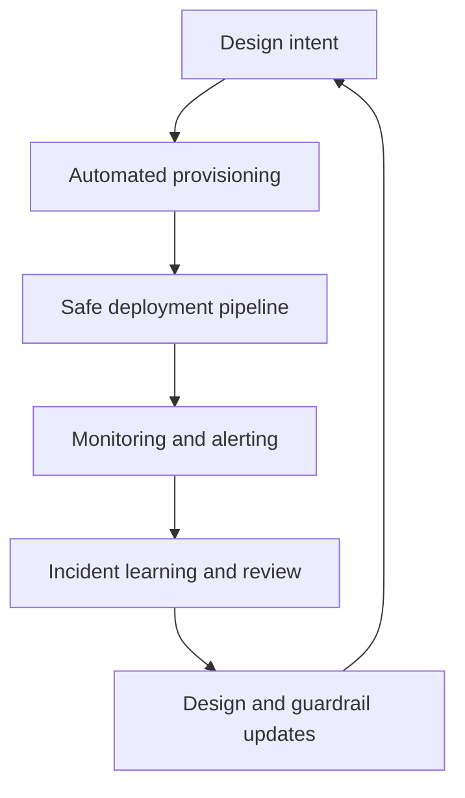

---
content_sources:
  diagrams:
    - id: waf-ops-diagram-1
      type: flowchart
      source: mslearn-adapted
      mslearn_url: https://learn.microsoft.com/en-us/azure/well-architected/operational-excellence/
---
# Operational Excellence

Operational Excellence is the pillar that turns architecture intent into repeatable runtime practice. A design is not operationally excellent because it looks clean on a diagram. It is operationally excellent when teams can deploy it safely, observe it clearly, recover it predictably, and improve it without chaos.

## Design principles

[Documented] Azure guidance emphasizes automation, observability, continuous improvement, and safe deployment. In practical architecture terms, that means:

1. Prefer infrastructure and policy as code over manual configuration.
2. Standardize release paths so environments behave predictably.
3. Design for actionable monitoring, not data accumulation.
4. Make rollback, rollback alternatives, and blast-radius control explicit.
5. Define ownership before incidents, not during incidents.

## Operating model

| Concern | Desired outcome | Architecture implication |
|---|---|---|
| Deployment safety | Low-risk change flow | Progressive delivery, automation, environment parity |
| Configuration control | Reproducible state | Versioned IaC, secrets flow, policy guardrails |
| Incident response | Fast diagnosis and recovery | Clear telemetry, dependencies, runbooks, ownership |
| Continuous improvement | Learning from change and failure | Post-incident review, backlog, architecture revisit triggers |

## Operational feedback loop

<!-- diagram-id: waf-ops-diagram-1 -->

## Operational anti-patterns

- Manual environment drift hidden behind ticket-based changes.
- Monitoring that detects symptoms but not dependency failure.
- Pipelines that promote artifacts without policy or health gates.
- Shared services owned by everyone and therefore by no one.
- Production-only knowledge trapped in individual operators.

## Failure modes

[Observed] Weak operational design often appears as:

- Long change lead times because every release is bespoke.
- High incident duration because dependencies are undocumented.
- Recovery actions that require privileged manual intervention.
- Configuration drift between dev, staging, and production.
- Alerts that page teams but do not support diagnosis or action.

## Decision criteria

- Can this workload be fully recreated from version-controlled definitions?
- Is the deployment strategy appropriate for the workload blast radius?
- Are critical controls observable with meaningful signals and thresholds?
- Does the ownership model separate platform and application responsibilities clearly?
- Can incident responders tell whether failure is code, configuration, dependency, or capacity related?

## Ownership

[Inferred] Operational excellence is where team topology matters most:

- Platform teams own paved roads, base images, shared telemetry, and policy.
- Application teams own workload behavior, release quality, and service objectives.
- Security and governance teams own mandatory controls and exception handling.
- Architecture teams ensure operational burden is considered during design.

## Operational excellence checklist

- IaC is the primary mechanism for platform and workload provisioning.
- Promotion paths and approval criteria exist across environments.
- [Observed] Alerts are tied to user impact, dependency health, or guardrail breach.
- [Measured] Change failure rate, deployment frequency, and time to restore are tracked.
- [Validated] Rollback or compensating deployment paths are rehearsed.
- [Correlated] Incident reviews lead to architecture or runbook changes, not only tickets.
- [Inferred] Shared services include explicit support and escalation ownership.
- [Unknown] Any critical operational step still requiring tribal knowledge is recorded as risk.

## Validation guidance

Validate operational excellence through release simulations, drift detection, incident exercises, and alert reviews. If a team cannot explain how a change moves from source to safe production rollback, the architecture is not yet operationally sound.

## Microsoft Learn references

- [Operational Excellence pillar](https://learn.microsoft.com/en-us/azure/well-architected/operational-excellence/)
- [Azure Monitor overview](https://learn.microsoft.com/en-us/azure/azure-monitor/overview)

## Takeaway

[Validated] Operational excellence is the architecture pillar that proves whether a design can survive real-world change. Good operations are designed, versioned, and exercised.
