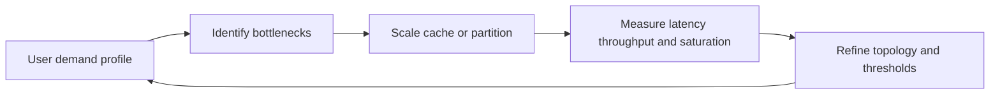

---
content_sources:
  diagrams:
    - id: waf-performance-diagram-1
      type: flowchart
      source: mslearn-adapted
      mslearn_url: https://learn.microsoft.com/en-us/azure/well-architected/performance-efficiency/
---
# Performance Efficiency

Performance Efficiency is about meeting demand with the least wasteful architecture that still satisfies workload objectives. It is not only about low latency. It includes elasticity, throughput, concurrency behavior, and the ability to adapt as traffic patterns change.

## Design principles

[Documented] The Azure guidance focuses on scaling, testing, and continuous optimization. For architecture decisions, the key principles are:

1. Scale bottlenecks independently.
2. Cache and precompute where demand is repetitive.
3. Partition data and workloads to avoid hot spots.
4. Prefer asynchronous decoupling when end-to-end latency budgets allow it.
5. Test realistic traffic shapes, not just average load.

## Architecture focus areas

| Focus area | Architecture question | Trade-off |
|---|---|---|
| Scaling | Can the slowest component scale without scaling everything else? | Simplicity vs efficiency |
| Data access | Will the data model create contention under peak demand? | Consistency vs throughput |
| Caching | Can repeated reads be served closer to users or compute? | Freshness vs latency |
| Integration | Should work be synchronous, queued, or event driven? | User responsiveness vs complexity |
| Geography | Is latency driven by user placement, dependency placement, or both? | Global reach vs operational cost |

## Performance optimization loop

<!-- diagram-id: waf-performance-diagram-1 -->

## Common anti-patterns

- Scaling application instances while a shared database remains the bottleneck.
- Assuming premium compute solves serialization or locking problems.
- Using synchronous chains across too many services.
- Ignoring cache invalidation and serving stale critical data.
- Running load tests that exclude background jobs, failover paths, or telemetry overhead.

## Failure modes

[Observed] Performance failures often originate from architecture coupling:

- Hot partitions caused by poor tenant or key design.
- Latency amplification from chatty cross-service calls.
- Noisy-neighbor effects in shared compute or data tiers.
- Regional mismatch between clients, app tier, and data tier.
- Retry storms that increase load during dependency degradation.

## Trade-offs

- [Correlated] Stronger security inspection can increase latency.
- [Inferred] Higher reliability via cross-region replication may add write latency and coordination complexity.
- [Inferred] Cost controls can limit headroom if scaling thresholds are too conservative.
- [Assumed] Aggressive caching improves user experience only when staleness tolerance is understood.

## Ownership

Performance is shared across app, data, and platform teams:

- Application teams own request shape, code paths, and cache strategy.
- Data teams own indexing, partitioning, and contention risk.
- Platform teams provide autoscaling patterns, network baselines, and observability.
- Architecture teams ensure topology choices match growth expectations.

## Performance efficiency checklist

- The workload has explicit latency, throughput, and concurrency goals.
- [Observed] Bottlenecks are identified across application, network, and data paths.
- [Measured] Performance tests include realistic steady-state and peak conditions.
- [Validated] Autoscaling or partitioning strategies were tested under stress.
- [Correlated] Cache hit rates, queue depth, and dependency latency are reviewed together.
- [Inferred] Synchronous dependencies are minimized for non-critical user paths.
- [Assumed] Capacity headroom is proportional to demand variability.
- [Unknown] Any component without saturation signals is flagged as monitoring debt.

## Validation guidance

Use scenario-based validation: launch spikes, batch overlap, tenant skew, degraded dependency performance, and failover conditions. If performance expectations only hold in the happy path, the architecture is fragile.

## Microsoft Learn references

- [Performance Efficiency pillar](https://learn.microsoft.com/en-us/azure/well-architected/performance-efficiency/)
- [Azure Architecture Center](https://learn.microsoft.com/en-us/azure/architecture/)

## Takeaway

[Validated] Efficient performance comes from choosing the right topology and data boundaries first, then tuning service tiers second.
