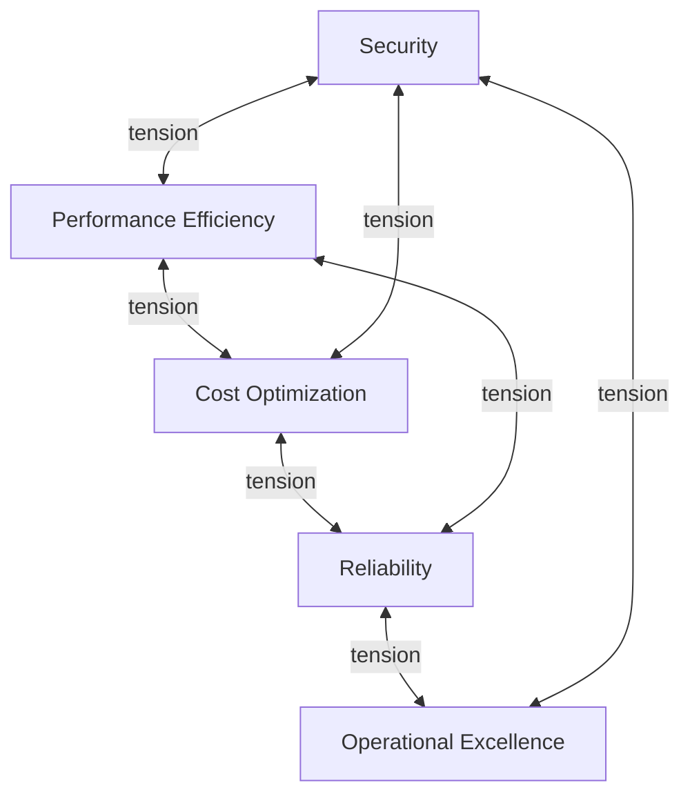

---
content_sources:
  diagrams:
    - id: waf-tradeoffs-diagram-1
      type: flowchart
      source: mslearn-adapted
      mslearn_url: https://learn.microsoft.com/en-us/azure/well-architected/pillars
---
# Pillar Trade-offs

The five Well-Architected pillars are complementary, but they are not frictionless. Stronger decisions in one pillar often increase cost, complexity, latency, or delivery overhead elsewhere. Good architecture work makes those tensions explicit instead of pretending they do not exist.

## Why trade-offs matter

[Documented] Microsoft Learn describes the pillars as a balancing exercise. The practical implication is that architecture reviews must ask not only "what improves this pillar?" but also "what does that improvement cost in another pillar?"

## Tension map

<!-- diagram-id: waf-tradeoffs-diagram-1 -->

## Cost versus reliability

Typical examples:

- Active-active multi-region designs improve resilience but raise infrastructure, data replication, and operational cost.
- High-availability database tiers can reduce outage risk while increasing baseline spend.
- Generous capacity headroom reduces incident risk but lowers utilization efficiency.

[Inferred] The right choice depends on business tolerance for downtime and data loss, not on technical elegance alone.

## Security versus performance

Typical examples:

- Deep inspection, private routing, and stricter authorization checks can increase latency.
- Strong encryption and key management can add processing overhead.
- Fine-grained authorization can complicate caching strategies.

[Correlated] Performance regressions are often blamed on application code when the real cause is an unexamined control-path trade-off.

## Operational excellence versus delivery speed

- Safer deployment pipelines require more automation, health signals, and rollback design.
- Strong guardrails reduce manual drift but may slow ad hoc experimentation.
- Standardized operating models reduce chaos later while increasing upfront design work.

## Cost versus security

- Private connectivity, centralized inspection, and advanced logging increase spend.
- Broad telemetry retention helps investigations but raises storage and analytics cost.
- Custom controls can reduce risk but increase ongoing maintenance burden.

## Reliability versus performance

- Cross-region writes or synchronous replication can raise latency.
- Retry and fallback logic can stabilize user experience but increase downstream load.
- Isolation patterns that protect reliability can reduce absolute throughput.

## Decision framework

Use a simple prioritization sequence:

1. Clarify business outcomes and failure tolerance.
2. Rank pillar priorities for the workload and lifecycle stage.
3. Identify which design options improve the top priorities.
4. Make secondary-pillar impacts explicit.
5. Decide what must be implemented now versus later.
6. Add owners, guardrails, and revisit triggers.

## Questions to ask in reviews

- Which pillar is primary for this workload today?
- What is the cost of optimizing that pillar too early or too late?
- Are we paying permanent cost for a temporary concern?
- Which trade-off is reversible, and which will be expensive to unwind later?
- What evidence would tell us the current balance is wrong?

## Ownership and governance

[Observed] Trade-offs break down when stakeholders are missing:

- Product leaders must state business tolerance for delay, spend, and outage.
- Security and governance teams must define what is mandatory.
- Architecture and platform teams must explain system-wide consequences.
- Application teams must own workload-specific consequences and operations.

## Validation guidance

- Trade-offs are written into ADRs or review records.
- [Observed] Cost, latency, and recovery data are compared after major design shifts.
- [Validated] High-risk decisions are exercised through drills or load tests.
- [Inferred] Deferred improvements include explicit revisit triggers.
- [Unknown] Any unowned trade-off is a governance gap.

## Microsoft Learn references

- [Well-Architected pillars](https://learn.microsoft.com/en-us/azure/well-architected/pillars)
- [Azure Well-Architected Framework](https://learn.microsoft.com/en-us/azure/well-architected/)

## Takeaway

[Validated] Mature Azure architecture decisions do not avoid trade-offs; they expose, justify, and revisit them as evidence changes.
