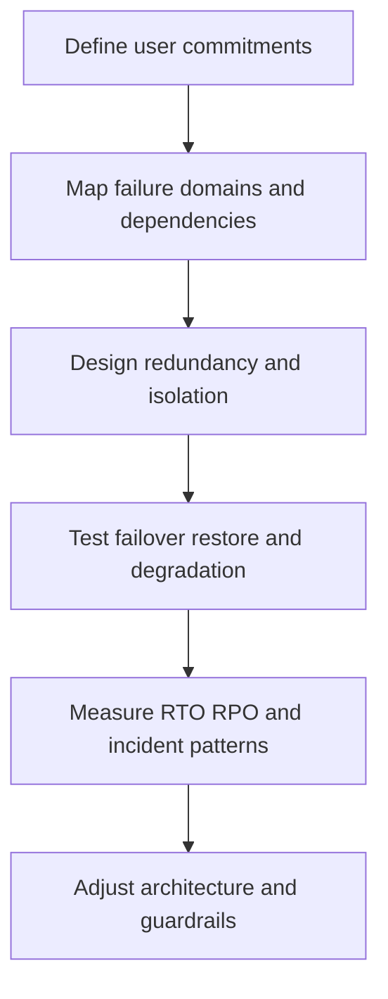

---
content_sources:
  diagrams:
    - id: waf-reliability-diagram-1
      type: flowchart
      source: mslearn-adapted
      mslearn_url: https://learn.microsoft.com/en-us/azure/well-architected/reliability/
---
# Reliability

Reliability is the ability of a workload to meet commitments during both expected operations and adverse conditions. In Azure architecture work, reliability is not achieved by adding redundancy everywhere. It comes from understanding failure domains, controlling blast radius, and validating recovery assumptions.

## Design principles

[Documented] Microsoft Learn emphasizes redundancy, resiliency, and recovery. In practical architecture terms:

1. Design for component, zone, and regional failure.
2. Reduce coupling so failures do not cascade unnecessarily.
3. Favor graceful degradation over total outage where possible.
4. Build recovery paths that operators can execute under pressure.
5. Test recovery objectives with realistic dependency conditions.

## Reliability dimensions

| Dimension | Question | Design implication |
|---|---|---|
| Availability | Can users still reach critical functions? | Redundancy, health routing, graceful degradation |
| Recoverability | How quickly can service be restored? | Runbooks, automation, failover design |
| Data durability | Can required data survive failure and recovery? | Backup, replication, restore design |
| Dependency resilience | What happens when upstream or downstream services degrade? | Isolation, timeouts, queues, fallback logic |

## Reliability loop

<!-- diagram-id: waf-reliability-diagram-1 -->

## Common anti-patterns

- Multi-region architectures without application-level failover drills.
- Assuming managed services eliminate the need for recovery planning.
- Shared dependencies with no tenant, workload, or traffic isolation.
- Backup policies defined without restoration testing.
- Retry behavior that turns partial outages into full outages.

## Failure modes

[Observed] Reliability weaknesses often appear as:

- Control plane dependencies blocking runtime recovery actions.
- Hidden single points of failure in DNS, identity, secrets, or deployment systems.
- Data recovery plans that satisfy retention requirements but miss recovery time targets.
- Traffic failover that works technically but overwhelms downstream capacity.
- Operators unable to distinguish transient degradation from hard failure.

## RTO and RPO guidance

Reliability reviews should name and validate both:

- **RTO**: the maximum acceptable restoration time.
- **RPO**: the maximum acceptable data loss window.

[Inferred] These targets are meaningful only when tied to workload scope. A reporting workload and a payment workflow should not inherit the same assumptions.

## Ownership

- Platform teams provide resilient platform baselines and validated recovery patterns.
- Application teams own workload behavior during dependency failure.
- Data teams own backup, restore, and consistency strategy.
- Business stakeholders approve acceptable interruption and data-loss limits.

## Reliability checklist

- Critical user journeys and dependencies are identified.
- RTO and RPO targets exist for each important data and service path.
- [Observed] Failure domains such as zones, regions, and shared services are mapped.
- [Validated] Recovery time and failover duration are captured during drills.
- [Validated] Backup restoration and dependency-failure scenarios were tested.
- [Correlated] Incident trends are compared with topology and deployment changes.
- [Inferred] Graceful degradation paths exist for partial dependency failure.
- [Unknown] Any untested failover step is treated as reliability debt.

## Validation guidance

Run tabletop reviews, backup restorations, zonal failure simulations, dependency throttling tests, and failover exercises. Reliability without drills is mostly [Assumed].

## Microsoft Learn references

- [Reliability pillar](https://learn.microsoft.com/en-us/azure/well-architected/reliability/)
- [Azure reliability documentation](https://learn.microsoft.com/en-us/azure/reliability/overview)

## Takeaway

[Validated] Reliable Azure architectures are explicit about failure, realistic about recovery, and measured against RTO and RPO commitments rather than optimistic diagrams.
