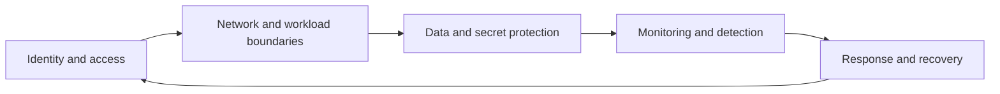

---
content_sources:
  diagrams:
    - id: waf-security-diagram-1
      type: flowchart
      source: mslearn-adapted
      mslearn_url: https://learn.microsoft.com/en-us/azure/well-architected/security/
---
# Security

Security in the Azure Well-Architected Framework is about reducing the probability and blast radius of compromise while keeping the workload operable. A secure architecture does not rely on one strong perimeter. It applies zero trust, least privilege, and defense in depth across identity, network, data, workload, and operations.

## Design principles

[Documented] Microsoft Learn emphasizes identity-first controls, segmentation, and monitoring. For practical architecture decisions:

1. Prefer identity-based access over implicit network trust.
2. Minimize privileges for people, workloads, and automation.
3. Segment systems so compromise does not spread easily.
4. Protect secrets, keys, and certificates with clear lifecycle ownership.
5. Make security events observable and actionable.

## Security decision areas

| Area | Architecture question | Typical tension |
|---|---|---|
| Identity | Who or what can do what, from where, and under which conditions? | Security vs developer speed |
| Network | Which paths must be private, inspected, or blocked? | Security vs simplicity and cost |
| Data | Which data needs encryption, tokenization, or isolation? | Security vs performance |
| Secrets | How are credentials issued, rotated, and consumed? | Security vs operational overhead |
| Detection | How quickly can abuse or drift be seen and investigated? | Signal quality vs alert noise |

## Security control model

<!-- diagram-id: waf-security-diagram-1 -->

## Common anti-patterns

- Flat trust models inside virtual networks.
- Shared admin identities or long-lived secrets.
- Treating private networking as a substitute for authorization.
- Exception-heavy policy models that normalize bypasses.
- Security controls enabled without ownership for review and response.

## Failure modes

[Observed] Security weaknesses in architecture usually appear as:

- Excessive standing privilege for operators and pipelines.
- Secret sprawl across apps, scripts, and deployment systems.
- Data copied into lower-trust zones without matching controls.
- Incomplete logging of authentication, authorization, or key operations.
- Security monitoring that detects events but cannot link them to workload context.

## Trade-offs

- [Correlated] More network inspection can increase latency and operational overhead.
- [Inferred] Centralized controls improve consistency but may create bottlenecks if exception handling is weak.
- [Assumed] Strong segmentation helps containment only if identity and DNS dependencies are equally resilient.
- [Validated] Least privilege is sustainable when roles and automation paths are reviewed continuously.

## Ownership

- Security teams define policy, threat model expectations, and control standards.
- Platform teams provide identity baselines, network controls, and secret-management patterns.
- Application teams classify data, implement authorization, and minimize secret use.
- Operations teams ensure alerts, escalation, and containment actions are practical.

## Security checklist

- [Documented] Identity boundaries and privileged roles are defined.
- [Documented] Data classification and required protections are known.
- [Observed] Secrets are minimized and rotated through managed processes.
- [Measured] Security-relevant logs cover authentication, authorization, and control changes.
- [Validated] Access reviews, incident exercises, and control tests occur regularly.
- [Correlated] Network controls align with identity and data sensitivity boundaries.
- [Inferred] Default-deny and least-privilege principles guide new changes.
- [Unknown] Any undocumented trust relationship is treated as risk.

## Validation guidance

Validate through access reviews, secret rotation drills, policy compliance checks, penetration testing where appropriate, and post-incident learning. A control that exists but is not reviewed or exercised remains only partially trusted.

## Microsoft Learn references

- [Security pillar](https://learn.microsoft.com/en-us/azure/well-architected/security/)
- [Azure security best practices and patterns](https://learn.microsoft.com/en-us/azure/security/fundamentals/best-practices-and-patterns)

## Takeaway

[Validated] Secure Azure architectures start with identity, limit trust everywhere else, and pair preventive controls with realistic detection and response ownership.
