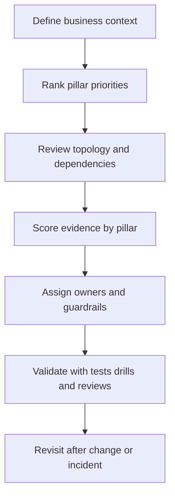

---
content_sources:
  diagrams:
    - id: using-waf-diagram-1
      type: flowchart
      source: mslearn-adapted
      mslearn_url: https://learn.microsoft.com/en-us/azure/well-architected/
---
# Using WAF in This Guide

This guide embeds the Azure Well-Architected Framework into every major topic so readers can move from service selection to architecture review without switching mental models. Instead of separating design from operations, the framework is used as the connective tissue between topology choices, ownership boundaries, cost controls, and validation practices.

## Integration model

[Documented] Microsoft Learn describes the WAF as a set of decision principles for workload quality. In this guide, each section maps back to those principles in a practical way:

- Platform pages explain foundational decisions and likely pillar impact.
- Pattern pages explain when a design pattern improves one pillar while stressing another.
- Workload guides apply the pillars to common Azure archetypes.
- Operations pages define how pillar intent survives change, incidents, and growth.
- Architecture review pages convert pillar concerns into evidence-based questions.

## Assessment approach

Architecture assessment in this guide follows six steps:

1. Clarify business context, constraints, and non-goals.
2. Rank quality attributes for the workload.
3. Map major components, dependencies, and control points.
4. Score risks and strengths against the five pillars.
5. Record trade-offs, owners, and validation tasks.
6. Reassess after incidents, material growth, or platform change.

## Assessment flow

<!-- diagram-id: using-waf-diagram-1 -->

## Evidence model used in this guide

The guide uses evidence tags to avoid false confidence:

- [Documented] Official Microsoft guidance or approved design records exist.
- [Observed] Runtime behavior, logs, or operational patterns have been seen.
- `Measured` Numeric evidence such as cost, latency, or recovery time is available.
- [Validated] Assumptions have been tested through drills, load tests, or reviews.
- [Correlated] Several signals align but do not prove full causality.
- [Inferred] The conclusion is reasoned from context and supporting evidence.
- [Assumed] A temporary assumption exists and needs follow-up validation.
- [Unknown] The data required for a decision is missing.

## Scoring guidance

Use simple, explainable scoring rather than artificial precision. A practical model is:

| Score | Meaning | Interpretation |
|---|---|---|
| 0 | No evidence | Material unknown or missing control |
| 1 | Weak evidence | Intent exists but implementation is incomplete |
| 2 | Partial evidence | Control exists for core paths but not edge cases |
| 3 | Strong evidence | Control is implemented and operationalized |
| 4 | Validated evidence | Control is tested, measured, and reviewed regularly |

[Inferred] A low score should trigger a design or ownership conversation, not just a backlog item.

## How to use the Azure WAF Assessment tool

The official assessment helps teams identify improvement areas by pillar. Use it at three moments:

- Before a new production launch to expose design blind spots.
- After a major migration or platform change to compare old and new risk profiles.
- After incidents to understand whether architectural weaknesses were already visible.

Do not treat the assessment as a standalone approval gate. Pair it with diagrams, dependency maps, SLOs, and review notes.

## Common review questions

- Which pillar is most business-critical for this workload right now?
- What are the most likely failure modes across dependencies?
- Which controls are implemented but not yet validated?
- What trade-offs were accepted intentionally?
- Who owns remediation when a pillar score is weak?

## Anti-patterns in assessment usage

- Treating the five pillars as equally important for every workload.
- Scoring from opinion without evidence.
- Reviewing the primary application path but not operational dependencies.
- Ignoring people and process controls because they are not represented in topology diagrams.
- Performing assessment only once and never revisiting it.

## Ownership and cadence

[Observed] The most durable model is a shared operating cadence:

- Platform team: baseline controls, landing zone standards, common observability.
- Security and governance teams: policy, identity, and exception review.
- Application team: workload behavior, release process, and service objectives.
- Architecture reviewers: challenge assumptions and verify evidence quality.

Review at least on initial design, pre-production readiness, post-incident, and major scale or regulatory change.

## Microsoft Learn references

- [Azure Well-Architected Framework](https://learn.microsoft.com/en-us/azure/well-architected/)
- [Well-Architected Review](https://learn.microsoft.com/en-us/assessments/azure-architecture-review/)

## Takeaway

[Validated] The guide is strongest when WAF is used continuously: design with it, review with it, operate with it, and revisit decisions when evidence changes.
