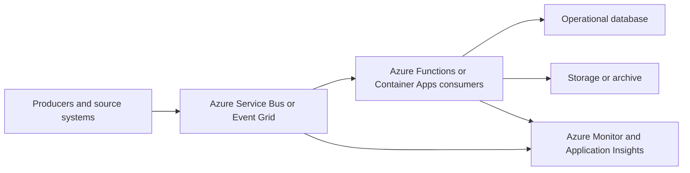

---
content_sources:
  diagrams:
    - id: event-driven-integration-baseline-architecture
      type: flowchart
      source: mslearn-adapted
      mslearn_url: https://learn.microsoft.com/en-us/azure/architecture/guide/architecture-styles/event-driven
---
# Event-Driven Integration Baseline

This baseline fits workloads where messaging is the coordination backbone and compute is primarily consumer-driven rather than user-driven. [Documented]

## Recommended baseline

Use **Service Bus** or **Event Grid** as the event transport layer, run consumers on **Azure Functions** or **Azure Container Apps**, and persist workflow state or downstream results in dedicated operational data stores. [Documented]

## Canonical reference architecture

<!-- diagram-id: event-driven-integration-baseline-architecture -->

## Service composition

| Layer | Preferred choice | Use when | Trade-off |
|---|---|---|---|
| Command and durable workflow | Service Bus queues or topics | Need ordered handling, retry control, and dead-letter semantics | More operational semantics than lightweight eventing. [Documented] |
| Event fan-out | Event Grid | Need push-style event distribution and simple subscriber model | Less suited for rich queue semantics. [Documented] |
| Consumer runtime | Azure Functions | Event-driven scale and simple execution model dominate | Cold starts or runtime boundaries may need review. [Observed] |
| Consumer runtime | Container Apps | Need container packaging, longer-lived process behavior, or language/runtime control | More operational surface than Functions. [Correlated] |

## Why this choice

### Messaging first

The baseline optimizes for decoupling and resilience under variable downstream performance. Producers do not need to know consumer state in real time, which reduces direct dependency chains. [Documented]

### Consumption-based or elastic consumers

Functions and Container Apps align well with bursty workloads because consumer scale can track queue depth or event volume. [Observed]

### Isolated operational state

Keep workflow progress, processed results, and archives in purpose-built stores rather than overloading the messaging service as long-term storage. [Validated]

## When not to use this baseline

- Business value depends on immediate synchronous orchestration. [Observed]
- Event contracts and ownership are not mature enough to support autonomous producers and consumers. [Assumed]
- Teams really need a microservices platform with service-to-service APIs, release autonomy, and platform engineering controls. [Correlated]

## Risks and watchpoints

- Backlogs can hide systemic failure until business SLAs are already impacted. [Correlated]
- Duplicate delivery handling is often underestimated. [Observed]
- Event schema drift without ownership quickly erodes integration reliability. [Validated]

## Trade-offs to keep visible

- Durable messaging increases resilience but also increases the need for schema, replay, and backlog governance. [Observed]
- Consumption-based compute looks inexpensive until downstream dependencies and retries dominate the real cost profile. [Correlated]
- Separating workflow state from transport adds clarity but requires more deliberate data ownership. [Validated]

## Architecture review checklist

- Is the selected broker aligned with the actual delivery semantics required?
- Can consumers fail independently without forcing producers to stop?
- Are archive, replay, and retention responsibilities assigned?

## Revisit triggers

- Business stakeholders now require tight synchronous confirmations. [Observed]
- Event volume has shifted toward streaming telemetry rather than workflow events. [Observed]
- The team needs stronger service platform capabilities than a messaging-centric baseline provides. [Inferred]

## Decision takeaway

This baseline is strongest when messaging, retries, and asynchronous completion are business-compatible defaults rather than emergency workarounds around brittle APIs. [Validated]

## Related decisions

- Add more sophisticated orchestration only after proving simple queue or event patterns are insufficient. [Observed]
- Keep broker choice aligned with delivery semantics rather than standardizing on one tool for every use case. [Validated]

## Microsoft Learn references

- [Event-driven architecture style](https://learn.microsoft.com/en-us/azure/architecture/guide/architecture-styles/event-driven)
- [Service Bus messaging overview](https://learn.microsoft.com/en-us/azure/service-bus-messaging/service-bus-messaging-overview)
- [Azure Functions scale and hosting](https://learn.microsoft.com/en-us/azure/azure-functions/functions-scale)
- [Azure Container Apps overview](https://learn.microsoft.com/en-us/azure/container-apps/overview)
- [Choose between Azure Container Apps, AKS, and App Service](https://learn.microsoft.com/en-us/azure/container-apps/compare-options)
