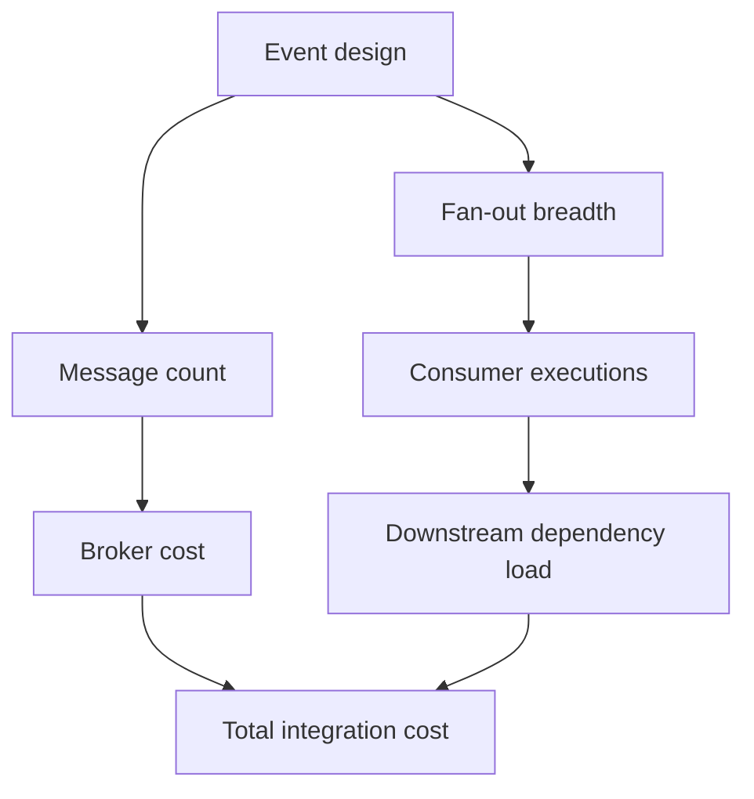

---
content_sources:
  diagrams:
    - id: event-driven-integration-cost-anti-patterns
      type: flowchart
      source: self-generated
      justification: "Highlights event-driven cost drivers and common anti-patterns."
      based_on:
        - https://learn.microsoft.com/en-us/azure/well-architected/cost-optimization/
        - https://learn.microsoft.com/en-us/azure/event-grid/compare-messaging-services
---
# Event-Driven Integration Cost and Anti-Patterns

Messaging-based architectures can be cost-efficient, but only when the number of events, fan-out behavior, retention, and consumer execution model are grounded in measured business demand. [Correlated]

## Main cost drivers

| Driver | Why it matters |
|---|---|
| Message volume and operations | Costs grow with transaction count and delivery pattern. [Correlated] |
| Fan-out to many subscribers | Each subscriber can multiply downstream processing cost. [Observed] |
| Consumer execution time | Event-driven compute is economical only when runtimes stay aligned with event work. [Correlated] |
| Long retention or replay archives | Helpful for recovery, but not free. [Documented] |

## Anti-patterns

### Over-engineering simple integration

Not every file transfer or two-system notification needs a full event backbone. If there are few systems and simple dependency semantics, introducing topics, retries, replay stores, and compensations can exceed the value delivered. [Observed]

### Chatty events

Events that expose tiny field-level changes or highly repetitive low-value signals can create operational noise and inflated downstream cost. [Observed]

### Missing DLQ monitoring

The architecture is not cheaper if undetected dead-letter growth causes business rework or manual recovery later. [Validated]

### Treating broker throughput as free scale

Consumer and storage cost often dominate after message acceptance becomes easy. [Correlated]

## Cost pressure map

<!-- diagram-id: event-driven-integration-cost-anti-patterns -->

## What good looks like

- Event granularity matches business value. [Validated]
- Replay and retention windows are justified by compliance or recovery needs. [Documented]
- Cost reviews include downstream processing, not only broker invoice lines. [Correlated]

## Trade-offs to keep visible

- Cheaper event acceptance can still produce expensive downstream processing. [Inferred]
- Fine-grained events improve flexibility only if consumers truly need that granularity. [Observed]
- Long replay retention adds resilience but can dilute accountability for fixing source issues. [Correlated]

## Architecture review checklist

- Is the event volume forecast based on measured business activity?
- Are fan-out subscriptions justified by explicit consumer value?
- Does the cost review include broker, compute, storage, and operator effort together?

## Revisit triggers

- Message volume grows faster than business value delivered. [Correlated]
- Subscriber sprawl leads to weak ownership and duplicated transformations. [Observed]
- Broker selection no longer matches payload or throughput profile. [Inferred]

## Decision takeaway

The most cost-effective event architecture is usually the one with the fewest events and subscribers needed to preserve business decoupling. [Validated]

## Related decisions

- Revisit event shape before adding more infrastructure to handle rising volume. [Observed]
- Prefer consolidation of low-value event streams over blind scaling of every consumer path. [Inferred]

## Adoption note

FinOps reviews for event-driven systems should sample both message paths and downstream processing paths so optimization does not stop at the broker bill. [Correlated]

That keeps hidden consumer cost visible. [Observed]

## Microsoft Learn references

- [Azure Well-Architected Framework cost optimization](https://learn.microsoft.com/en-us/azure/well-architected/cost-optimization/)
- [Compare messaging services in Azure](https://learn.microsoft.com/en-us/azure/event-grid/compare-messaging-services)
- [Azure Functions scale and hosting](https://learn.microsoft.com/en-us/azure/azure-functions/functions-scale)
