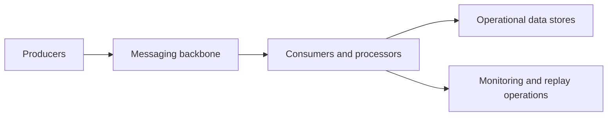

---
content_sources:
  diagrams:
    - id: event-driven-integration-scope
      type: flowchart
      source: self-generated
      justification: "Summarizes entry conditions for event-driven integration workloads on Azure."
      based_on:
        - https://learn.microsoft.com/en-us/azure/architecture/guide/architecture-styles/event-driven
        - https://learn.microsoft.com/en-us/azure/service-bus-messaging/service-bus-messaging-overview
---
# Event-Driven Integration

Use this workload family when the system's main value comes from asynchronous communication, decoupled processing, event fan-out, or buffered integration between independently changing systems. [Documented]

## When to use this workload type

- Producers and consumers should evolve independently. [Documented]
- Temporary backlog is acceptable and often desirable for smoothing bursts. [Observed]
- Business workflows span systems that should not depend on synchronous request chains. [Validated]

## Audience

- Integration architects selecting messaging patterns. [Documented]
- Teams modernizing batch or polling-heavy enterprise integration. [Observed]
- Reviewers assessing consistency, retry, and dead-letter handling. [Validated]

## Prerequisites

- Clear event ownership and schema boundaries. [Assumed]
- Agreement on delivery semantics and business tolerance for delay or duplication. [Validated]
- Operational ownership for replay, dead-letter, and backlog review. [Observed]

## What this family optimizes for

| Priority | Why it matters |
|---|---|
| Loose coupling | Reduces deployment-time and runtime dependency chains. [Documented] |
| Elastic processing | Consumers can scale independently from producers. [Documented] |
| Failure isolation | Backlogs and retries absorb downstream instability. [Observed] |
| Event visibility | Systems remain understandable only if ownership and observability are explicit. [Correlated] |

<!-- diagram-id: event-driven-integration-scope -->

## Signals that this is the wrong family

- End users require strict synchronous confirmation from every downstream system. [Observed]
- The main architecture question is multi-team microservice platform ownership rather than event transport. [Inferred]
- The workload is essentially a single private internal application with occasional notifications. [Correlated]

## Trade-offs to keep visible

- Better decoupling usually means more operational indirection. [Observed]
- Business stakeholders must understand that buffering and eventual completion are intentional design properties. [Validated]
- Integration contracts require ownership discipline, or producer and consumer freedom turns into schema drift. [Correlated]

## Architecture review checklist

- Is every event or command tied to a business owner? [Validated]
- Can operators distinguish backlog growth from business outage? [Observed]
- Are replay, deduplication, and compensation expectations documented? [Correlated]

## Revisit triggers

- A growing number of synchronous exceptions appear because the workflow no longer tolerates delay. [Observed]
- Consumers need stronger domain ownership and independent platform controls than the integration baseline provides. [Inferred]
- Messaging cost or replay complexity begins to exceed the value of loose coupling. [Correlated]

## Decision takeaway

Choose this family when asynchronous integration is a deliberate product and operational design choice, not merely a technical preference for queues. [Validated]

## Related decisions

- Use the microservices platform family when the primary challenge is service autonomy and platform governance rather than messaging semantics. [Correlated]
- Use the private internal app family when the dominant architecture is still an internal application with only limited asynchronous integration. [Observed]

## Adoption note

Start with one well-owned event flow and prove replay, observability, and business ownership before standardizing the pattern more broadly. [Validated]

That sequencing lowers integration risk. [Inferred]

## Microsoft Learn references

- [Event-driven architecture style](https://learn.microsoft.com/en-us/azure/architecture/guide/architecture-styles/event-driven)
- [Service Bus messaging overview](https://learn.microsoft.com/en-us/azure/service-bus-messaging/service-bus-messaging-overview)
- [Azure Functions event-driven scale guidance](https://learn.microsoft.com/en-us/azure/azure-functions/functions-scale)

## Next reading

- [Baseline architecture](baseline.md)
- [Messaging and consistency decisions](messaging-and-consistency.md)
- [Operations and reliability](operations-and-reliability.md)
