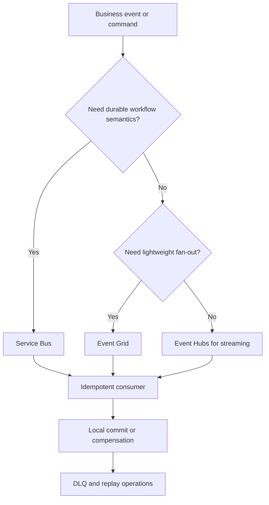

---
content_sources:
  diagrams:
    - id: event-driven-integration-messaging-choices
      type: flowchart
      source: self-generated
      justification: "Compares messaging choices and consistency controls for event-driven integration workloads."
      based_on:
        - https://learn.microsoft.com/en-us/azure/architecture/patterns/saga
        - https://learn.microsoft.com/en-us/azure/service-bus-messaging/service-bus-messaging-overview
---
# Event-Driven Integration Messaging and Consistency

Messaging architecture succeeds when transport semantics, business consistency rules, and operational recovery design are aligned. Problems begin when teams expect the broker to guarantee business correctness by itself. [Validated]

## Service Bus, Event Grid, and Event Hubs

| Service | Best fit | Notable trade-off |
|---|---|---|
| Service Bus | Commands, workflow steps, durable queue or topic handling | Higher operational semantics and cost than lightweight notification patterns. [Documented] |
| Event Grid | Reactive event distribution and subscriber fan-out | Not designed for rich queue workflow semantics. [Documented] |
| Event Hubs | High-volume telemetry or streaming ingestion | Excellent throughput, but not a workflow broker. [Documented] |

## Idempotency is mandatory

At-least-once delivery is common in resilient systems, so consumers must tolerate duplicates. [Documented]

Practical implications:

- Use business keys or message IDs to detect replay. [Validated]
- Keep side effects repeat-safe where possible. [Observed]
- Distinguish technical deduplication from business duplication rules. [Correlated]

## Exactly-once semantics

Exactly-once is usually a local property inside a narrow boundary, not a realistic end-to-end promise across heterogeneous systems. [Inferred]

Architectural stance:

- Use transactional capabilities where they genuinely reduce risk inside the chosen service boundary. [Documented]
- Do not promise business stakeholders “exactly-once” for distributed workflows without careful proof. [Validated]
- Prefer compensating actions and reconciliations over impossible guarantees. [Observed]

## Dead-letter handling

Dead-letter queues are not just error buckets; they are operating surfaces. [Observed]

Good practice includes:

- Categorizing dead-letter reasons. [Validated]
- Defining ownership for triage and replay. [Documented]
- Setting backlog thresholds tied to business impact. [Correlated]

## Saga pattern for distributed transactions

Use the **Saga pattern** when a business workflow spans multiple services and cannot rely on a single ACID transaction. [Documented]

The design goal is not to eliminate failure, but to define compensating actions and visible workflow state so recovery remains possible. [Validated]

## Messaging and consistency flow

<!-- diagram-id: event-driven-integration-messaging-choices -->

## Review questions

1. Are message semantics aligned with business process importance?
2. Can every consumer safely retry or replay messages?
3. Is dead-letter ownership explicit and staffed?

## Trade-offs to keep visible

- Stronger delivery guarantees increase cost and operational ceremony. [Correlated]
- Consumer simplicity often depends on more explicit business reconciliation processes. [Correlated]
- “Exactly-once” language should be reserved for narrowly proven boundaries, not broad architecture claims. [Validated]

## Architecture review checklist

- Is duplicate handling verifiable in design and operations?
- Does every DLQ path have an owner and replay decision process?
- Are event schemas versioned in a way producers and consumers can both sustain?

## Revisit triggers

- Duplicate business actions appear despite technical deduplication. [Observed]
- Dead-letter growth becomes a recurring manual burden. [Observed]
- Workflow spans now require orchestration patterns beyond current saga design. [Inferred]

## Decision takeaway

Messaging consistency is a system property built from broker semantics, consumer behavior, and business compensation rules together. [Validated]

## Microsoft Learn references

- [Saga distributed transactions pattern](https://learn.microsoft.com/en-us/azure/architecture/patterns/saga)
- [Service Bus messaging overview](https://learn.microsoft.com/en-us/azure/service-bus-messaging/service-bus-messaging-overview)
- [Choose a messaging service in Azure](https://learn.microsoft.com/en-us/azure/event-grid/compare-messaging-services)
