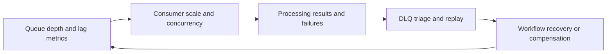

---
content_sources:
  diagrams:
    - id: event-driven-integration-operations-loop
      type: flowchart
      source: self-generated
      justification: "Shows operational loop for backlog monitoring, scaling, and poison message handling in event-driven systems."
      based_on:
        - https://learn.microsoft.com/en-us/azure/service-bus-messaging/service-bus-dead-letter-queues
        - https://learn.microsoft.com/en-us/azure/azure-monitor/overview
---
# Event-Driven Integration Operations and Reliability

Reliability in event-driven systems is measured less by immediate response time and more by backlog health, processing latency, replay safety, and operator visibility into workflow progress. [Correlated]

## Monitoring backlog and lag

- Track queue depth, processing age, and dead-letter growth together. [Documented]
- Distinguish normal burst buffering from sustained consumer inability to keep up. [Measured]
- Monitor business backlog in addition to technical backlog when some messages are more urgent than others. [Observed]

## Scaling consumers

Consumer scaling must reflect both throughput and downstream dependency limits. [Validated]

Good practice:

- Scale on backlog and processing time, not only CPU. [Documented]
- Protect databases and downstream APIs from stampedes caused by sudden consumer expansion. [Observed]
- Use concurrency limits when dependencies, not compute, are the bottleneck. [Correlated]

## Handling poison messages

Poison message strategy should be explicit before production launch. [Validated]

- Define what qualifies as poison versus transient failure. [Observed]
- Route irrecoverable messages to DLQ with diagnostic context. [Documented]
- Decide whether replay is automatic, manual, or business-approved. [Correlated]

## Operational feedback loop

<!-- diagram-id: event-driven-integration-operations-loop -->

## Reliability targets

| Dimension | Example target |
|---|---|
| Event acceptance | Producers can enqueue within agreed latency budget. [Measured] |
| Processing completion | Most messages complete within a business-defined time window. [Validated] |
| DLQ recovery | Dead-letter items are triaged within an agreed operational window. [Observed] |

## Ownership model

| Area | Primary owner |
|---|---|
| Broker health and quotas | Platform or integration platform team. [Observed] |
| Consumer logic and replay safety | Workload team. [Validated] |
| Business compensation and exception handling | Product and operations jointly. [Correlated] |

## Common failure patterns

- Backlog accepted as normal until recovery window objectives are already missed. [Observed]
- Consumer retries amplify dependency outages instead of isolating them. [Correlated]
- DLQ exists but no owner regularly inspects it. [Validated]

## Trade-offs to keep visible

- High consumer parallelism can improve lag while increasing downstream instability. [Correlated]
- Short retry intervals can hide defects briefly but lengthen real recovery during incidents. [Observed]
- Replay capability is valuable only when business owners trust the resulting side effects. [Validated]

## Architecture review checklist

- Are queue lag thresholds tied to business impact? [Measured]
- Can operators pause, replay, or redirect safely during incidents? [Observed]
- Are downstream protections in place before consumer scaling expands? [Validated]

## Revisit triggers

- Backlog age becomes a leading outage signal. [Measured]
- The team cannot explain what proportion of failures are transient, poison, or schema-related. [Observed]
- Operations effort shifts from routine monitoring to continuous manual replay. [Correlated]

## Decision takeaway

Reliable event-driven operations depend on visible backlog economics and disciplined exception handling, not just message acceptance success. [Validated]

## Microsoft Learn references

- [Overview of Service Bus dead-letter queues](https://learn.microsoft.com/en-us/azure/service-bus-messaging/service-bus-dead-letter-queues)
- [Azure Monitor overview](https://learn.microsoft.com/en-us/azure/azure-monitor/overview)
- [Reliability in Azure Functions](https://learn.microsoft.com/en-us/azure/azure-functions/performance-reliability)
