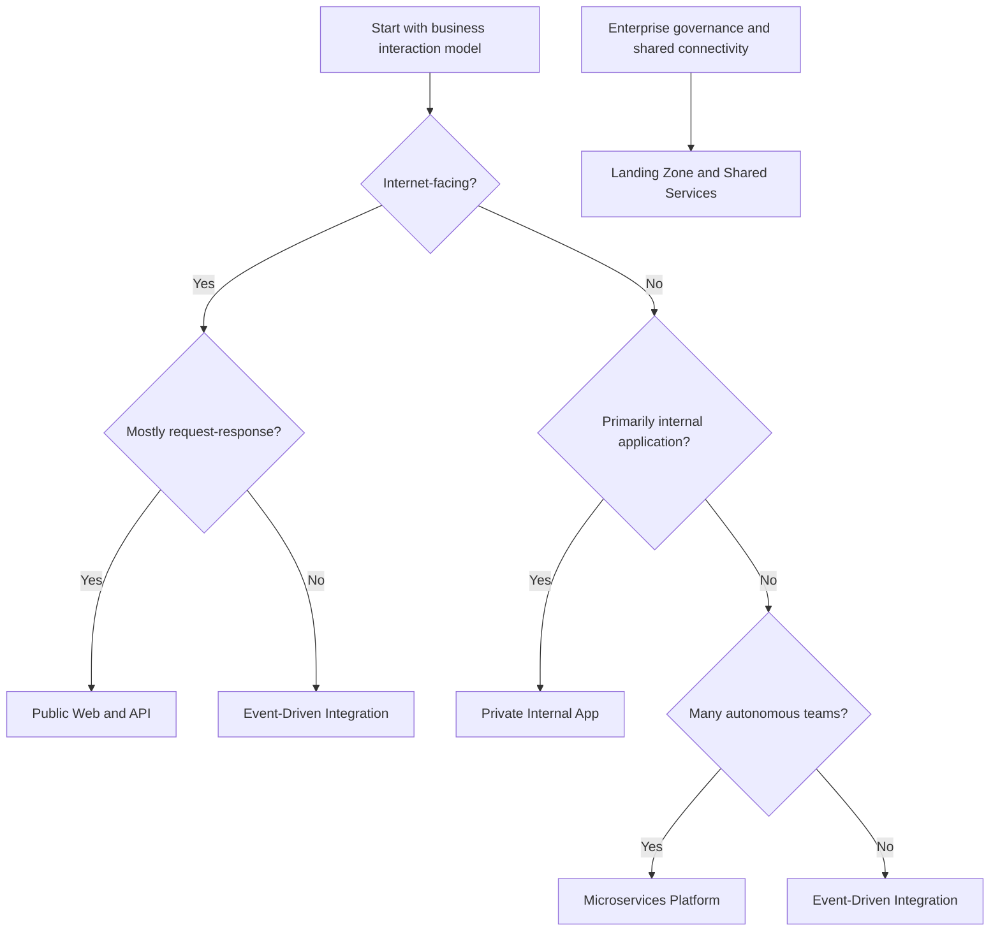

---
content_sources:
  diagrams:
    - id: workload-guides-overview-map
      type: flowchart
      source: self-generated
      justification: "Synthesizes workload family decision guidance from Azure Architecture Center and Azure Well-Architected guidance."
      based_on:
        - https://learn.microsoft.com/en-us/azure/architecture/
        - https://learn.microsoft.com/en-us/azure/well-architected/
---
# Workload Guides

Use this section to choose a workload family before making service-level decisions. The goal is not to prescribe one Azure product stack for every case, but to narrow design choices to a baseline that matches exposure, coupling, scale profile, operating model, and governance needs. [Documented]

## What these guides cover

- Architecture baselines and service composition, not deployment tutorials. [Documented]
- Trade-offs across security, reliability, performance, and cost. [Documented]
- Workload-specific topology decisions for networking, identity, data, and operations. [Inferred]
- Anti-patterns that commonly appear when teams mix workload assumptions. [Observed]

## Workload family comparison

| Workload family | Best fit | Typical Azure control plane choices | Main trade-off | Start here |
|---|---|---|---|---|
| Public Web and API | Internet-facing sites, mobile back ends, partner APIs | Azure Front Door, App Service or Azure Container Apps, Azure SQL Database or Azure Cosmos DB | Fast delivery versus tighter edge and abuse controls | [Public Web and API](public-web-api/index.md) |
| Private Internal App | Employee or business-process apps with private access only | Private Link, App Service with VNet integration, private data stores, ExpressRoute or VPN | Higher network complexity for lower exposure risk | [Private Internal App](private-internal-app/index.md) |
| Event-Driven Integration | Decoupled business workflows, asynchronous processing, event fan-out | Service Bus, Event Grid, Azure Functions, Container Apps, storage-backed consumers | Better decoupling but harder end-to-end troubleshooting | [Event-Driven Integration](event-driven-integration/index.md) |
| Microservices Platform | Complex domains with multiple teams and independent release cycles | AKS or Container Apps, API gateway, service mesh or Dapr, per-service data | Team autonomy versus platform overhead | [Microservices Platform](microservices-platform/index.md) |
| Landing Zone and Shared Services | Enterprise-scale governance, shared platform services, multi-subscription operations | Management groups, Azure Policy, hub-spoke or Virtual WAN, central security and monitoring | Strong control versus risk of central bottlenecks | [Landing Zone and Shared Services](landing-zone-shared-services/index.md) |

## Decision guide

Use the following sequence when selecting a workload type:

1. Determine whether the primary entry point is internet-facing or private-only. [Documented]
2. Decide whether the main value comes from synchronous request-response or asynchronous event flow. [Inferred]
3. Check whether one product team owns the workload or whether many teams need independent life cycles. [Observed]
4. Separate workload architecture from enterprise platform architecture. A landing zone is not a workload type; it is the governance and connectivity foundation around workloads. [Documented]

<!-- diagram-id: workload-guides-overview-map -->

## How to use the workload guides

### 1. Pick the closest baseline first

Most architecture review failures come from starting with a preferred service instead of a workload shape. A baseline anchors discussions around topology, blast radius, and operational ownership before optimization begins. [Observed]

### 2. Read the cross-cutting guidance next

Each family adds network, identity, data, or communication guidance where the default Azure trade-offs change. For example, private internal apps emphasize DNS and Private Endpoint operations, while event-driven integration emphasizes idempotency and dead-letter handling. [Correlated]

### 3. Use operations and cost sections to test viability

If the target SLO, DR target, or cost envelope cannot be met with the baseline assumptions, revisit the workload selection rather than tuning endlessly inside the wrong pattern. [Inferred]

## Choosing between adjacent workload types

### Public Web and API versus Private Internal App

Choose **Public Web and API** when customer, partner, or mobile traffic is a primary design driver and edge controls matter. Choose **Private Internal App** when every dependency and user path can stay on private connectivity and public ingress would add unnecessary attack surface. [Documented]

### Event-Driven Integration versus Microservices Platform

Choose **Event-Driven Integration** when loose coupling and asynchronous workflow orchestration are the core need. Choose **Microservices Platform** when organizational boundaries, service autonomy, and polyglot runtime decisions are the main reason to decompose. [Inferred]

### Landing Zone and Shared Services versus workload guides

Landing zones answer platform questions such as subscription hierarchy, guardrails, and shared networking. They do not replace workload-specific baselines for application architecture, data choices, or runtime scaling. [Documented]

## Prerequisites for using these guides

- Familiarity with Azure identity, networking, compute, and data fundamentals. [Assumed]
- Agreement on business criticality, data classification, and recovery objectives. [Validated]
- Basic platform guardrails such as naming, tagging, RBAC boundaries, and policy exceptions. [Observed]

## Evidence posture and review expectations

- Prefer Microsoft Learn as the starting source for service capabilities and reference architectures. [Documented]
- Treat benchmark numbers and cost examples as directional until validated in your tenant and region. [Measured]
- Use architecture decision records when deviating from a baseline for compliance, latency, or organizational reasons. [Validated]

## Related Microsoft Learn references

- [Azure Architecture Center](https://learn.microsoft.com/en-us/azure/architecture/)
- [Azure Well-Architected Framework](https://learn.microsoft.com/en-us/azure/well-architected/)
- [Choose an Azure compute service](https://learn.microsoft.com/en-us/azure/architecture/guide/technology-choices/compute-decision-tree)

## Next step

Start with the family that best matches your workload shape, then use the baseline guide to anchor architecture decisions and review trade-offs.
