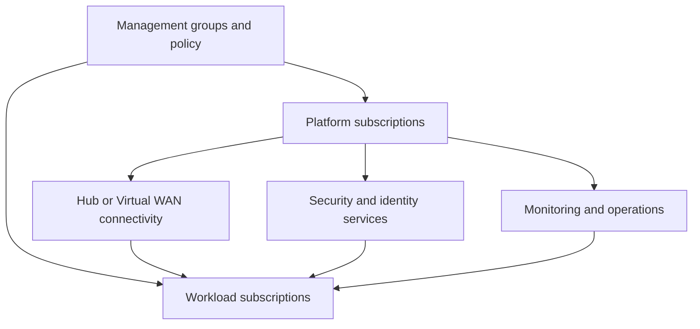

---
content_sources:
  diagrams:
    - id: landing-zone-baseline-architecture
      type: flowchart
      source: mslearn-adapted
      mslearn_url: https://learn.microsoft.com/en-us/azure/cloud-adoption-framework/ready/landing-zone/
---
# Landing Zone and Shared Services Baseline

This baseline provides the conceptual enterprise platform around workloads: governance hierarchy, subscriptions, shared networking, identity integration, and reusable operations services. [Documented]

## Recommended baseline

Use **management groups** for hierarchy and policy inheritance, separate **platform** and **workload subscriptions**, provide shared services such as connectivity, DNS, firewall, and monitoring from dedicated platform subscriptions, and define a federated operating model so workload teams consume paved roads without losing delivery autonomy. [Documented]

## Canonical reference architecture

<!-- diagram-id: landing-zone-baseline-architecture -->

## Core composition

| Component | Baseline role | Why |
|---|---|---|
| Management groups | Policy scope and organizational hierarchy | Keeps guardrails consistent at scale. [Documented] |
| Platform subscriptions | Shared services boundary | Separates central controls from workload ownership. [Observed] |
| Workload subscriptions | Application delivery boundary | Supports team-level accountability and cost tracking. [Validated] |
| Shared networking | Hub-spoke or Virtual WAN | Standardizes connectivity and egress posture. [Documented] |

## Why this choice

### Governance before service sprawl

Landing zones prevent early subscription sprawl and policy inconsistency that become expensive to unwind later. [Observed]

### Shared services with bounded ownership

Central capabilities such as DNS, firewall, logging, and identity integration are valuable only when ownership and service expectations are clear. [Validated]

### Federated workload autonomy

The goal is not full centralization. Workload teams should inherit standards and consume shared platform capabilities while still owning application-specific decisions. [Documented]

## When not to use this baseline

- One small team runs a limited Azure footprint with little governance complexity. [Inferred]
- Shared services would create more bottleneck than consistency. [Observed]
- Subscription boundaries are required for legal or business reasons that the standard hierarchy does not yet address. [Correlated]

## Risks and watchpoints

- Central teams becoming gatekeepers for every change. [Observed]
- Hub network designs turning into throughput or policy bottlenecks. [Observed]
- Policy inheritance used without exception governance, causing delivery friction. [Validated]

## Trade-offs to keep visible

- Central consistency can degrade into platform gatekeeping if service boundaries are weak. [Observed]
- Shared networking and security create economies of scale but also concentrated dependency risk. [Correlated]
- Subscription separation improves accountability only when platform and workload roles are explicit. [Validated]

## Architecture review checklist

- Is the management group model aligned to the organization, not just to technical preference?
- Are shared services separated from workload ownership boundaries?
- Can the platform scale to more teams and regions without redesign?

## Revisit triggers

- Exception handling consumes too much central effort. [Observed]
- Shared services begin constraining workload release speed. [Observed]
- Subscription boundaries no longer match accountability or compliance needs. [Correlated]

## Decision takeaway

The landing zone baseline is effective when it combines clear governance inheritance with enough federation that workload teams can still move safely. [Validated]

## Related decisions

- Decide early whether shared services are mandatory, recommended, or optional with justified exceptions. [Observed]
- Treat platform subscriptions as products with lifecycle management, not one-time setup containers. [Correlated]

## Adoption note

Baseline landing zones should be opinionated enough to prevent drift but modular enough to add regions, business units, and shared capabilities without major rework. [Validated]

## Microsoft Learn references

- [Cloud Adoption Framework landing zones](https://learn.microsoft.com/en-us/azure/cloud-adoption-framework/ready/landing-zone/)
- [Azure landing zone conceptual architecture](https://learn.microsoft.com/en-us/azure/cloud-adoption-framework/ready/landing-zone/design-areas)
- [Azure best practices and recommendations](https://learn.microsoft.com/en-us/azure/cloud-adoption-framework/ready/azure-best-practices/)
