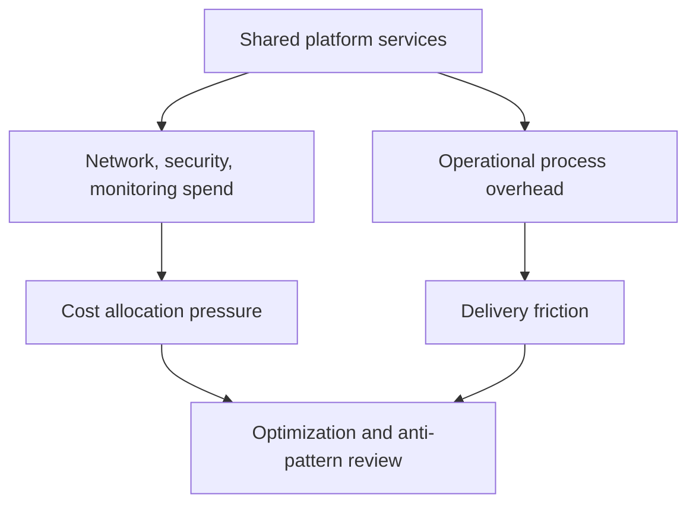

---
content_sources:
  diagrams:
    - id: landing-zone-cost-and-anti-patterns
      type: flowchart
      source: self-generated
      justification: "Maps cost allocation and anti-patterns for enterprise landing zones and shared services."
      based_on:
        - https://learn.microsoft.com/en-us/azure/well-architected/cost-optimization/
        - https://learn.microsoft.com/en-us/azure/cloud-adoption-framework/ready/landing-zone/
---
# Landing Zone and Shared Services Cost and Anti-Patterns

Landing zone cost is often indirect. Teams feel it through shared networking, logging, security tooling, and operational processes rather than through one obvious application bill. [Measured]

## Cost allocation model

Shared services need explicit cost allocation rules or they become politically difficult to optimize. [Observed]

Typical allocation dimensions:

- Subscription or business unit consumption. [Measured]
- Shared network traffic or egress intensity. [Correlated]
- Security and monitoring data volume. [Observed]

## Common anti-patterns

### Over-centralization

If every platform change needs one central team, delivery slows and teams route around the platform. [Observed]

### Permission sprawl

Too many standing privileges undermine governance and create hidden operational risk. [Validated]

### Hub bottleneck

A central hub that carries too much traffic or too many policy dependencies can turn one platform component into a failure and cost hotspot. [Measured]

### Shared service without service catalog

When consumers do not know what platform services exist, what they cost, or what SLA they carry, duplication and shadow infrastructure increase. [Correlated]

## Cost and risk map

<!-- diagram-id: landing-zone-cost-and-anti-patterns -->

## What good looks like

- Shared services have transparent service and cost ownership. [Validated]
- Platform bottlenecks are monitored like production dependencies. [Observed]
- Workload teams understand when to consume a shared service and when an exception is acceptable. [Correlated]

## Trade-offs to keep visible

- Shared services lower duplication but can obscure consumption if chargeback is weak. [Measured]
- Central security and networking improve consistency but can become expensive failure domains. [Correlated]
- Governance quality declines when permissions and cost ownership are not reviewed together. [Validated]

## Architecture review checklist

- Are platform costs allocated with a method teams understand? [Observed]
- Do shared services publish ownership, expectations, and consumption rules? [Validated]
- Are hub and monitoring costs reviewed as product dependencies rather than overhead only? [Correlated]

## Revisit triggers

- Shared service consumption rises without clear cost attribution. [Measured]
- Teams increasingly bypass the platform. [Observed]
- Central components repeatedly become performance or availability bottlenecks. [Correlated]

## Decision takeaway

Healthy landing zone economics depend on transparent shared-service value, explicit ownership, and active prevention of central bottlenecks. [Validated]

## Related decisions

- Review chargeback or showback mechanisms before adding more shared services. [Measured]
- Evaluate whether platform standardization is removing duplication or merely moving it into central budgets. [Correlated]

## Adoption note

Cost discipline improves when shared services publish both consumption guidance and design intent, so teams understand not just what they pay for but why it exists. [Observed]

That supports better chargeback conversations. [Correlated]

## Microsoft Learn references

- [Azure Well-Architected Framework cost optimization](https://learn.microsoft.com/en-us/azure/well-architected/cost-optimization/)
- [Cloud Adoption Framework landing zones](https://learn.microsoft.com/en-us/azure/cloud-adoption-framework/ready/landing-zone/)
- [Azure Architecture Framework cost overview](https://learn.microsoft.com/en-us/azure/architecture/framework/cost/overview)
