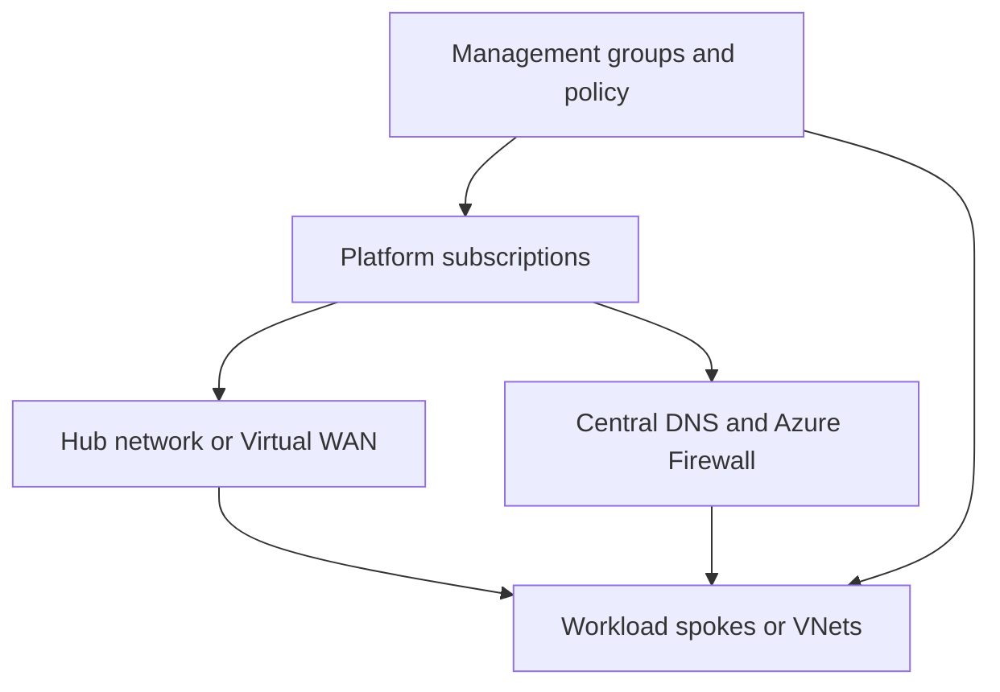

---
content_sources:
  diagrams:
    - id: landing-zone-governance-topology
      type: flowchart
      source: self-generated
      justification: "Shows governance and connectivity topology for landing zones and shared services."
      based_on:
        - https://learn.microsoft.com/en-us/azure/cloud-adoption-framework/ready/azure-best-practices/
        - https://learn.microsoft.com/en-us/azure/cloud-adoption-framework/ready/landing-zone/design-area/network-topology-and-connectivity/
---
# Landing Zone and Shared Services Governance and Network Topology

Governance and topology choices define the control envelope within which every workload operates. Architecture quality depends on making those controls predictable, scalable, and exception-aware. [Inferred]

## Policy-driven governance

Use Azure Policy, role boundaries, and management group scoping to enforce baseline security, compliance, tagging, and deployment guardrails. [Documented]

Principles:

- Keep mandatory controls centralized. [Documented]
- Make exception handling explicit and time-bound. [Inferred]
- Avoid policy sets so broad that teams cannot understand why deployments fail. [Correlated]

## Hub-spoke versus Virtual WAN

| Topology | Good fit | Trade-off |
|---|---|---|
| Hub-spoke | Moderate scale with strong central control and standard routing patterns | Hub complexity can grow as more spokes and services attach. [Documented] |
| Virtual WAN | Large-scale, distributed connectivity with managed transit features | Less bespoke control in some scenarios, but operational simplicity at scale. [Documented] |

## Centralized DNS and firewall

Shared DNS and Azure Firewall services can simplify consistency across workloads, but they must be designed as reusable products rather than hidden network dependencies. [Observed]

## Governance and network view

<!-- diagram-id: landing-zone-governance-topology -->

## Architecture review questions

1. Are policies preventing drift without becoming opaque blockers? [Observed]
2. Can the network topology scale with new subscriptions, regions, and connectivity requirements? [Inferred]
3. Is centralized DNS and firewall ownership backed by operational SLAs? [Documented]

## Common mistakes

- Over-centralizing all networking decisions into one team with no service model. [Observed]
- Treating hub-spoke as mandatory even when Virtual WAN better fits global scale. [Correlated]
- Copying on-premises perimeter assumptions directly into cloud topology without reviewing Azure-native controls. [Inferred]

## Trade-offs to keep visible

- Stronger policy inheritance reduces drift but increases the need for transparent exceptions. [Correlated]
- Centralized network services lower duplication while increasing shared dependency concentration. [Correlated]
- Topology decisions should reflect scale and geography, not habit from earlier environments. [Observed]

## Architecture review checklist

- Are policy failures explainable to workload teams? [Observed]
- Is hub or Virtual WAN design sized for expected regional growth? [Inferred]
- Do shared firewall and DNS services have operational ownership and support paths? [Documented]

## Revisit triggers

- More spokes, regions, or acquisitions stress the current topology. [Correlated]
- Firewall and DNS changes become chronic release blockers. [Observed]
- Exception volume indicates the governance model no longer fits real workload needs. [Observed]

## Decision takeaway

Governance and network topology should provide a stable enterprise control plane, not a permanent source of architectural friction. [Inferred]

## Related decisions

- Validate whether network centralization is still aligned to regional growth and M&A scenarios. [Validated]
- Periodically review policy density so teams can still reason about inherited controls. [Inferred]

## Adoption note

Treat topology patterns as products with documented support expectations, not as one-time network diagrams. [Validated]

This reduces unmanaged drift. [Observed]

It also clarifies shared accountability. [Correlated]

## Microsoft Learn references

- [Azure best practices and recommendations](https://learn.microsoft.com/en-us/azure/cloud-adoption-framework/ready/azure-best-practices/)
- [Network topology and connectivity design area](https://learn.microsoft.com/en-us/azure/cloud-adoption-framework/ready/landing-zone/design-area/network-topology-and-connectivity/)
- [Azure Firewall architecture guidance](https://learn.microsoft.com/en-us/azure/architecture/networking/guide/azure-firewall)
