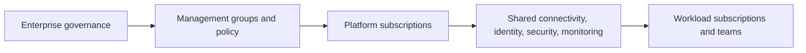

---
content_sources:
  diagrams:
    - id: landing-zone-shared-services-scope
      type: flowchart
      source: self-generated
      justification: "Summarizes the role of landing zones and shared services in enterprise Azure architectures."
      based_on:
        - https://learn.microsoft.com/en-us/azure/cloud-adoption-framework/ready/landing-zone/
        - https://learn.microsoft.com/en-us/azure/cloud-adoption-framework/ready/azure-best-practices/
---
# Landing Zone and Shared Services

Use this workload family for enterprise Azure platform setup: management groups, subscriptions, policy, shared connectivity, and common services used by many teams. [Documented]

## When to use this workload type

- Multiple teams or business units share the Azure estate. [Observed]
- Governance, identity, networking, and security controls need standardization at scale. [Documented]
- Platform teams provide reusable capabilities rather than each workload inventing its own foundation. [Validated]

## Audience

- Enterprise platform architects. [Documented]
- Cloud center of excellence and platform engineering teams. [Observed]
- Security, network, and governance stakeholders defining operating boundaries. [Validated]

## Prerequisites

- Defined management group strategy and subscription lifecycle model. [Assumed]
- Agreement on centralized versus federated platform responsibilities. [Correlated]
- Executive support for policy enforcement and guardrail exceptions. [Observed]

## What this family optimizes for

| Priority | Why it matters |
|---|---|
| Governance at scale | Standard guardrails reduce drift across teams. [Documented] |
| Shared connectivity | Common network and DNS patterns simplify enterprise integration. [Observed] |
| Platform operations | Monitoring, security, and identity should be reusable capabilities. [Validated] |
| Cost accountability | Shared services need transparent allocation and review. [Observed] |

<!-- diagram-id: landing-zone-shared-services-scope -->

## Signals that this is the wrong family

- The main goal is application runtime design for one workload. [Observed]
- Teams need a workload-specific baseline more than enterprise platform guidance. [Validated]
- Governance is so lightweight that centralized shared services would add more process than value. [Inferred]

## Trade-offs to keep visible

- More standardization usually means stronger central accountability and exception management. [Observed]
- Shared services simplify workload onboarding only when they are reliable and documented as products. [Validated]
- Cost transparency is part of platform trust, not a finance-only concern. [Inferred]

## Architecture review checklist

- Are platform responsibilities distinct from workload responsibilities? [Validated]
- Can teams understand the guardrails they inherit? [Observed]
- Are shared services backed by operating expectations and ownership? [Correlated]

## Revisit triggers

- Platform teams become approval bottlenecks. [Observed]
- New subscriptions and regions create unmanaged policy drift. [Observed]
- Workload teams bypass shared services due to weak usability or unclear value. [Correlated]

## Decision takeaway

Choose this family when the central problem is enterprise-scale control and reuse, not the detailed architecture of one application. [Validated]

## Related decisions

- Pair this family with workload-specific baselines rather than replacing them. [Documented]
- Review platform team operating model before scaling shared services to more business units. [Observed]

## Adoption note

Landing zones create long-lived organizational constraints, so early design choices should be reviewed with platform, security, finance, and workload stakeholders together. [Correlated]

That improves long-term alignment. [Inferred]

## Microsoft Learn references

- [Cloud Adoption Framework landing zones](https://learn.microsoft.com/en-us/azure/cloud-adoption-framework/ready/landing-zone/)
- [Azure best practices and recommendations](https://learn.microsoft.com/en-us/azure/cloud-adoption-framework/ready/azure-best-practices/)
- [Manage cloud adoption at scale](https://learn.microsoft.com/en-us/azure/cloud-adoption-framework/manage/)

## Next reading

- [Baseline architecture](baseline.md)
- [Governance and network topology](governance-and-network-topology.md)
- [Platform operations](platform-operations.md)
