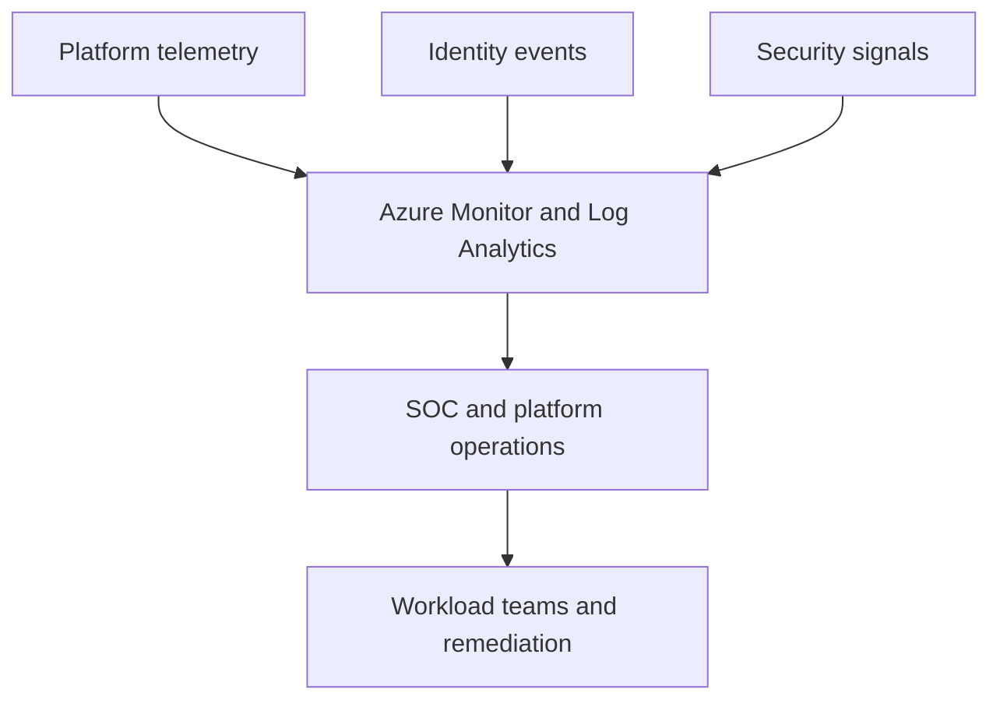

---
content_sources:
  diagrams:
    - id: landing-zone-platform-operations
      type: flowchart
      source: self-generated
      justification: "Shows centralized monitoring, identity, and security operations model for landing zones."
      based_on:
        - https://learn.microsoft.com/en-us/azure/cloud-adoption-framework/manage/
        - https://learn.microsoft.com/en-us/azure/azure-monitor/overview
---
# Landing Zone and Shared Services Platform Operations

Platform operations should provide shared visibility and control without obscuring workload ownership. The goal is a consistent operating model, not a central team that owns every incident. [Validated]

## Centralized monitoring strategy

Use Log Analytics workspace strategy deliberately: centralized enough for cross-estate visibility, but not so centralized that data access, retention, or cost become unmanageable. [Correlated]

Key considerations:

- Common workspace patterns for security and platform telemetry. [Documented]
- Clear tagging and data separation for workload teams. [Observed]
- Shared KQL content, alerts, and dashboards as reusable platform assets. [Validated]

## Identity management at scale

Landing zones need identity guardrails that extend beyond workload code.

- Standardize privileged access workflows and administrative role boundaries. [Documented]
- Separate platform operators, security operations, and workload engineering responsibilities. [Validated]
- Use group-based assignment and lifecycle automation where possible to limit permission drift. [Observed]

## SOC integration

Security operations center integration matters when platform signals, identity events, and workload telemetry must converge for triage. [Correlated]

## Platform operations model

<!-- diagram-id: landing-zone-platform-operations -->

## Operational ownership model

| Area | Primary owner |
|---|---|
| Platform monitoring baseline | Platform operations team. [Observed] |
| Workload-specific dashboards and alerts | Workload teams. [Validated] |
| Identity governance and privileged access | Security or identity team. [Documented] |
| SOC correlation and incident intake | Security operations. [Correlated] |

## Common mistakes

- One central workspace without role, retention, or cost strategy. [Observed]
- Security alerts routed centrally but lacking workload ownership for remediation. [Validated]
- Identity governance implemented as one-time setup instead of continuous lifecycle work. [Correlated]

## Trade-offs to keep visible

- Central visibility improves governance only when workload teams can still access and act on their own signals. [Observed]
- Unified monitoring reduces duplication but can increase data volume and RBAC complexity. [Correlated]
- Identity guardrails must balance least privilege with operational responsiveness. [Validated]

## Architecture review checklist

- Is the workspace strategy clear about retention, ownership, and access?
- Can incidents be handed from central teams to workload teams without losing context?
- Are identity lifecycle and privileged access processes continuously operated?

## Revisit triggers

- Telemetry growth outpaces operational usage. [Observed]
- SOC alerts repeatedly lack workload remediation ownership. [Observed]
- Platform operations tooling becomes harder to govern than the workloads it supports. [Correlated]

## Decision takeaway

Platform operations should standardize visibility and control while preserving the accountability of workload teams closest to business impact. [Validated]

## Related decisions

- Keep shared dashboards and detections versioned as platform assets rather than informal queries. [Observed]
- Revisit workspace and identity operating models when estate size or regulatory boundaries change materially. [Correlated]

## Adoption note

The platform operations model is sustainable only when central teams can enable workload teams instead of becoming the only people who can interpret platform telemetry. [Validated]

## Microsoft Learn references

- [Manage cloud adoption at scale](https://learn.microsoft.com/en-us/azure/cloud-adoption-framework/manage/)
- [Azure Monitor overview](https://learn.microsoft.com/en-us/azure/azure-monitor/overview)
- [Cloud Adoption Framework governance and management](https://learn.microsoft.com/en-us/azure/cloud-adoption-framework/govern/)
