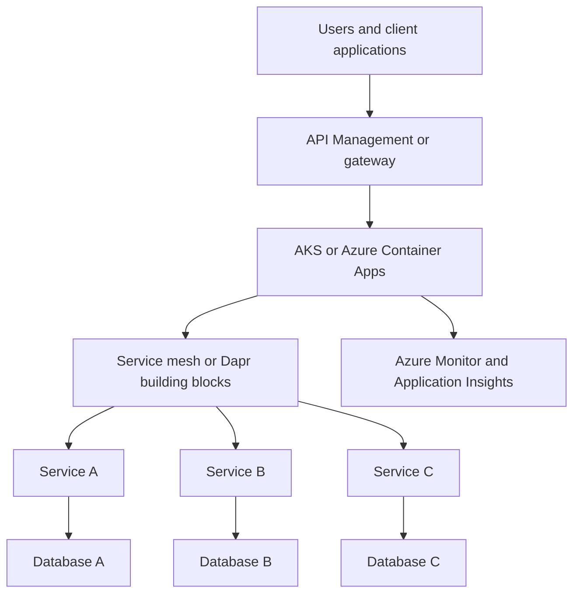

---
content_sources:
  diagrams:
    - id: microservices-platform-baseline-architecture
      type: flowchart
      source: mslearn-adapted
      mslearn_url: https://learn.microsoft.com/en-us/azure/architecture/microservices/
---
# Microservices Platform Baseline

This baseline is for organizations that need a managed service platform for many independently deployable services, strong API control, and consistent platform guardrails. [Documented]

## Recommended baseline

Use **AKS** or **Azure Container Apps** as the service runtime, place **API Management** or another gateway in front of north-south traffic, assign **database per service** as the default data model, and use **service mesh or Dapr-style building blocks** only when cross-cutting service concerns justify the added platform complexity. [Documented]

## Canonical reference architecture

<!-- diagram-id: microservices-platform-baseline-architecture -->

## Service composition

| Layer | Preferred choice | Why | Trade-off |
|---|---|---|---|
| Runtime | AKS for maximum control, Container Apps for reduced platform overhead | Choose based on operational capability and workload complexity. [Documented] | AKS offers control; Container Apps lowers platform burden. [Correlated] |
| North-south traffic | API Management or gateway | Central policy, auth, and productized API exposure. [Documented] | Gateway sprawl can occur if every team creates its own. [Observed] |
| East-west concerns | Service mesh or Dapr only when needed | Standardizes retries, mTLS, discovery, or pub-sub abstractions. [Inferred] | Adds complexity and learning curve. [Observed] |
| Data | Database per service | Preserves service autonomy and bounded context ownership. [Documented] | Increases integration and reporting complexity. [Observed] |

## Why this choice

### Platform for autonomy, not fragmentation

The baseline aims to provide team-level independence inside a governed platform. That means platform engineering must offer secure defaults and shared telemetry without taking away service ownership. [Validated]

### Gateway at the boundary

Central north-south ingress simplifies policy enforcement, versioning strategy, consumer onboarding, and identity integration. [Documented]

### Per-service data ownership

Shared databases often turn microservices into a distributed monolith. Database per service is the cleaner default even when it makes reporting and transaction coordination harder. [Observed]

## When not to use this baseline

- The organization lacks platform engineering capacity. [Observed]
- The domain does not justify service decomposition. [Validated]
- Teams cannot commit to observability, contract discipline, and operational maturity. [Correlated]

## Risks and watchpoints

- Service mesh adoption before teams understand service communication basics. [Observed]
- Shared platform components becoming a central delivery bottleneck. [Correlated]
- Excessive service granularity increasing cost and failure modes. [Observed]

## Trade-offs to keep visible

- Platform flexibility increases both runtime and governance surface area. [Inferred]
- Per-service data ownership improves autonomy but makes cross-service reporting and transactions harder. [Observed]
- Gateway and mesh capabilities help most when service count and policy complexity are already real. [Correlated]

## Architecture review checklist

- Is the runtime choice aligned with platform engineering maturity?
- Are gateway, identity, and data ownership standards explicit?
- Can each service fail or deploy without coordinated platform-wide change?

## Revisit triggers

- Shared database pressure reappears. [Observed]
- Teams use the platform mainly as a place to host one large application. [Observed]
- Tooling overhead grows faster than feature throughput. [Correlated]

## Decision takeaway

This baseline works when the platform provides consistent paved roads while leaving service teams accountable for their own code, contracts, and data. [Validated]

## Microsoft Learn references

- [Architect microservices on Azure](https://learn.microsoft.com/en-us/azure/architecture/microservices/)
- [Interservice communication in a microservices architecture](https://learn.microsoft.com/en-us/azure/architecture/microservices/design/interservice-communication)
- [Data considerations for microservices](https://learn.microsoft.com/en-us/azure/architecture/microservices/design/data-considerations)
- [Azure Kubernetes Service (AKS) overview](https://learn.microsoft.com/en-us/azure/aks/what-is-aks)
- [Azure Container Apps overview](https://learn.microsoft.com/en-us/azure/container-apps/overview)
- [Choose between Azure Container Apps, AKS, and App Service](https://learn.microsoft.com/en-us/azure/container-apps/compare-options)
