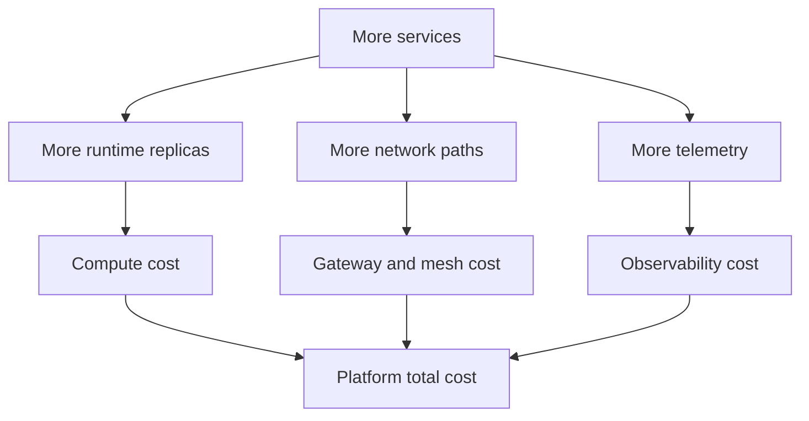

---
content_sources:
  diagrams:
    - id: microservices-platform-cost-map
      type: flowchart
      source: self-generated
      justification: "Maps overhead and anti-patterns common to microservices platforms on Azure."
      based_on:
        - https://learn.microsoft.com/en-us/azure/well-architected/cost-optimization/
        - https://learn.microsoft.com/en-us/azure/architecture/microservices/
---
# Microservices Platform Cost and Anti-Patterns

Microservices platforms cost more than simpler architectures because networking, observability, platform operations, and duplicated service scaffolding are part of the operating model. The architecture is justified only when autonomy and domain complexity return more value than that overhead. [Measured]

## Main cost drivers

| Driver | Why it matters |
|---|---|
| Runtime baseline | Many services need minimum replicas, ingress, and supporting components. [Measured] |
| Networking and gateway layers | Gateways, meshes, and egress add operational and direct cost. [Observed] |
| Observability | Distributed tracing and logs multiply telemetry volume. [Correlated] |
| Platform engineering | Shared platform work is necessary, not optional. [Validated] |

## Anti-patterns

### Distributed monolith

If services cannot deploy independently or fail independently, the platform has the cost of microservices without the benefit. [Validated]

### Shared database

A shared schema undermines bounded contexts and turns service coordination into database coordination. [Observed]

### Nano-services

Overly small services create too much coordination cost for the value delivered. [Measured]

### Tool-first platform sprawl

Adopting mesh, gateway, pub-sub framework, secrets tool, and policy engine all at once can overload teams before the first service proves the model. [Correlated]

## Cost pressure map

<!-- diagram-id: microservices-platform-cost-map -->

## What good looks like

- Service count reflects real bounded contexts. [Validated]
- Platform capabilities are adopted in stages, not all at once. [Observed]
- Cost reviews consider engineering time and operational drag, not only Azure invoice lines. [Correlated]

## Trade-offs to keep visible

- Autonomy gains can be erased by excessive service count. [Measured]
- Platform tooling saves effort only if teams adopt shared practices consistently. [Observed]
- Observability spend is justified when it shortens major-incident diagnosis across services. [Correlated]

## Architecture review checklist

- Is the number of services explainable by domain needs? [Validated]
- Are platform capabilities adopted incrementally? [Observed]
- Does cost review include engineering and operational overhead? [Correlated]

## Revisit triggers

- Teams complain more about platform friction than service delivery benefits. [Observed]
- Shared dependencies and release coordination keep increasing. [Measured]
- Telemetry and gateway costs outpace growth in business capability. [Correlated]

## Decision takeaway

Microservices are economically sound only when organizational speed, fault isolation, and domain clarity outweigh the unavoidable platform tax. [Validated]

## Related decisions

- Merge services when ownership and deployment patterns show the boundaries are artificial. [Observed]
- Delay advanced platform tooling when simpler operating practices would resolve the current pain. [Correlated]

## Adoption note

Review cost alongside architecture review outcomes so service sprawl is challenged with the same rigor as availability or security drift. [Validated]

## Microsoft Learn references

- [Azure Well-Architected Framework cost optimization](https://learn.microsoft.com/en-us/azure/well-architected/cost-optimization/)
- [Architect microservices on Azure](https://learn.microsoft.com/en-us/azure/architecture/microservices/)
- [Cost optimization in the Azure Architecture Framework](https://learn.microsoft.com/en-us/azure/architecture/framework/cost/overview)
