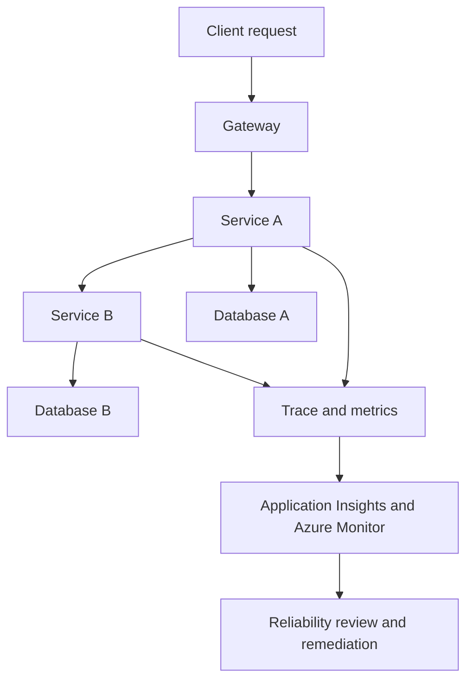

---
content_sources:
  diagrams:
    - id: microservices-platform-data-observability
      type: flowchart
      source: self-generated
      justification: "Shows per-service data ownership and distributed observability loop for microservices platforms."
      based_on:
        - https://learn.microsoft.com/en-us/azure/architecture/microservices/design/data-considerations
        - https://learn.microsoft.com/en-us/azure/azure-monitor/app/distributed-tracing-telemetry-correlation
content_validation:
  status: pending_review
  last_reviewed: '2026-04-22'
  reviewer: agent
  core_claims:
  - claim: Document covers Microservices Platform Data, Observability, and Reliability
      aligned with Azure architecture guidance
    source: https://learn.microsoft.com/en-us/azure/architecture/microservices/design/data-considerations
    verified: false
  - claim: Document includes Microsoft Learn-traceable guidance for Microservices
      Platform Data, Observability, and Reliability
    source: https://learn.microsoft.com/en-us/azure/azure-monitor/app/distributed-tracing-telemetry-correlation
    verified: false
  - claim: Document addresses Database per service for Microservices Platform Data,
      Observability, and Reliability
    source: https://learn.microsoft.com/en-us/azure/architecture/patterns/circuit-breaker
    verified: false
  - claim: Document addresses Distributed tracing with Application Insights for Microservices
      Platform Data, Observability, and Reliability
    source: https://learn.microsoft.com/en-us/azure/architecture/microservices/design/data-considerations
    verified: false
  - claim: Document addresses Reliability patterns for Microservices Platform Data,
      Observability, and Reliability
    source: https://learn.microsoft.com/en-us/azure/azure-monitor/app/distributed-tracing-telemetry-correlation
    verified: false
---
# Microservices Platform Data, Observability, and Reliability

Microservices architectures succeed only when data ownership, tracing, and resilience controls are treated as core design elements rather than optional later enhancements. [Validated]

## Database per service

The default is **database per service** because service autonomy breaks down when many services coordinate through a shared operational schema. [Documented]

Trade-offs to manage:

- Cross-service reporting becomes harder. [Observed]
- Consistency across services must use messaging, orchestration, or reconciliation patterns. [Correlated]
- Data governance must still work across many stores. [Validated]

## Distributed tracing with Application Insights

Tracing is not optional in a microservices platform. Without correlation across services, mean time to diagnosis grows quickly as request paths branch. [Observed]

Architecture implications:

- Standardize correlation IDs and trace context propagation. [Documented]
- Combine application traces with platform logs and dependency telemetry. [Validated]
- Sample intelligently so cost remains sustainable while preserving critical diagnostic paths. [Inferred]

## Reliability patterns

| Pattern | Why it matters |
|---|---|
| Circuit breaker | Prevents failing dependencies from causing repeated cascading calls. [Documented] |
| Health probes | Supports orchestrator decisions and safer rollout behavior. [Documented] |
| Retry with backoff | Handles transient failure but must be scoped to avoid amplifying outages. [Observed] |
| Bulkhead isolation | Limits the impact of one service class on another. [Correlated] |

## Data and observability flow

<!-- diagram-id: microservices-platform-data-observability -->

## Reliability stance

- Design for partial failure as the normal case. [Validated]
- Keep retry budgets and timeout budgets explicit across service chains. [Inferred]
- Ensure readiness probes check what the orchestrator actually needs to know, not every optional dependency. [Observed]

## Common mistakes

- Shared database introduced “temporarily” and never removed. [Observed]
- Tracing enabled inconsistently across services, leaving blind spots in major incidents. [Validated]
- Readiness probes tied to non-critical dependencies, causing avoidable restarts. [Correlated]

## Review questions

1. Is each service's system of record clear?
2. Can one request be traced end to end across services and dependencies?
3. Are resilience patterns consistent enough to avoid accidental retry storms?

## Trade-offs to keep visible

- Database-per-service autonomy raises reconciliation and reporting effort. [Observed]
- Full-fidelity tracing improves diagnostics but can materially increase telemetry cost. [Correlated]
- Retry and circuit-breaker patterns help only when dependency budgets are also explicit. [Correlated]

## Architecture review checklist

- Can traces connect user-facing latency to dependency behavior?
- Is each data store owned by one service boundary?
- Are resilience defaults consistent across the platform?

## Revisit triggers

- Shared reporting or analytics demands start recreating a hidden shared schema. [Observed]
- Telemetry cost grows without corresponding incident-resolution benefit. [Correlated]
- Reliability patterns differ so much between teams that diagnosis becomes inconsistent. [Correlated]

## Decision takeaway

Observability and data ownership are the control mechanisms that keep a microservices platform diagnosable and governable at scale. [Validated]

## Microsoft Learn references

- [Data considerations for microservices](https://learn.microsoft.com/en-us/azure/architecture/microservices/design/data-considerations)
- [Telemetry correlation in Application Insights](https://learn.microsoft.com/en-us/azure/azure-monitor/app/distributed-tracing-telemetry-correlation)
- [Circuit Breaker pattern](https://learn.microsoft.com/en-us/azure/architecture/patterns/circuit-breaker)

## See Also

- [Guide home](../../index.md)
- [Section index](index.md)
- [Start here](../../start-here/overview.md)

## Sources

- [Microsoft Learn source 1](https://learn.microsoft.com/en-us/azure/architecture/microservices/design/data-considerations)
- [Microsoft Learn source 2](https://learn.microsoft.com/en-us/azure/azure-monitor/app/distributed-tracing-telemetry-correlation)
- [Microsoft Learn source 3](https://learn.microsoft.com/en-us/azure/architecture/patterns/circuit-breaker)
