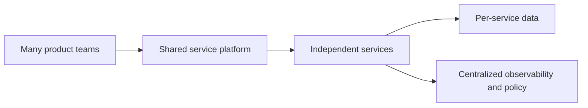

---
content_sources:
  diagrams:
    - id: microservices-platform-scope
      type: flowchart
      source: self-generated
      justification: "Summarizes when to select a microservices platform workload family."
      based_on:
        - https://learn.microsoft.com/en-us/azure/architecture/microservices/
        - https://learn.microsoft.com/en-us/azure/architecture/microservices/design/interservice-communication
---
# Microservices Platform

Use this workload family when domain complexity, team boundaries, and release independence justify a platform that supports many services, independent deployment cycles, and clear service ownership. [Documented]

## When to use this workload type

- Multiple teams need autonomy over service design and delivery. [Observed]
- The domain can be decomposed into bounded contexts with durable ownership boundaries. [Validated]
- Shared runtime governance is still needed for security, networking, and observability. [Correlated]

## Audience

- Platform architects designing a service platform. [Documented]
- Product organizations scaling beyond a single deployable application. [Observed]
- Reviewers assessing interservice communication, data ownership, and operational maturity. [Validated]

## Prerequisites

- Clear reason for decomposition beyond fashion or tool preference. [Validated]
- Platform engineering capacity to support shared controls and paved roads. [Observed]
- Agreement on domain boundaries, API standards, and observability conventions. [Correlated]

## What this family optimizes for

| Priority | Why it matters |
|---|---|
| Team autonomy | Separate release velocity is a core reason to adopt microservices. [Observed] |
| Fault isolation | Smaller blast radius is possible when dependencies are explicit. [Documented] |
| Polyglot flexibility | Some services may need distinct runtimes or scaling patterns. [Inferred] |
| Platform consistency | Shared identity, policy, and telemetry are essential to avoid chaos. [Validated] |

<!-- diagram-id: microservices-platform-scope -->

## Signals that this is the wrong family

- One team owns a simple application with limited change pressure. [Observed]
- Services still require a shared schema and synchronized releases. [Validated]
- Messaging or streaming, not service platform engineering, is the main architecture problem. [Correlated]

## Trade-offs to keep visible

- Team autonomy only pays off when service boundaries are credible. [Validated]
- Platform consistency requires central investment that small organizations may not recover. [Correlated]
- Faster local change can increase system-wide complexity if contracts and observability are weak. [Observed]

## Architecture review checklist

- Is decomposition driven by domain and ownership rather than tooling fashion? [Validated]
- Can teams release and support services independently? [Observed]
- Is there a platform team with clear product responsibilities? [Correlated]

## Revisit triggers

- Shared releases remain common. [Observed]
- Service count grows while domain clarity shrinks. [Observed]
- Teams need simpler workload patterns more than more platform features. [Inferred]

## Decision takeaway

Choose this family when organizational structure, release cadence, and domain complexity all demand a service platform, not simply because containers are available. [Validated]

## Related decisions

- Start with one or two bounded contexts to prove the platform model before scaling to dozens of services. [Observed]
- Keep workload families separate in reviews so not every application is forced into microservices language. [Correlated]

## Adoption note

The first sign of a healthy microservices program is clearer team ownership, not a larger number of repositories or clusters. [Validated]

Ownership should become easier to explain. [Observed]

## Microsoft Learn references

- [Architect microservices on Azure](https://learn.microsoft.com/en-us/azure/architecture/microservices/)
- [Interservice communication in a microservices architecture](https://learn.microsoft.com/en-us/azure/architecture/microservices/design/interservice-communication)
- [Data considerations for microservices](https://learn.microsoft.com/en-us/azure/architecture/microservices/design/data-considerations)

## Next reading

- [Baseline architecture](baseline.md)
- [Networking, identity, and service communication](networking-identity-and-service-communication.md)
- [Data, observability, and reliability](data-observability-and-reliability.md)
