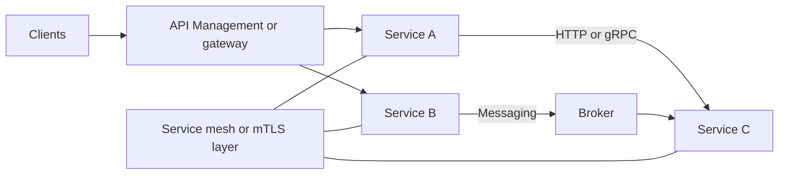

---
content_sources:
  diagrams:
    - id: microservices-platform-service-communication
      type: flowchart
      source: self-generated
      justification: "Shows north-south and east-west communication patterns for a microservices platform on Azure."
      based_on:
        - https://learn.microsoft.com/en-us/azure/architecture/microservices/design/interservice-communication
        - https://learn.microsoft.com/en-us/azure/architecture/patterns/gateway-routing
---
# Microservices Platform Networking, Identity, and Service Communication

Communication architecture determines whether a microservices platform behaves like a coherent system or a distributed reliability problem. [Validated]

## North-south versus east-west communication

- Use an **API gateway** for external traffic, policy enforcement, and consumer-facing contract management. [Documented]
- Use direct service-to-service communication only when ownership, latency, and failure handling are explicit. [Observed]
- Prefer messaging for decoupling when immediate synchronous response is not required. [Correlated]

## HTTP, gRPC, and messaging

| Pattern | Best fit | Trade-off |
|---|---|---|
| HTTP or REST | Broad compatibility and external-facing APIs | Higher payload overhead and looser contracts. [Documented] |
| gRPC | High-throughput internal service calls with strong contracts | Less human-readable and often gateway-sensitive. [Correlated] |
| Messaging | Decoupled workflows and buffered integration | Harder tracing and operational reasoning. [Observed] |

## Identity and trust

Service identity should be workload-native and machine-oriented rather than based on shared secrets. [Documented]

- Use managed identity where platform support exists. [Documented]
- Use mTLS or equivalent service identity patterns when east-west trust boundaries matter. [Correlated]
- Keep user identity propagation separate from service identity to avoid confused-deputy issues. [Validated]

## API gateway and service mesh choices

API Management, Envoy-based gateways, service mesh, and Dapr solve different problems. They should not be selected as a bundle by default. [Observed]

- **API gateway**: consumer policy, auth, throttling, versioning. [Documented]
- **Service mesh**: east-west security, retries, and traffic shaping when scale and risk justify it. [Inferred]
- **Dapr-style sidecars**: app building blocks such as pub-sub and state abstractions for teams that value portability more than raw simplicity. [Correlated]

## Communication topology

<!-- diagram-id: microservices-platform-service-communication -->

## Common mistakes

- Building service-to-service call chains so deep that one user request traverses many services synchronously. [Observed]
- Adopting service mesh before a real need for mTLS, traffic shaping, or policy consistency exists. [Measured]
- Reusing one identity principal across many services. [Validated]

## Review questions

1. Is the communication pattern chosen for business need or platform fashion? [Observed]
2. Can the system tolerate partial failure without user-visible cascade? [Validated]
3. Are user identity, service identity, and admin identity clearly separated? [Documented]

## Trade-offs to keep visible

- Synchronous communication improves immediacy but raises cascade risk. [Observed]
- Stronger east-west identity and mTLS controls add operational complexity that must be justified. [Measured]
- Gateway and mesh adoption should follow a problem statement, not precede it. [Validated]

## Architecture review checklist

- Are service contracts and timeout budgets documented? [Validated]
- Is service identity separated from user and operator identity? [Documented]
- Can the team explain why each communication mode exists? [Observed]

## Revisit triggers

- Average request path keeps adding synchronous hops. [Measured]
- Shared secrets remain in broad use between services. [Observed]
- Gateway policy or service mesh becomes a delivery bottleneck. [Correlated]

## Decision takeaway

Communication architecture should minimize accidental coupling while keeping trust and policy controls understandable to service teams. [Validated]

## Microsoft Learn references

- [Interservice communication in a microservices architecture](https://learn.microsoft.com/en-us/azure/architecture/microservices/design/interservice-communication)
- [Gateway Routing pattern](https://learn.microsoft.com/en-us/azure/architecture/patterns/gateway-routing)
- [API Management architecture guidance](https://learn.microsoft.com/en-us/azure/architecture/web-apps/guides/apim-application-gateway)
