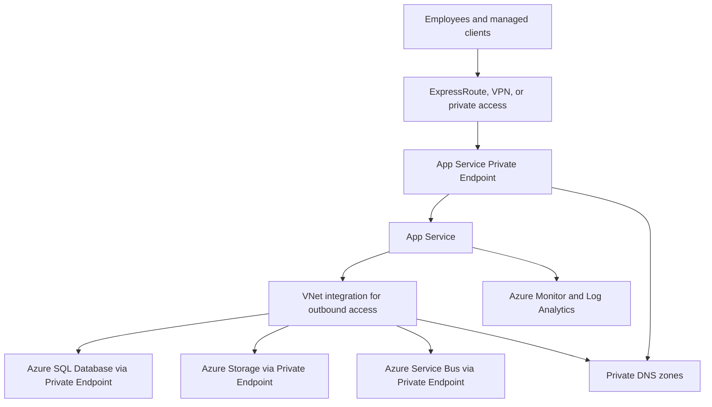

---
content_sources:
  diagrams:
    - id: private-internal-app-baseline-architecture
      type: flowchart
      source: mslearn-adapted
      mslearn_url: https://learn.microsoft.com/en-us/azure/private-link/private-endpoint-overview
      based_on:
        - https://learn.microsoft.com/en-us/azure/app-service/overview-vnet-integration
---
# Private Internal App Baseline

This baseline is for internal applications that need managed web runtime simplicity while keeping users, dependencies, and data paths on private connectivity. [Documented]

## Recommended baseline

Use **App Service Private Endpoint** for private inbound access and **disable public network access** on the App Service to ensure a true private-only posture. Use **Azure App Service VNet integration** for outbound-only access from the app to private dependencies, and connect data services through **Private Endpoints** with **Private DNS zones**. [Documented]

## Canonical reference architecture

<!-- diagram-id: private-internal-app-baseline-architecture -->

## Service composition

| Layer | Preferred choice | Why |
|---|---|---|
| Private user access | Enterprise connectivity through ExpressRoute, VPN, or managed remote access | Aligns application reachability with enterprise network controls. [Documented] |
| Application runtime | App Service with Private Endpoint for inbound and VNet integration for outbound | Managed web hosting with simpler operations than self-managed compute while keeping ingress and egress roles distinct. [Documented] |
| Data access | Private Endpoints to Azure SQL, Storage, and other PaaS services | Removes public endpoint dependence from core dependencies. [Documented] |
| Name resolution | Private DNS zones | Makes private endpoint resolution deterministic across spokes and on-premises integration. [Validated] |

## Why this choice

### Private-by-default reachability

Internal systems often contain operational data, administrative workflows, or sensitive business processes that do not benefit from internet exposure. A private baseline narrows the ingress surface and aligns review conversations around segmentation and controlled access. [Validated]

### Managed runtime, enterprise network posture

This pattern preserves the operational simplicity of App Service while still participating in private network patterns. Teams avoid unnecessary VM or cluster management while keeping enterprise routing and policy control. [Observed]

> [!NOTE]
> App Service **VNet integration is outbound only**. For private inbound access on multitenant App Service, use an **App Service Private Endpoint** and **disable public network access** on the App Service — Private Endpoint and public access can coexist, so disabling public access is required for a true private-only posture. If the workload requires full network isolation with inbound traffic through an **Internal Load Balancer**, use **App Service Environment v3 (ASE v3)** instead, accepting the higher cost profile. [Documented]

### PaaS without public endpoint sprawl

Private Endpoints let teams keep managed services while avoiding the false choice between pure PaaS and “everything on VMs.” The trade-off is higher DNS and network operations complexity, which must be planned explicitly. [Correlated]

## Quality attribute stance

| Attribute | Baseline stance |
|---|---|
| Security | Prefer private endpoints, managed identity, and controlled egress. [Documented] |
| Reliability | Use zone-aware services where supported and avoid single points in DNS or connectivity. [Inferred] |
| Cost | Accept some network premium for reduced exposure and simpler compliance posture. [Observed] |
| Operations | Make DNS, endpoint lifecycle, and connectivity monitoring first-class runbooks. [Observed] |

## When not to use this baseline

- The application must serve internet clients directly. [Documented]
- Teams need container-level portability and service-mesh style communication patterns. [Observed]
- Connectivity dependence on on-premises networks would create an unacceptable availability dependency for cloud-first user access. [Correlated]

## Risks and constraints

- Private DNS misconfiguration can look like random application failure. [Observed]
- VNet integration and endpoint count can create non-obvious network planning limits. [Observed]
- On-premises dependency chains can reduce real availability even when Azure resources are healthy. [Correlated]

## Trade-offs to keep visible

- Private Endpoints preserve PaaS value while shifting more responsibility to DNS and network operations. [Observed]
- Hybrid connectivity can become part of the workload availability budget. [Correlated]
- App Service simplicity remains valuable, but only when private path assumptions are continuously validated. [Validated]

## Architecture review checklist

- Are dependency private endpoints and DNS records part of the baseline runbook?
- Can operators access the environment during a business-critical incident?
- Is the on-premises dependency chain visible in recovery planning?

## Revisit triggers

- Workload growth requires broader external access patterns. [Observed]
- DNS or route drift becomes a recurring failure source. [Observed]
- Teams need container-platform capabilities beyond the managed web baseline. [Inferred]

## Decision takeaway

The baseline works best when the application team accepts that network, DNS, and identity are co-equal parts of the architecture. [Validated]

## Microsoft Learn references

- [Baseline highly available zone-redundant web application](https://learn.microsoft.com/en-us/azure/architecture/web-apps/app-service/architectures/baseline-zone-redundant)
- [Private Endpoint overview](https://learn.microsoft.com/en-us/azure/private-link/private-endpoint-overview)
- [Virtual network integration for App Service](https://learn.microsoft.com/en-us/azure/app-service/overview-vnet-integration)
