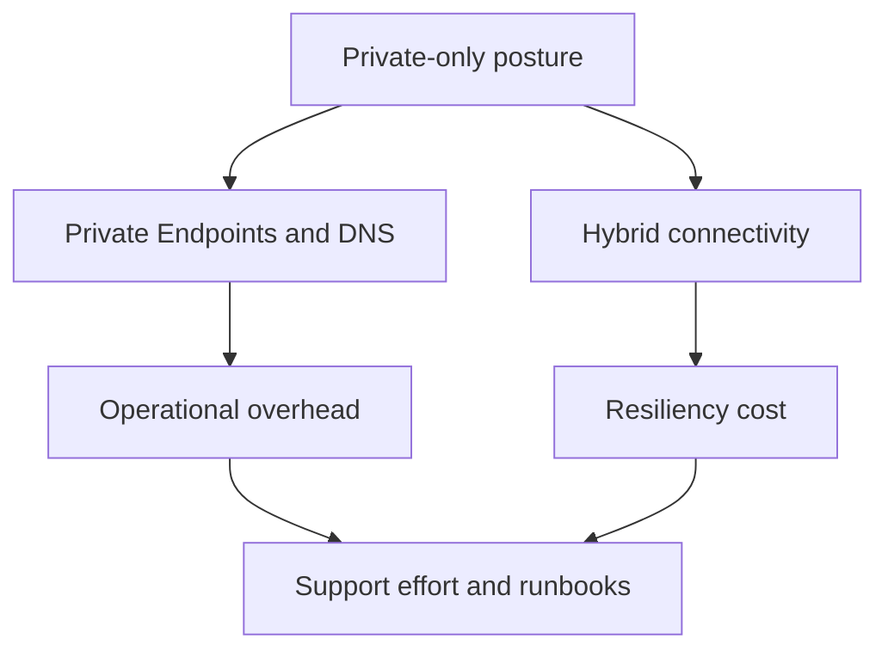

---
content_sources:
  diagrams:
    - id: private-internal-app-cost-drivers
      type: flowchart
      source: self-generated
      justification: "Maps common cost drivers and architectural anti-patterns for private internal applications."
      based_on:
        - https://learn.microsoft.com/en-us/azure/well-architected/cost-optimization/
        - https://learn.microsoft.com/en-us/azure/private-link/private-endpoint-overview
---
# Private Internal App Cost and Anti-Patterns

Private architectures often appear inexpensive at the application layer but accumulate cost and complexity in networking, DNS, and hybrid connectivity. [Measured]

## Cost factors to watch

| Area | Why cost rises |
|---|---|
| Private Endpoints | Per-endpoint deployment growth across environments and services. [Measured] |
| VNet integration and address planning | Additional network boundaries and operational overhead. [Observed] |
| ASE v3 isolation model | Full isolation and ILB-based inbound access typically carry higher cost than multitenant App Service with Private Endpoint. [Correlated] |
| Hybrid connectivity | ExpressRoute circuits, gateways, and redundant paths. [Documented] |
| Premium runtime tiers | Chosen for convenience even when scale or isolation needs are modest. [Observed] |

## Cost optimization guidance

- Consolidate endpoint strategy where security boundaries allow, but do not compromise blast-radius requirements. [Correlated]
- Review whether private-only access is needed for every environment or whether lower tiers can use simpler patterns with documented exception handling. [Inferred]
- Align retention and logging volume with operational use; internal systems frequently over-collect telemetry. [Measured]

## Common anti-patterns

### Unnecessary premium SKUs

Internal systems sometimes inherit premium plans from public reference designs without a measurable need for scale or edge resilience. [Observed]

### DNS treated as implementation detail

Private DNS design is an architecture concern. If it is deferred, teams usually pay later through outages, support time, and duplicated workarounds. [Validated]

### SNAT exhaustion and hidden egress limits

Applications with many outbound private or hybrid dependencies can encounter connection scaling issues if outbound behavior is not reviewed. [Correlated]

- Treating VNet integration as if it provides private inbound access on multitenant App Service. Private ingress requires an **App Service Private Endpoint** and corresponding DNS design; ILB-based ingress belongs to **ASE v3** scenarios. [Inferred]

### Recreating on-premises complexity in Azure

Lifting old trust boundaries and appliance patterns directly into Azure often adds cost without improving security outcomes. [Inferred]

## Cost and complexity map

<!-- diagram-id: private-internal-app-cost-drivers -->

## What good looks like

- Every networking premium has a security or compliance rationale. [Validated]
- Connectivity and DNS ownership are explicit. [Observed]
- Runtime SKU choices match actual scale and performance needs. [Measured]

## Trade-offs to keep visible

- Private networking spend is justified only when it reduces real business risk or compliance exposure. [Measured]
- Central DNS and connectivity services can be efficient or expensive depending on operational maturity. [Correlated]
- Simplifying access with premium services may still be cheaper than prolonged outage and support effort. [Inferred]

## Architecture review checklist

- Does each private endpoint or premium tier have a documented reason? [Validated]
- Are hybrid connectivity costs visible to workload owners? [Observed]
- Is DNS support effort included in the architecture's real cost model? [Correlated]

## Revisit triggers

- Networking charges rise faster than business criticality. [Measured]
- Support teams spend excessive time diagnosing private resolution and path issues. [Observed]
- Lower environments copy every production-grade network control without clear value. [Inferred]

## Decision takeaway

The right private architecture cost model includes platform complexity, support time, and recovery friction alongside Azure invoice items. [Validated]

## Related decisions

- Reduce duplicated lower-environment controls when they do not materially change risk. [Measured]
- Compare private-path costs against the cost of broader public exposure with compensating controls. [Correlated]

## Adoption note

Private architecture remains economically sound when each additional network control can be traced to a real security, compliance, or continuity outcome. [Observed]

## Microsoft Learn references

- [Azure Well-Architected Framework cost optimization](https://learn.microsoft.com/en-us/azure/well-architected/cost-optimization/)
- [Private Endpoint overview](https://learn.microsoft.com/en-us/azure/private-link/private-endpoint-overview)
- [Azure Architecture Framework cost overview](https://learn.microsoft.com/en-us/azure/architecture/framework/cost/overview)
