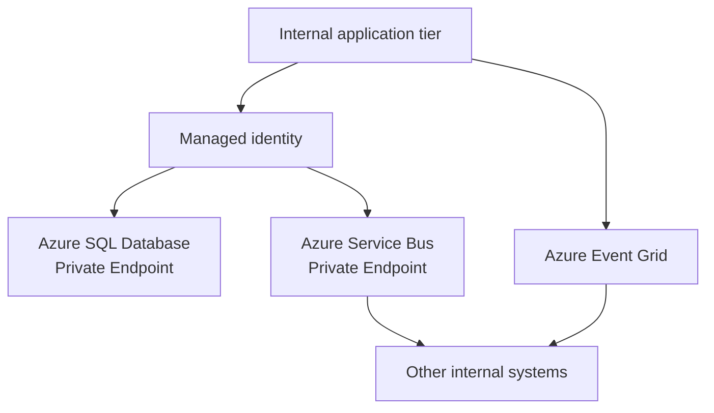

---
content_sources:
  diagrams:
    - id: private-internal-app-data-integration
      type: flowchart
      source: self-generated
      justification: "Shows private data and integration paths for internal applications using managed identity and messaging."
      based_on:
        - https://learn.microsoft.com/en-us/azure/service-bus-messaging/service-bus-messaging-overview
        - https://learn.microsoft.com/en-us/azure/architecture/guide/technology-choices/data-store-overview
---
# Private Internal App Data and Integration

Internal applications often sit at the center of enterprise process flows, so architecture quality depends on predictable data access and controlled integration boundaries rather than public API scale alone. [Observed]

In this workload family, App Service private ingress and private dependency access are separate concerns: use **Private Endpoint** for inbound reachability to the app, and use **VNet integration** for outbound calls from the app to databases, messaging, and other private services. [Documented]

## Database access over private endpoints

The preferred baseline is to keep database access on private network paths and authenticate through managed identity where the service combination supports it. [Documented]

Benefits:

- Reduces exposed endpoints and credential sprawl. [Validated]
- Makes data-path ownership clearer during reviews. [Observed]
- Supports policy enforcement through networking and RBAC together. [Correlated]

## Service Bus and Event Grid for internal integration

Use messaging when internal systems have different life cycles, need buffering, or should be protected from direct synchronous dependency chains. [Documented]

| Integration need | Preferred pattern | Why |
|---|---|---|
| Command or guaranteed business workflow | Service Bus queue or topic | Delivery controls and dead-letter capabilities support enterprise workflows. [Documented] |
| Lightweight notifications | Event Grid | Efficient event fan-out for event subscribers. [Documented] |
| Tight synchronous dependency | Direct API call only when latency and consistency need it | Simpler semantics but higher blast radius. [Observed] |

## Managed identity for all connections

Managed identity should be the default for app-to-data and app-to-messaging paths. Embedded secrets create rotation overhead and often outlive the systems that introduced them. [Documented]

## Integration topology

<!-- diagram-id: private-internal-app-data-integration -->

## Data design guidance

- Keep operational data in a clearly defined system of record. [Validated]
- Do not let messaging become an undocumented data integration layer with no schema or ownership. [Observed]
- Use event notifications to reduce polling and direct coupling where consistency rules allow. [Inferred]

## Common pitfalls

- Service Bus used as a hidden retry engine for synchronous failures that should be fixed at the source. [Observed]
- Database private connectivity added, but application authentication still uses static credentials. [Correlated]
- Multiple internal applications writing directly to one database schema with no ownership boundary. [Validated]

## Review questions

1. Are integration responsibilities clear enough to know who owns schema, retry, and dead-letter handling?
2. Is every sensitive dependency using a private access path where supported?
3. Are secrets still present where managed identity could remove them?

## Trade-offs to keep visible

- Private data access reduces exposure but can hide dependency sprawl if ownership is weak. [Observed]
- Messaging reduces tight coupling only when schemas and replay rules are actively governed. [Correlated]
- Managed identity simplifies secret management while increasing the importance of RBAC hygiene. [Validated]

## Architecture review checklist

- Is every system of record clearly identified?
- Are integration channels chosen for business semantics rather than convenience?
- Can identity and authorization issues be diagnosed without falling back to shared secrets?

## Revisit triggers

- Direct database sharing starts replacing documented interfaces. [Observed]
- Queue ownership or retry behavior becomes ambiguous. [Observed]
- More external integration needs begin to challenge the private-only assumptions. [Inferred]

## Decision takeaway

Internal application integration stays maintainable when data ownership, message ownership, and identity ownership are all explicit. [Validated]

## Microsoft Learn references

- [Service Bus messaging overview](https://learn.microsoft.com/en-us/azure/service-bus-messaging/service-bus-messaging-overview)
- [Choose a data store for an application](https://learn.microsoft.com/en-us/azure/architecture/guide/technology-choices/data-store-overview)
- [Managed identities for Azure resources](https://learn.microsoft.com/en-us/azure/active-directory/managed-identities-azure-resources/overview)
