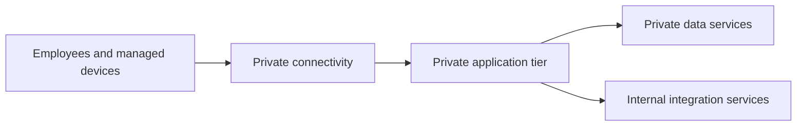

---
content_sources:
  diagrams:
    - id: private-internal-app-scope
      type: flowchart
      source: self-generated
      justification: "Summarizes decision scope for private internal application architectures on Azure."
      based_on:
        - https://learn.microsoft.com/en-us/azure/private-link/private-endpoint-overview
        - https://learn.microsoft.com/en-us/azure/app-service/overview-vnet-integration
---
# Private Internal App

Use this workload family for line-of-business applications, internal portals, and operational systems that should not expose internet-facing endpoints and can rely on corporate network connectivity, private access patterns, and enterprise identity controls. [Documented]

## When to use this workload type

- Users are employees, contractors, or managed devices on trusted networks. [Documented]
- The application can be reached through ExpressRoute, VPN, private peering, or managed remote access paths. [Observed]
- Data stores and integrations benefit from removing public network exposure. [Validated]

This family is especially useful when the business driver is risk reduction, internal process integrity, or regulatory separation rather than consumer growth and internet elasticity. [Inferred]

For Azure App Service variants in this family, private inbound access should terminate on an **App Service Private Endpoint**, while **VNet integration** is reserved for outbound connectivity from the app to private dependencies. [Documented]

## Audience

- Enterprise and solution architects designing internal business systems. [Documented]
- Platform teams standardizing private application blueprints. [Observed]
- Security and network reviewers validating segmentation and egress assumptions. [Validated]

## Prerequisites

- Defined corporate connectivity pattern such as hub-spoke, Virtual WAN, or branch VPN. [Assumed]
- Agreement on private DNS ownership and naming. [Observed]
- Identity source and group lifecycle defined in Microsoft Entra ID or a federated workforce identity model. [Documented]

## What this family optimizes for

| Priority | Why it matters |
|---|---|
| Reduced exposure | Private-only reachability lowers public attack surface. [Documented] |
| Controlled east-west traffic | Internal workloads often depend on many enterprise systems. [Observed] |
| Predictable enterprise access | Identity, network, and DNS ownership need strong operating discipline. [Validated] |
| Data protection by topology | Private endpoints and managed identity reduce credential and endpoint sprawl. [Correlated] |

<!-- diagram-id: private-internal-app-scope -->

## Architecture assumptions

- Public endpoints should be disabled or operationally unreachable wherever practical. [Documented]
- Network and DNS design are part of the application baseline, not separate afterthoughts. [Validated]
- App Service private ingress depends on **Private Endpoint** plus **Private DNS**; VNet integration alone does not make the app privately reachable. [Documented]
- Managed identity should replace embedded secrets for service-to-service connections by default. [Documented]

## Signals that this is the wrong family

- Users are predominantly external customers or partner systems over the internet. [Documented]
- The system needs independent service-by-service deployment autonomy across many teams. [Observed]
- The dominant requirement is event routing and asynchronous choreography rather than an internal application front end. [Inferred]

## Trade-offs to keep visible

- Reduced public exposure often comes with higher DNS and hybrid networking complexity. [Correlated]
- Private-only access is valuable only if user and operator routes remain dependable during incidents. [Observed]
- Managed services still require enterprise network design discipline. [Validated]

## Architecture review checklist

- Are private DNS and connectivity ownership clearly assigned? [Validated]
- Can the application operate if one hybrid path is impaired? [Correlated]
- Is the private posture tied to a real business or compliance need? [Observed]

## Revisit triggers

- Users increasingly need secure internet access rather than network-bound access. [Observed]
- Connectivity and DNS operations dominate incident volume. [Observed]
- The application is becoming a platform for many autonomous teams rather than one internal product. [Inferred]

## Decision takeaway

Choose this family when private reachability and controlled enterprise access are core architecture goals, not incidental preferences. [Validated]

## Adoption note

Internal application baselines are most effective when application, network, and identity teams agree on one service ownership model before implementation begins. [Correlated]

## Microsoft Learn references

- [Private Endpoint overview](https://learn.microsoft.com/en-us/azure/private-link/private-endpoint-overview)
- [Baseline highly available zone-redundant web application](https://learn.microsoft.com/en-us/azure/architecture/web-apps/app-service/architectures/baseline-zone-redundant)
- [Virtual network integration for App Service](https://learn.microsoft.com/en-us/azure/app-service/overview-vnet-integration)
- [Azure Monitor overview](https://learn.microsoft.com/en-us/azure/azure-monitor/overview)

## Next reading

- [Baseline architecture](baseline.md)
- [Network and access decisions](network-and-access.md)
- [Data and integration decisions](data-and-integration.md)
