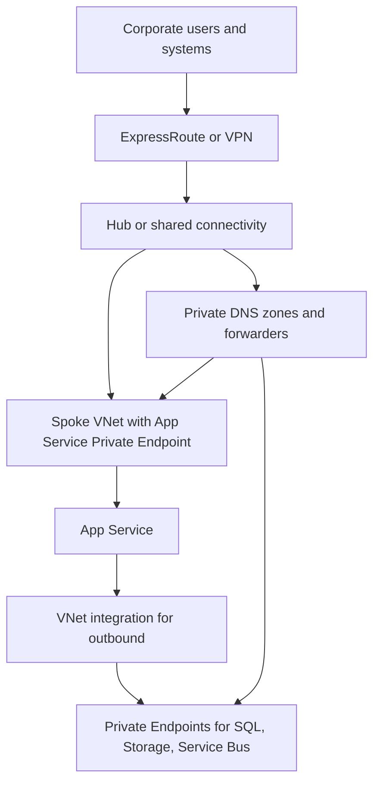

---
content_sources:
  diagrams:
    - id: private-internal-app-network-access
      type: flowchart
      source: self-generated
      justification: "Summarizes network and access flow for private internal applications using Private Link, VNet integration, and enterprise connectivity."
      based_on:
        - https://learn.microsoft.com/en-us/azure/private-link/private-endpoint-overview
        - https://learn.microsoft.com/en-us/azure/app-service/overview-vnet-integration
        - https://learn.microsoft.com/en-us/azure/dns/private-dns-privatednszone
---
# Private Internal App Network and Access

For private internal apps, architecture quality is determined as much by routing, DNS, and access segmentation as by application code. [Validated]

## Preferred network posture

- Use **Private Endpoints** for data and integration services whenever supported. [Documented]
- Use **App Service Private Endpoint** for inbound private access to the application tier and **disable public network access** on the App Service to ensure a true private-only posture. [Documented]
- Use **VNet integration** so the application tier can reach private dependencies without public egress assumptions; this is outbound only. [Documented]
- Apply **NSG rules** and route control to enforce least-necessary east-west communication. [Observed]

## Private DNS design

Private endpoint architectures fail most often on name resolution drift rather than on service availability. [Observed]

Design expectations:

- Assign clear ownership for Private DNS zones. [Validated]
- Decide whether DNS is centralized in a hub or delegated per environment. [Correlated]
- Validate split-horizon and on-premises forwarding behavior before production cutover. [Validated]

## On-premises connectivity choices

| Connectivity option | Best fit | Trade-off |
|---|---|---|
| ExpressRoute | Stable, high-dependency enterprise traffic | Higher fixed cost but more predictable enterprise connectivity. [Documented] |
| Site-to-site VPN | Lower volume or transitional hybrid scenarios | Lower cost but typically less deterministic than dedicated circuits. [Documented] |
| Managed remote access plus private app exposure | User-centric internal apps without broad network dependency | May reduce branch dependency but needs stronger device and identity controls. [Inferred] |

## Network access topology

<!-- diagram-id: private-internal-app-network-access -->

> [!NOTE]
> On multitenant App Service, **VNet integration does not provide private inbound access**. Use **Private Endpoint** for inbound private reachability and the `privatelink.azurewebsites.net` Private DNS zone for name resolution. If the workload needs full network isolation and inbound access through an **Internal Load Balancer**, consider **ASE v3**, which typically carries a higher cost. [Documented]

## NSG and route design principles

- Default-deny where possible for lateral movement paths. [Validated]
- Explicitly allow only application-to-dependency ports and subnets. [Observed]
- Document route exceptions so troubleshooting can distinguish intended service chaining from accidental asymmetry. [Correlated]

## Access model decisions

### Workforce identity

Use Microsoft Entra ID for workforce access where possible, and apply Conditional Access, compliant device policy, or privileged access workflows outside the app whenever enterprise posture requires it. [Documented]

### Administrative access

Do not collapse user and operator paths into the same endpoint. Separate administration interfaces, management networks, and privileged identity assignments. [Validated]

## Architecture review questions

1. Can any dependency still be reached from the public internet when the intended model is private-only? [Validated]
2. Is DNS centrally governed enough to avoid split-resolution surprises? [Observed]
3. Does failure of the on-premises network make the cloud application unusable even for cloud-hosted operators? [Correlated]

## Trade-offs to keep visible

- More segmentation improves control but increases troubleshooting paths. [Observed]
- Central DNS simplifies standards yet can create shared dependency concentration. [Correlated]
- Private access models fail most often at the boundaries between identity, DNS, and routing ownership. [Validated]

## Architecture review checklist

- Is private DNS forwarding tested from every relevant network edge? [Validated]
- Are NSG rules minimal and documented enough for incident review? [Observed]
- Can operators explain the intended egress and east-west paths? [Validated]

## Revisit triggers

- Private name resolution issues become a regular outage cause. [Observed]
- User access patterns shift toward broader remote access models. [Observed]
- Network policy exceptions outnumber the baseline rules. [Correlated]

## Decision takeaway

Strong private access architecture depends on predictable name resolution and clearly governed network paths more than on any single Azure service choice. [Validated]

## Microsoft Learn references

- [Private Endpoint overview](https://learn.microsoft.com/en-us/azure/private-link/private-endpoint-overview)
- [Azure Private DNS zones overview](https://learn.microsoft.com/en-us/azure/dns/private-dns-privatednszone)
- [Virtual network integration for App Service](https://learn.microsoft.com/en-us/azure/app-service/overview-vnet-integration)
