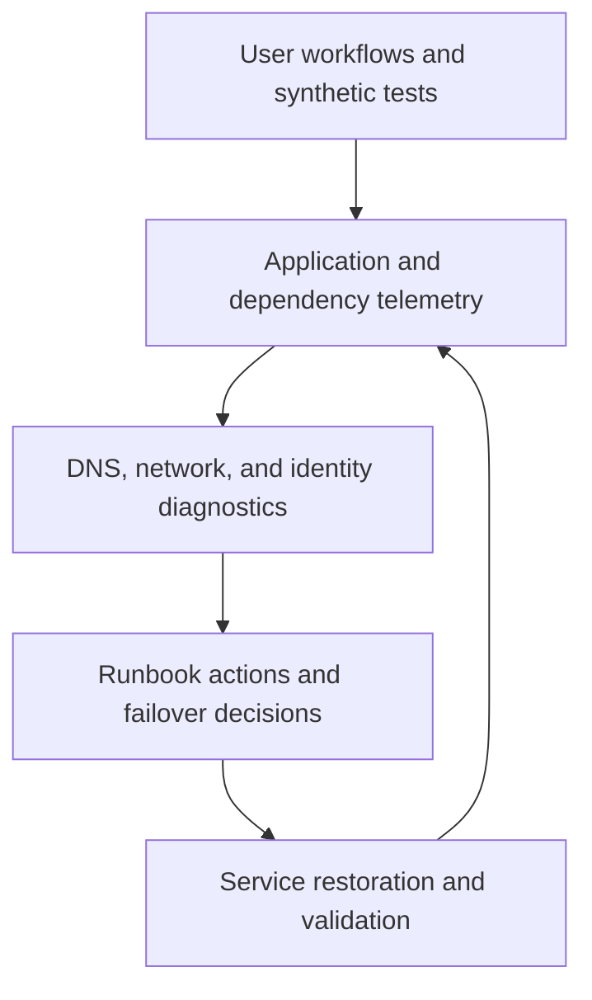

---
content_sources:
  diagrams:
    - id: private-internal-app-observability-loop
      type: flowchart
      source: self-generated
      justification: "Illustrates monitoring and recovery loop for private internal applications with private dependencies."
      based_on:
        - https://learn.microsoft.com/en-us/azure/azure-monitor/overview
        - https://learn.microsoft.com/en-us/azure/reliability/reliability-app-service
---
# Private Internal App Operations and Reliability

Internal workloads still need explicit SLOs, but those targets often prioritize business-process continuity and supportability over internet-visible latency metrics. [Inferred]

## SLO guidance

| Internal workload type | Typical target | What it implies |
|---|---|---|
| Back-office support app | 99.5% to 99.9% | Good rollback and restore matter more than active-active design. [Inferred] |
| Operational process system | 99.9% to 99.95% | Requires dependency monitoring, tested failover, and runbook maturity. [Observed] |
| Enterprise-critical internal platform | 99.95% or higher | Network, identity, and dependency budgets must be managed explicitly. [Observed] |

## Monitoring without public endpoints

The absence of public endpoints changes probe strategy but not the need for observability. [Validated]

- Use private network synthetic probes from representative locations. [Observed]
- Centralize telemetry in Azure Monitor and Log Analytics with clear environment tagging. [Documented]
- Correlate connectivity, DNS, and dependency failures with application metrics. [Correlated]

## Private endpoint health monitoring

Private endpoint failures often present as timeouts, DNS misresolution, or intermittent authentication issues rather than explicit endpoint alarms. [Observed]

For App Service workloads, monitor the **Private Endpoint** path for inbound user access separately from **VNet integration** paths used for outbound dependency calls. [Inferred]

Operational expectations:

- Monitor name resolution success paths. [Validated]
- Include dependency connection checks in readiness and smoke tests. [Correlated]
- Track hybrid network circuit health as part of application availability review. [Observed]

## Reliability loop

<!-- diagram-id: private-internal-app-observability-loop -->

## DR strategy

- Prefer recovery strategies that include data, DNS, and connectivity validation together. [Validated]
- Document what happens when Azure is healthy but the enterprise network path is not. [Observed]
- Keep operator access paths available during major incidents so recovery does not depend on the same failing route as end users. [Inferred]

## Ownership model

| Area | Primary owner |
|---|---|
| Application behavior and release | Product team. [Validated] |
| Private connectivity and DNS | Platform networking team. [Observed] |
| Identity governance | Central identity or security team with workload input. [Documented] |

## Failure patterns to drill

- Private DNS zone linkage removed or misrouted. [Observed]
- ExpressRoute or VPN impairment during a production business cycle. [Observed]
- Service dependency reachable but blocked by identity or RBAC drift. [Correlated]

## Trade-offs to keep visible

- Private access reduces exposure but increases dependence on enterprise network health. [Correlated]
- Central monitoring helps diagnostics only if network and DNS signals are included with application telemetry. [Validated]
- DR planning must account for operator access as well as end-user access. [Observed]

## Architecture review checklist

- Are private dependency checks built into synthetic monitoring?
- Can the team distinguish Azure service health from hybrid path failure?
- Are DNS and connectivity drills part of reliability testing?

## Revisit triggers

- Most incidents trace back to hidden network dependencies. [Observed]
- Business continuity requirements exceed the current hybrid design. [Observed]
- Central monitoring exists, but recovery still depends on ad hoc tribal knowledge. [Correlated]

## Decision takeaway

Reliable internal applications require an operating model that treats connectivity and name resolution as part of production health, not background infrastructure. [Validated]

## Microsoft Learn references

- [Azure Monitor overview](https://learn.microsoft.com/en-us/azure/azure-monitor/overview)
- [Azure App Service reliability](https://learn.microsoft.com/en-us/azure/reliability/reliability-app-service)
- [Business continuity and disaster recovery guidance](https://learn.microsoft.com/en-us/azure/architecture/framework/resiliency/overview)
