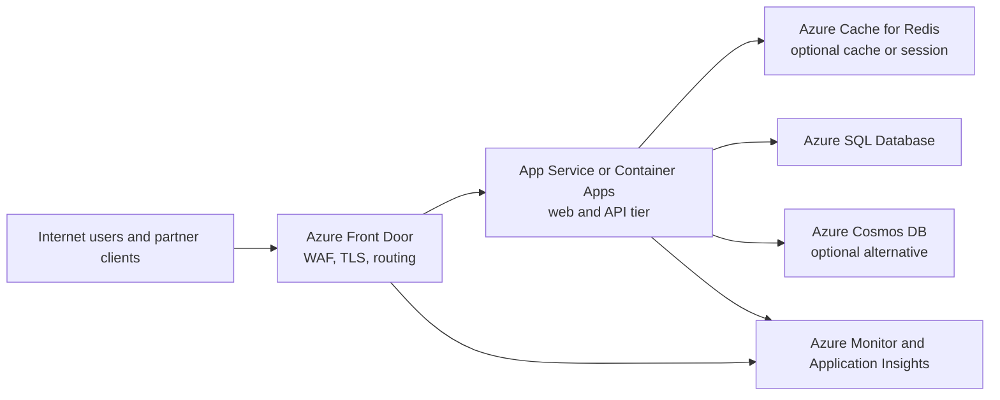

---
content_sources:
  diagrams:
    - id: public-web-api-baseline-architecture
      type: flowchart
      source: mslearn-adapted
      mslearn_url: https://learn.microsoft.com/en-us/azure/architecture/web-apps/app-service/architectures/baseline-zone-redundant
---
# Public Web and API Baseline

This baseline fits managed internet-facing applications that need strong default reliability, edge protection, and a clear path to multi-region expansion without adopting full Kubernetes complexity on day one. [Documented]

## Decision question

What is the default Azure architecture for public web applications and APIs when a team needs managed scale, resilient ingress, and operationally simple data access? [Validated]

## Recommended baseline

Use **Azure Front Door** as the global ingress and WAF layer, terminate at **Azure App Service** or **Azure Container Apps** for the web and API tier, and place operational data in **Azure SQL Database** or **Azure Cosmos DB** depending on transactional and distribution needs. Add **Azure Cache for Redis** only when latency, session, or hot-read patterns justify it. [Documented]

## Canonical reference architecture

<!-- diagram-id: public-web-api-baseline-architecture -->

## Service composition

| Layer | Primary choice | Use when | Alternative | Main trade-off |
|---|---|---|---|---|
| Global entry | Azure Front Door Standard or Premium | Need global anycast edge, WAF, and origin routing | Application Gateway alone for regional-only exposure | Front Door adds edge cost but simplifies internet entry. [Documented] |
| Web runtime | App Service | Managed HTTP hosting and strong operational simplicity matter most | Container Apps for container packaging and finer scale behavior | App Service is simpler; Container Apps offers more runtime flexibility. [Correlated] |
| Relational data | Azure SQL Database | Strong transactional consistency and familiar relational patterns are needed | SQL Managed Instance when compatibility needs are higher | Managed Instance increases operational and cost footprint. [Documented] |
| Distributed data | Azure Cosmos DB | Global distribution, flexible schema, or low-latency reads dominate | Azure SQL Database with read replicas | Cosmos DB changes consistency and cost design assumptions. [Measured] |
| Cache and session | Azure Cache for Redis | Hot reads, token/session offload, or event buffering is required | In-memory cache per instance for low criticality | Redis reduces repeated data access but adds stateful operations. [Observed] |

## Why this choice

### Front Door at the edge

Front Door centralizes TLS termination, WAF policy, custom domain routing, and origin health evaluation. That combination keeps internet edge concerns outside the application tier and reduces the number of public endpoints teams must manage. [Documented]

### Managed application runtime

App Service and Container Apps reduce infrastructure management burden, making deployment safety, autoscaling, and diagnostics available earlier in the lifecycle. For many public applications, that translates into better operational maturity than self-managed VM or cluster approaches. [Observed]

### Right-sized data path

Most public web applications are operational systems, not analytical platforms. A transactional store plus optional cache is the simplest reliable baseline. Add Cosmos DB only when global distribution or partitioned document-style access is a workload requirement rather than a platform preference. [Inferred]

## Quality attribute priorities

| Attribute | Baseline stance |
|---|---|
| Security | Layered edge controls, managed identity, and minimized public origin exposure. [Documented] |
| Reliability | Zone-redundant managed services first; multi-region introduced when business continuity needs justify it. [Documented] |
| Cost | Start with managed services and right-size scale units before adding premium edge or active-active regions. [Measured] |
| Performance | Cache reads and static assets close to users; keep origin latency predictable. [Correlated] |
| Operations | Favor platform features such as health checks, slots, and built-in telemetry. [Observed] |

## Design notes

- Prefer stateless application instances so scale-out remains straightforward. [Documented]
- Keep admin surfaces separate from customer-facing APIs. [Validated]
- Avoid forcing every request through synchronous downstream calls when a queue would isolate spikes better. [Inferred]
- Use private origin access where supported so the app tier is not directly internet exposed. [Documented]

## When not to use this baseline

- The workload is private-only and does not require public ingress. [Documented]
- The domain has many independently deployable services with separate team ownership, making a single web tier an artificial bottleneck. [Observed]
- The dominant traffic pattern is event ingestion or streaming, not request-response interaction. [Inferred]

## Risks and watchpoints

- Session affinity can hide poor state design and reduce scale efficiency. [Observed]
- Cosmos DB cost can rise quickly when partitioning and RU allocation are chosen without measured access patterns. [Measured]
- Multi-region active-active adds operational complexity that many teams underestimate in deployment, cache invalidation, and data conflict handling. [Correlated]

## Evidence and references

- [Baseline highly available zone-redundant web application](https://learn.microsoft.com/en-us/azure/architecture/web-apps/app-service/architectures/baseline-zone-redundant)
- [Azure Front Door overview](https://learn.microsoft.com/en-us/azure/frontdoor/front-door-overview)
- [Data store choice guide](https://learn.microsoft.com/en-us/azure/architecture/guide/technology-choices/data-store-overview)

## Next decisions

Continue with [Network, edge, and identity](network-edge-and-identity.md) and [Data and state](data-and-state.md) to refine ingress, authentication, and persistence choices.
