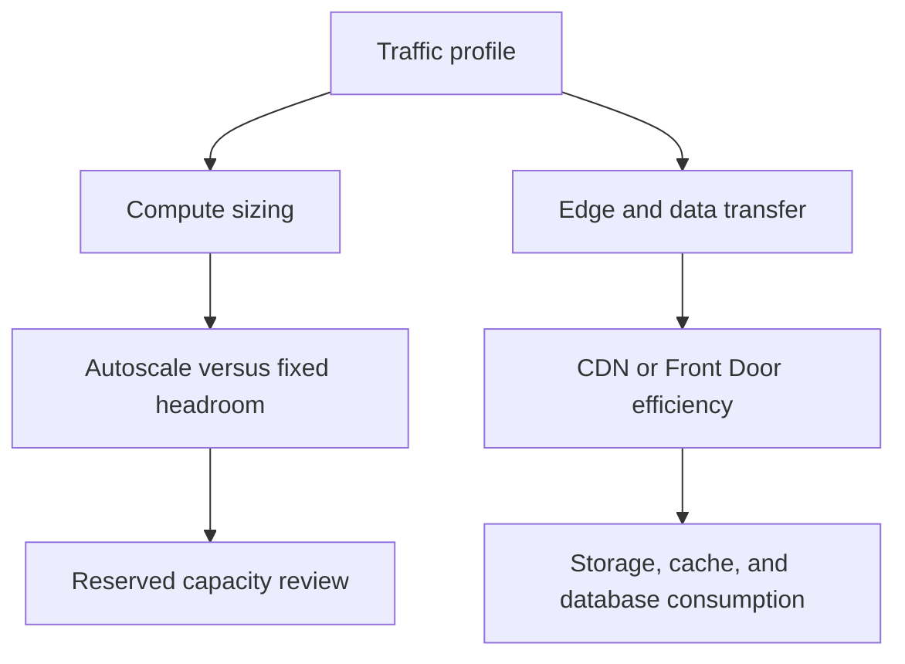

---
content_sources:
  diagrams:
    - id: public-web-api-cost-pressure-points
      type: flowchart
      source: self-generated
      justification: "Maps typical public web workload cost drivers and anti-patterns."
      based_on:
        - https://learn.microsoft.com/en-us/azure/well-architected/cost-optimization/
        - https://learn.microsoft.com/en-us/azure/architecture/web-apps/app-service/architectures/baseline-zone-redundant
---
# Public Web and API Cost and Anti-Patterns

Public workloads often accumulate cost through defensive overprovisioning, premium edge features that are not actively used, and data services selected for hypothetical scale rather than measured demand. [Correlated]

## Main cost drivers

| Layer | Typical driver | Review signal |
|---|---|---|
| Edge | WAF policy tier, rules processing, outbound data transfer | Is global edge capability actually required? |
| Compute | Always-on instance count, premium plans, idle headroom | Does peak demand justify the baseline capacity? |
| Data | Provisioned throughput, storage redundancy, backup retention | Are consistency and replication settings tied to business requirements? |
| Observability | High-cardinality telemetry and long retention | Is all collected data used operationally? |

## Cost optimization guidance

- Right-size App Service plans and review whether isolated or premium tiers are used for a documented requirement. [Documented]
- Compare App Service reserved capacity or savings options for steady-state workloads. [Documented]
- Use Container Apps scale-to-zero only when latency expectations and traffic patterns support it; otherwise cold-start avoidance may justify always-ready instances. [Correlated]
- Put static assets on the right delivery path to reduce repeated origin processing. [Observed]

## Common anti-patterns

### Over-provisioning for fear of spikes

Teams sometimes run peak-season capacity year-round because autoscale policy confidence is low. This raises cost without improving architecture quality. The fix is to validate scaling behavior with load testing and clear rollback thresholds. [Validated]

### Paying for premium features without consuming them

Premium edge, premium app plans, and advanced data replication can remain enabled even when no business driver depends on them. Review utilization and architecture rationale quarterly. [Observed]

### Missing reserved capacity opportunities

Stable, long-lived web workloads often qualify for discounts that are ignored because ownership of runtime cost and subscription commitments is unclear. [Correlated]

### Treating cache as free performance

Redis can lower origin load, but it also adds service cost, memory sizing decisions, and operational risk. If cache hit rate is low or data churn is high, the economics may not work. [Correlated]

## Cost review flow

<!-- diagram-id: public-web-api-cost-pressure-points -->

## What good looks like

- A documented reason exists for every premium tier. [Validated]
- Performance tests inform scale policy instead of guesswork. [Validated]
- Cost anomalies are reviewed with architecture context, not only invoice data. [Correlated]

## Trade-offs to keep visible

- Premium runtime or edge tiers are worthwhile only when they protect a measured user or business outcome. [Inferred]
- Cost savings from autoscale depend on confidence in performance testing and rollback. [Observed]
- Data and telemetry spend can outweigh compute when left ungoverned. [Correlated]

## Architecture review checklist

- Is every premium capability tied to a requirement or validation result?
- Are cache, database, and observability costs reviewed together?
- Does the team revisit reserved capacity or savings options for stable demand?

## Revisit triggers

- Spending grows while utilization and SLO performance stay flat. [Correlated]
- Premium features remain enabled without operational use. [Observed]
- Cost optimization efforts begin to conflict with user-facing latency or reliability goals. [Correlated]

## Decision takeaway

Public web cost discipline comes from linking each major spending area to a user-visible reliability, performance, or security outcome. [Validated]

## Related decisions

- Reassess edge and data service tiers after major traffic pattern changes. [Inferred]
- Keep cost reviews paired with architecture reviews so optimization does not erode resilience or security. [Correlated]

## Adoption note

The best public web cost optimizations usually remove unused complexity before they reduce runtime scale. [Observed]

## Microsoft Learn references

- [Azure Well-Architected Framework cost optimization](https://learn.microsoft.com/en-us/azure/well-architected/cost-optimization/)
- [Baseline highly available zone-redundant web application](https://learn.microsoft.com/en-us/azure/architecture/web-apps/app-service/architectures/baseline-zone-redundant)
- [Azure Architecture Center cost guidance](https://learn.microsoft.com/en-us/azure/architecture/framework/cost/overview)
