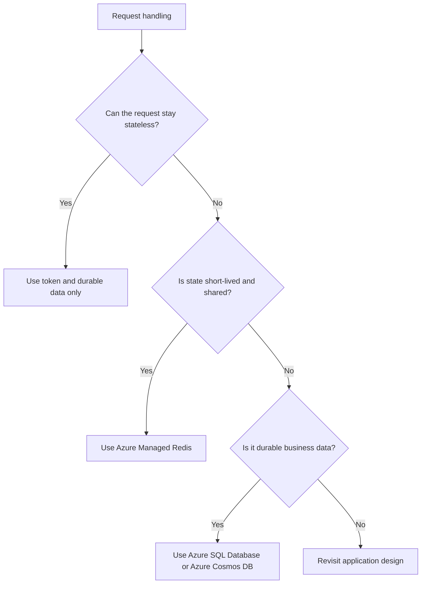

---
content_sources:
  diagrams:
    - id: public-web-api-state-patterns
      type: flowchart
      source: self-generated
      justification: "Summarizes common state and persistence options for internet-facing web applications on Azure."
      based_on:
        - https://learn.microsoft.com/en-us/azure/architecture/guide/technology-choices/data-store-overview
        - https://learn.microsoft.com/en-us/azure/architecture/patterns/cache-aside
---
# Public Web and API Data and State

State design determines whether a public web workload scales cleanly or becomes tied to individual instances, regions, or failure domains. Start by assuming stateless compute and add explicit shared state only when it serves a measurable need. [Documented]

## Database selection

| Workload trait | Preferred store | Why |
|---|---|---|
| Transactional business system with relational queries | Azure SQL Database | Mature relational consistency and operational simplicity. [Documented] |
| Globally distributed API with partition-friendly access model | Azure Cosmos DB | Tunable consistency and low-latency geo-distribution. [Documented] |
| Large unstructured file or blob content | Azure Blob Storage | Durable object storage with lifecycle and access tier controls. [Documented] |

Avoid selecting a data store only because it matches the development team's familiarity. Operational shape, consistency requirements, and cost behavior under load matter more. [Observed]

## Session state management

The best session strategy is often **no server-side session at all**. Stateless tokens and client-held state reduce coupling between requests and instances. [Documented]

When server-side state is required:

- Use **Azure Managed Redis (formerly Azure Cache for Redis)** for short-lived session or token-related state shared across instances. [Documented]
- Treat sticky sessions as a temporary compatibility technique, not a scale strategy. [Observed]
- Keep session data small and disposable; do not turn Azure Managed Redis into a hidden system of record. [Validated]

[Documented] Microsoft has announced the transition from Azure Cache for Redis to Azure Managed Redis. See [Azure Cache for Redis overview](https://learn.microsoft.com/en-us/azure/azure-cache-for-redis/cache-overview).

## File storage patterns

Use object storage for uploads, generated documents, and media rather than storing file binaries in the application runtime or transactional database by default. [Documented]

Architectural implications:

- Upload directly to storage when practical to reduce application tier bandwidth pressure. [Inferred]
- Store file metadata and access control context separately from binary content. [Observed]
- Use CDN or Front Door caching for cacheable public assets; keep private object access behind time-bound authorization patterns. [Documented]

## State decision model

<!-- diagram-id: public-web-api-state-patterns -->

## Cache patterns

- Use cache-aside for hot reads when the backing store becomes the latency bottleneck. [Documented]
- Separate session cache from data cache when eviction and failure tolerance differ. [Inferred]
- Define what happens when the cache is unavailable; many workloads should degrade gracefully rather than fail closed. [Validated]

## Data consistency guidance

Public APIs often mix strongly consistent transactional writes with eventually consistent read models, search indexes, or personalization stores. That is acceptable when the user experience and business semantics are explicit about freshness boundaries. [Correlated]

## Anti-drift review questions

1. Is the primary system of record obvious, or has cache/state sprawl blurred ownership?
2. Can the application scale horizontally without affinity to a specific node?
3. Has globally distributed data been chosen for a real latency or residency need rather than as premature future-proofing?

## Trade-offs to keep visible

- More shared state usually means less scale efficiency. [Observed]
- Distributed databases and caches add capability only when the access pattern actually needs them. [Inferred]
- File handling paths can dominate security and cost even when they are not the main product feature. [Correlated]

## Architecture review checklist

- Is the system of record obvious for each major data domain?
- Can the application scale without sticky sessions?
- Are cache and file patterns justified by measurable user or system behavior?

## Revisit triggers

- Session state starts leaking business data. [Observed]
- Global distribution or document data needs become clearer than the original relational assumptions. [Correlated]
- Blob and media workflows now dominate traffic and require separate architecture treatment. [Inferred]

## Decision takeaway

Good web workload state design keeps compute disposable and makes durable state explicit, minimal, and measurable. [Validated]

## Microsoft Learn references

- [Choose a data store for an application](https://learn.microsoft.com/en-us/azure/architecture/guide/technology-choices/data-store-overview)
- [Cache-Aside pattern](https://learn.microsoft.com/en-us/azure/architecture/patterns/cache-aside)
- [Azure Blob Storage architecture center guidance](https://learn.microsoft.com/en-us/azure/architecture/guide/technology-choices/storage-options)
