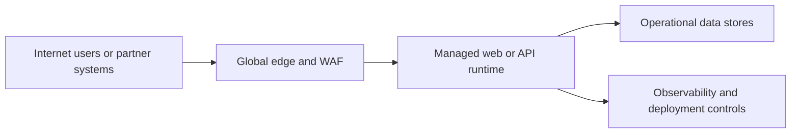

---
content_sources:
  diagrams:
    - id: public-web-api-decision-scope
      type: flowchart
      source: self-generated
      justification: "Summarizes public web and API workload entry conditions from Azure App Service and Azure Front Door guidance."
      based_on:
        - https://learn.microsoft.com/en-us/azure/architecture/web-apps/app-service/architectures/baseline-zone-redundant
        - https://learn.microsoft.com/en-us/azure/frontdoor/front-door-overview
---
# Public Web and API

Use this workload family for internet-facing web applications, mobile application back ends, and partner-facing APIs where public ingress, edge protection, and elastic scaling are first-order concerns. [Documented]

## When to use this workload type

Choose this family when most of the following are true:

- Users or systems connect over the public internet. [Documented]
- HTTP or HTTPS is the dominant interface. [Documented]
- Traffic volume is variable, bursty, or geographically distributed. [Observed]
- The product team wants managed platform services before considering full container orchestration. [Inferred]

Do not start here just because the application has a browser front end. If the workload is employee-only and can remain private, the private internal app baseline is usually a better fit. [Inferred]

## Audience

- Application architects selecting a default Azure runtime. [Documented]
- Platform teams defining reusable blueprints for web applications. [Observed]
- Reviewers assessing edge, identity, and data patterns for customer-facing systems. [Validated]

## Prerequisites

- A clear definition of user identity model: workforce, external customer, or partner federation. [Assumed]
- Expected SLO, peak traffic profile, and regional footprint. [Assumed]
- Data classification and regulatory requirements for public access, retention, and residency. [Validated]

## What this family optimizes for

| Priority | Why it matters |
|---|---|
| Internet edge resilience | Public outages are immediately visible and often business-critical. [Observed] |
| Managed scaling | Web and API demand changes quickly, so runtime elasticity matters. [Documented] |
| Identity integration | Authentication and token validation often shape the request path. [Documented] |
| Fast operability | Deployment slots, health probes, and observability need to be routine, not custom. [Inferred] |

## Common Azure service patterns

- **Edge**: Azure Front Door for global entry, caching, WAF, and split-region routing. [Documented]
- **Compute**: Azure App Service for managed web hosting or Azure Container Apps when container packaging and event-driven scale are important. [Documented]
- **Data**: Azure SQL Database for relational workloads, Azure Cosmos DB for globally distributed or flexible-schema patterns, Azure Managed Redis (formerly Azure Cache for Redis) for state or caching. [Documented]
- **Observability**: Azure Monitor, Application Insights, and Log Analytics for request, dependency, and platform telemetry. [Documented]

<!-- diagram-id: public-web-api-decision-scope -->

## Architectural assumptions

- Stateless request handling is the preferred default. [Documented]
- Session affinity should be an exception, not the primary scaling technique. [Inferred]
- Public ingress must be protected with layered controls rather than relying on application code alone. [Validated]

## Key decisions you will make in this family

1. Front Door only, or Front Door plus regional Application Gateway for additional Layer 7 controls. [Documented]
2. App Service versus Container Apps based on packaging, scaling granularity, and platform maturity needs. [Correlated]
3. Relational versus NoSQL data path, including session and cache placement. [Documented]
4. Active-active versus active-passive regional design. [Inferred]

## Signals that this is the wrong family

- Every user path is private and reachable only from corporate networks. [Documented]
- The dominant interaction model is asynchronous event handling with no stable web front end. [Inferred]
- Many autonomous domain teams need separate runtime stacks, service meshes, and per-service data ownership. [Observed]

## Trade-offs to keep visible

- Managed web services accelerate delivery but do not eliminate edge and abuse management responsibilities. [Observed]
- Global resiliency features add cost and design complexity that should track business need. [Correlated]
- Public identity and session choices have direct scaling consequences. [Correlated]

## Architecture review checklist

- Is the workload truly internet-facing in business terms? [Validated]
- Are traffic variability and identity expectations understood early? [Observed]
- Is there a clear reason to choose web workload patterns over private or event-driven baselines? [Correlated]

## Revisit triggers

- Most access patterns become private or partner-network constrained. [Observed]
- Event processing begins to dominate the architecture over synchronous request handling. [Inferred]
- Platform team requirements now point toward a multi-service platform rather than a single web baseline. [Correlated]

## Decision takeaway

This family fits when public ingress, managed web operations, and predictable API delivery are the primary architecture drivers. [Validated]

## Microsoft Learn references

- [Baseline highly available zone-redundant web application](https://learn.microsoft.com/en-us/azure/architecture/web-apps/app-service/architectures/baseline-zone-redundant)
- [Azure Front Door overview](https://learn.microsoft.com/en-us/azure/frontdoor/front-door-overview)
- [Azure App Service reliability](https://learn.microsoft.com/en-us/azure/reliability/reliability-app-service)
- [Azure Container Apps overview](https://learn.microsoft.com/en-us/azure/container-apps/overview)
- [Choose between Azure Container Apps, AKS, and App Service](https://learn.microsoft.com/en-us/azure/container-apps/compare-options)

## Next reading

- [Baseline architecture](baseline.md)
- [Network, edge, and identity decisions](network-edge-and-identity.md)
- [Data and state decisions](data-and-state.md)
