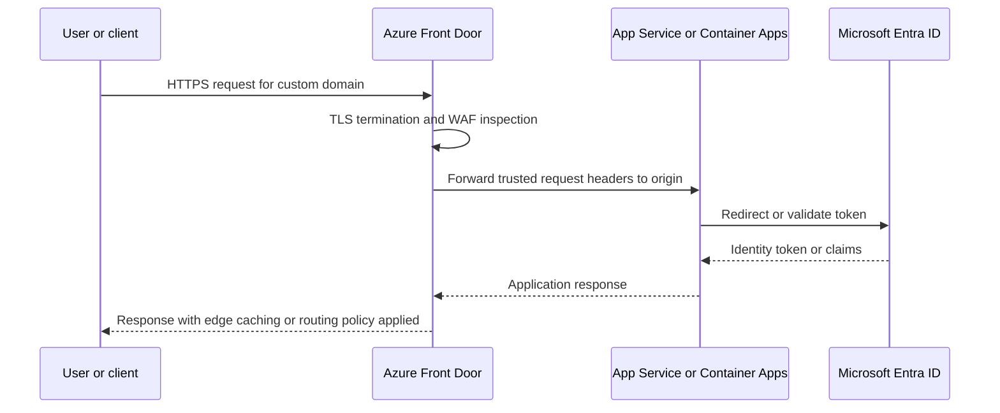

---
content_sources:
  diagrams:
    - id: public-web-api-edge-identity-flow
      type: sequence
      source: self-generated
      justification: "Synthesizes request, TLS, WAF, and identity flow for public web applications using Azure Front Door and Microsoft Entra ID."
      based_on:
        - https://learn.microsoft.com/en-us/azure/frontdoor/front-door-overview
        - https://learn.microsoft.com/en-us/azure/app-service/overview-authentication-authorization
---
# Public Web and API Network, Edge, and Identity

For public workloads, the ingress and identity path is usually the highest-risk part of the system. Design it as a layered architecture, not a collection of independent service settings. [Validated]

## Decision goals

- Reduce public attack surface. [Documented]
- Centralize edge controls such as TLS, WAF inspection, and origin routing. [Documented]
- Keep application code focused on business logic rather than repetitive authentication plumbing. [Observed]

## Edge decision matrix

| Decision | Preferred default | Use an alternative when | Notes |
|---|---|---|---|
| Global public entry | Azure Front Door | Traffic is regional-only and needs regional Layer 7 inspection close to the workload | Front Door adds global resiliency and simplifies custom domains. [Documented] |
| Additional regional reverse proxy | Application Gateway | Need path-specific routing, private backend patterns, or regional isolation controls not handled at edge alone | Layering both can be justified for regulated or segmented architectures, but adds latency and cost. [Correlated] |
| Web application firewall | Front Door WAF | Internal-only web ingress or non-HTTP workloads | WAF policy ownership must be explicit to avoid drift. [Observed] |

## Custom domains and TLS termination

Terminate internet TLS at the edge unless a compliance control explicitly requires end-to-end customer-managed certificate handling deeper in the path. Edge termination enables certificate lifecycle management, HTTP to HTTPS redirection, and standard policy enforcement in one place. [Documented]

Design implications:

- Use a small number of well-governed hostnames rather than many application-specific vanity domains. [Inferred]
- Avoid placing certificate ownership in every application team unless there is a clear separation requirement. [Observed]
- Treat domain validation and renewal operations as platform responsibilities. [Validated]

## Identity pattern

For workforce and many external-facing applications, prefer **Microsoft Entra ID** as the primary identity provider and use **App Service Authentication and Authorization** or equivalent platform-native auth integration where possible. [Documented]

This approach usually improves consistency for token validation, claims propagation, and conditional access integration while reducing custom authentication code. [Observed]

## Easy Auth versus custom auth middleware

| Option | Good fit | Trade-off |
|---|---|---|
| Easy Auth or platform auth integration | Standard OpenID Connect and OAuth flows, minimal custom token handling | Less flexibility for highly customized auth logic. [Documented] |
| Custom middleware | Protocol bridging, unusual claims shaping, or custom federation requirements | More code ownership and more failure modes. [Observed] |

## Reference interaction flow

<!-- diagram-id: public-web-api-edge-identity-flow -->

## Network choices for origins

- Prefer private origin access or restricted origin exposure where the chosen service combination supports it. [Documented]
- Minimize direct public reachability of the application runtime. [Validated]
- Keep health probe paths cheap and authorization-aware so origin health reflects real availability without revealing sensitive routes. [Observed]

## Common design mistakes

- Running WAF in detection mode for long periods without clear promotion criteria. [Observed]
- Mixing customer auth, admin auth, and machine-to-machine auth in one application registration without lifecycle boundaries. [Correlated]
- Treating CORS as a primary security boundary rather than a browser behavior control. [Documented]

## Review questions

1. Can the application tier be reached directly, bypassing edge policy?
2. Is there a single owner for certificate, hostname, and WAF policy lifecycle?
3. Does the chosen identity model support external users, APIs, and service principals without forcing one-size-fits-all token handling?

## Trade-offs to keep visible

- Extra edge layers can improve control while increasing latency, cost, and troubleshooting depth. [Correlated]
- Platform auth reduces custom code but may not fit highly specialized federation scenarios. [Correlated]
- Certificate and hostname operations are platform concerns whether or not the product team notices them. [Observed]

## Architecture review checklist

- Can any client bypass the intended edge control path?
- Is there one clear owner for WAF, certificates, and custom domains?
- Are user, partner, and service identities handled with deliberate boundaries?

## Revisit triggers

- Edge policy exceptions keep growing for application-specific reasons. [Observed]
- Authentication customizations outgrow platform-native capabilities. [Observed]
- Incident review shows origin exposure or trust header assumptions are unsafe. [Validated]

## Decision takeaway

Public edge and identity design should concentrate control at the boundary while keeping application code focused on business behavior. [Validated]

## Microsoft Learn references

- [Azure Front Door overview](https://learn.microsoft.com/en-us/azure/frontdoor/front-door-overview)
- [Authentication and authorization in Azure App Service](https://learn.microsoft.com/en-us/azure/app-service/overview-authentication-authorization)
- [Microsoft Entra architecture guidance](https://learn.microsoft.com/en-us/azure/architecture/guide/multitenant/considerations/identity)
