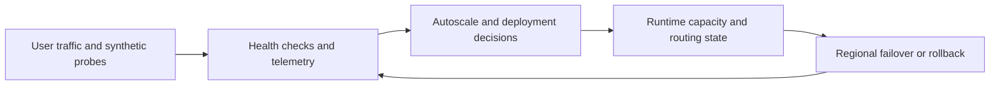

---
content_sources:
  diagrams:
    - id: public-web-api-reliability-loop
      type: flowchart
      source: self-generated
      justification: "Summarizes health, scaling, deployment, and DR feedback loop for public web workloads."
      based_on:
        - https://learn.microsoft.com/en-us/azure/reliability/reliability-app-service
        - https://learn.microsoft.com/en-us/azure/azure-monitor/overview
---
# Public Web and API Operations and Reliability

Public workloads are judged by external availability first, so operations must connect traffic health, deployment safety, and regional recovery into one model. [Validated]

## SLO targets

Target SLOs should match business criticality rather than default to generic “three nines” language.

| Workload criticality | Typical availability target | Operational implication |
|---|---|---|
| Informational or low-impact site | 99.9% | Regional resilience and solid rollback may be enough. [Inferred] |
| Revenue or customer workflow critical | 99.95% to 99.99% | Requires stronger dependency isolation, disciplined release process, and tested failover. [Correlated] |
| Mission-critical public API | 99.99% or higher | Usually demands multi-region design, dependency budgeting, and active resilience testing. [Measured] |

## Health checks and autoscaling

- Use health endpoints that represent application readiness, not just process liveness. [Documented]
- Scale on signals tied to user experience such as request concurrency, CPU saturation, queue depth, or latency trends. [Observed]
- Treat autoscale as a way to absorb demand variability, not as a substitute for capacity planning. [Validated]

## Deployment safety

Deployment slots, staged traffic shifts, and rapid rollback paths are part of the baseline operating model for public web workloads. [Documented]

Good practices:

- Warm new instances before switching traffic. [Observed]
- Separate schema-breaking changes from application rollout when possible. [Correlated]
- Measure error budget impact of release frequency, not only deployment speed. [Measured]

## Disaster recovery strategy

The DR model should align with dependency topology:

- **Single-region with restore** for lower criticality workloads. [Documented]
- **Active-passive multi-region** when recovery time matters more than simultaneous global read locality. [Inferred]
- **Active-active multi-region** only when business benefit justifies conflict handling, cache design, and operational overhead. [Observed]

## Reliability control loop

<!-- diagram-id: public-web-api-reliability-loop -->

## Observability expectations

- Capture request, dependency, exception, and platform metrics in one operational view. [Documented]
- Use synthetic tests from outside the application region to detect internet path failures. [Validated]
- Correlate edge logs with origin telemetry so WAF blocks, latency, and backend saturation can be reviewed together. [Correlated]

## Ownership model

| Area | Primary owner |
|---|---|
| Edge policy and certificates | Platform or shared networking team. [Observed] |
| Application code, release, and API contracts | Product team. [Validated] |
| SLO definition and error budget policy | Joint business and engineering ownership. [Inferred] |

## Failure modes to plan for

- Regional dependency degradation while the app tier appears healthy. [Observed]
- Cache or identity provider latency creating user-visible failures before CPU metrics show stress. [Correlated]
- Safe rollback becoming impossible because database changes were not backward-compatible. [Validated]

## Trade-offs to keep visible

- Higher availability targets usually require stronger dependency governance, not only more instances. [Measured]
- Multi-region readiness adds release and data complexity that should be justified by business continuity needs. [Correlated]
- Synthetic monitoring is useful only when it reflects real user journeys. [Validated]

## Architecture review checklist

- Are health checks tied to readiness rather than simple liveness? [Validated]
- Can deployment rollback happen without database incompatibility? [Observed]
- Do SLOs and error budgets drive release decisions? [Correlated]

## Revisit triggers

- Customer-visible incidents occur without being detected first by telemetry. [Observed]
- Regional dependency issues dominate outage minutes. [Measured]
- Release speed is increasing but rollback confidence is not. [Correlated]

## Decision takeaway

Reliable public workloads combine edge health, safe deployment mechanics, and dependency-aware continuity planning in one operating model. [Validated]

## Microsoft Learn references

- [Azure App Service reliability](https://learn.microsoft.com/en-us/azure/reliability/reliability-app-service)
- [Azure Monitor overview](https://learn.microsoft.com/en-us/azure/azure-monitor/overview)
- [Designing for disaster recovery](https://learn.microsoft.com/en-us/azure/architecture/framework/resiliency/disaster-recovery)
