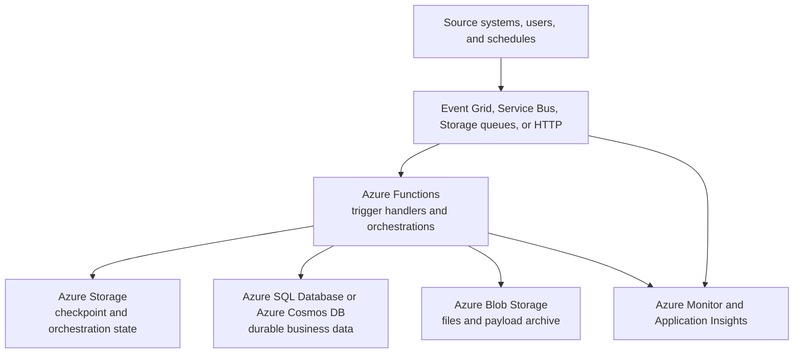

---
content_sources:
  diagrams:
    - id: serverless-processing-baseline-architecture
      type: flowchart
      source: mslearn-adapted
      mslearn_url: https://learn.microsoft.com/en-us/azure/architecture/reference-architectures/serverless/web-app
---
# Serverless Processing Baseline

This baseline fits event-driven workloads that need managed triggers, elastic execution, explicit durable state, and a straightforward path from single-function handlers to orchestrated workflows. [Documented]

## Decision question

What is the default Azure architecture for background processing and event-driven automation when a team wants managed scale without operating a full server fleet?

## Recommended baseline

Use **Azure Functions** as the primary execution runtime, receive work through **Event Grid**, **Service Bus**, **Storage queues**, **Blob events**, or **HTTP triggers**, keep durable state in **Azure Storage**, **Azure SQL Database**, or **Azure Cosmos DB**, and use **Application Insights** with **Azure Monitor** for telemetry and alerts. Introduce **Durable Functions** only when workflow coordination, fan-out, or long-running stateful orchestration is a real requirement. [Documented]

## Canonical reference architecture

<!-- diagram-id: serverless-processing-baseline-architecture -->

## Service composition

| Service | Role | Key trade-off |
|---|---|---|
| Azure Functions | Event-driven compute and orchestration entry point | Fast delivery and broad trigger support, but runtime limits and cold start behavior need design attention. [Documented] |
| Event Grid or Service Bus | Event routing or durable message delivery | Event Grid is simpler fan-out; Service Bus adds richer queue semantics and operational depth. [Documented] |
| Azure Storage | Function app storage, checkpoints, and payload staging | Simple and well-integrated, but not a substitute for full business system state. [Documented] |
| Azure SQL Database or Azure Cosmos DB | Durable application data and processing results | Azure SQL Database favors relational control; Azure Cosmos DB favors partitioned scale and flexible models. [Correlated] |
| Azure Monitor and Application Insights | Telemetry, alerting, and execution diagnostics | Strong visibility, but telemetry cost and signal quality need governance. [Observed] |

## Why this choice

### Managed event execution first

Azure Functions provides a strong default for Azure-native event processing because triggers, bindings, scaling, and diagnostics are already integrated into the platform. That removes substantial boilerplate compared with self-managed workers. [Documented]

### Durable state stays explicit

Background workloads become fragile when queues, blobs, or in-memory variables quietly become the system of record. This baseline keeps workflow mechanics in the runtime and business data in durable stores with deliberate ownership. [Validated]

### Progressive complexity

Teams can start with simple handlers and add Durable Functions, richer messaging semantics, or containerized jobs later without discarding the event-driven shape of the system. [Inferred]

## Quality attribute priorities

| Attribute | Baseline stance |
|---|---|
| Reliability | Prefer buffered triggers, idempotent handlers, and explicit retry control. [Documented] |
| Operations | Use built-in monitoring, distributed tracing, and per-trigger metrics early. [Observed] |
| Cost | Start with consumption-friendly patterns, then move to premium or reserved capacity when latency or network controls require it. [Correlated] |
| Performance | Design for burst handling and backlog drain, not only single-invocation speed. [Inferred] |
| Security | Minimize secrets, prefer managed identity, and keep trigger ingress scoped and intentional. [Validated] |

## Design notes

- Keep handlers idempotent because retries and duplicate delivery are normal. [Validated]
- Separate workflow state from payload archives and from business data. [Observed]
- Use sibling workload guides when user-facing APIs or enterprise platform guardrails become the dominant architecture concern. [Inferred]

## When not to use this baseline

- The workload is primarily an internet-facing web application with persistent interactive sessions. [Documented]
- Processing needs long-running custom processes or container-specific libraries that fit **Container Apps Jobs** better than the default function model. [Correlated]
- The main challenge is enterprise platform governance, shared connectivity, and subscription design rather than the runtime itself. [Observed]

## Cross-workload guidance

- Pair this baseline with [Public Web and API](../public-web-api/index.md) when HTTP-facing applications submit work to background processors. [Correlated]
- Pair it with [Event-Driven Integration](../event-driven-integration/index.md) when the dominant architecture question is broker semantics, replay, and multi-system integration. [Validated]
- Pair it with [Landing Zone and Shared Services](../landing-zone-shared-services/index.md) when policy, networking, and shared observability controls shape the deployment model. [Documented]

## Risks and watchpoints

- Queue or event backlog can hide business delay until SLAs are already missed. [Observed]
- Durable Functions can simplify coordination while increasing storage, replay, and debugging complexity. [Correlated]
- Trigger concurrency can overwhelm downstream systems if backpressure is not deliberate. [Validated]

## Evidence and references

- [Azure Functions overview](https://learn.microsoft.com/en-us/azure/azure-functions/functions-overview)
- [Azure Functions triggers and bindings](https://learn.microsoft.com/en-us/azure/azure-functions/functions-triggers-bindings)
- [Durable Functions overview](https://learn.microsoft.com/en-us/azure/azure-functions/durable/durable-functions-overview)
- [Serverless web application reference architecture](https://learn.microsoft.com/en-us/azure/architecture/reference-architectures/serverless/web-app)

## Next decisions

Continue with [Triggers, state, and storage](triggers-state-and-storage.md) and [Operations and reliability](operations-and-reliability.md) to refine trigger semantics, persistence, and operating controls.
