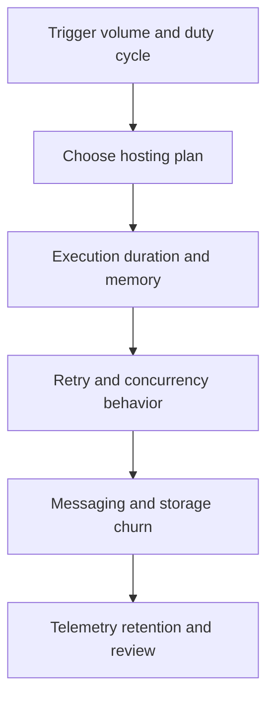

---
content_sources:
  diagrams:
    - id: serverless-processing-cost-pressure-points
      type: flowchart
      source: mslearn-adapted
      mslearn_url: https://learn.microsoft.com/en-us/azure/azure-functions/functions-scale
---
# Serverless Processing Cost and Anti-Patterns

Serverless cost control depends on understanding execution shape, retry behavior, storage churn, and whether the selected hosting model actually matches workload predictability. [Validated]

## Hosting plan trade-offs

| Plan | Best fit | Cost strength | Main risk |
|---|---|---|---|
| Consumption | Bursty, intermittent, or low-duty-cycle workloads | Pay-per-execution aligns well with idle-heavy demand. [Documented] | Cold starts and uncontrolled retry volume can erase expected savings. [Correlated] |
| Flex Consumption or Premium-style reserved capacity | Variable workloads that still need better network control or startup behavior | Reduces latency variance and supports stronger runtime controls. [Documented] | Idle capacity can become permanent overhead. [Observed] |
| Dedicated or always-on hosting | Steady throughput or shared app plan strategy | Predictable baseline spend for consistent demand. [Inferred] | Often overpays for genuinely intermittent processing. [Correlated] |

## Main cost drivers

| Area | Typical driver | Review signal |
|---|---|---|
| Executions | High invocation count, long duration, and memory allocation | Are retries or chatty triggers inflating work volume? |
| Messaging and storage | Queue transactions, blob operations, checkpoint churn, and payload archive growth | Is storage activity tracking business value or accidental workflow noise? |
| Premium capacity | Always-ready instances and reserved workers | Is low-latency demand steady enough to justify reserved capacity? |
| Observability | High-cardinality telemetry and long retention | Is collected telemetry actively used for operations? |

## Cost optimization guidance

- Match the hosting plan to real invocation shape, not to a generic preference for “serverless.” [Validated]
- Keep payloads small in hot paths and move large content to Blob Storage with references. [Observed]
- Review retry policies because wasteful retries increase execution, messaging, and dependency cost at the same time. [Correlated]
- Use Premium or reserved capacity only when latency, VNet integration, or sustained load justifies it. [Documented]

## Common anti-patterns

### Assuming consumption is automatically cheapest

Consumption plans look efficient until high-frequency invocations, long durations, or retry storms create a larger bill than predictable reserved capacity would have. Measure workload shape before standardizing. [Correlated]

### Building synchronous APIs on top of idle serverless paths

Using cold-start-prone paths for user-critical synchronous requests can force teams into expensive workarounds later. If low-latency HTTP is non-negotiable, plan for premium capacity early. [Observed]

### Treating retries as free resilience

Retries consume execution time, queue transactions, storage operations, and downstream capacity. Poor retry governance is both a reliability and cost anti-pattern. [Validated]

### Using one function app for unrelated workloads

Mixing unrelated triggers and scaling behaviors into one deployment unit can blur ownership, inflate blast radius, and make cost attribution difficult. [Observed]

### Turning Durable Functions into an all-purpose workflow engine

Durable Functions is powerful, but unnecessary orchestration histories, frequent checkpoints, and overly chatty activities can create avoidable storage and execution cost. [Correlated]

## Cost review flow

<!-- diagram-id: serverless-processing-cost-pressure-points -->

## What good looks like

- The chosen hosting plan is tied to measured latency, concurrency, and idle-time behavior. [Validated]
- Retry volume is monitored as both an operational and a financial signal. [Validated]
- Storage, messaging, and telemetry spend are reviewed together with execution cost. [Correlated]

## Trade-offs to keep visible

- Lower idle cost often means higher startup variance. [Documented]
- Premium capacity can improve user experience and operability while reducing serverless cost efficiency for intermittent workloads. [Correlated]
- Fine-grained functions help isolation, but too many tiny steps can increase orchestration and observability overhead. [Observed]

## Architecture review checklist

- Does the selected hosting plan match the real duty cycle and latency target?
- Are retries, checkpoints, and payload storage creating hidden cost multipliers?
- Can the team attribute spend by workflow or business capability?

## Revisit triggers

- Execution spend rises faster than useful throughput. [Correlated]
- Premium capacity remains idle most of the time. [Observed]
- Consumption-hosted HTTP workloads keep adding latency workarounds. [Observed]

## Decision takeaway

Serverless cost discipline comes from aligning plan choice, retry behavior, and state design with real workload shape rather than assuming pay-per-use will optimize itself. [Validated]

## Microsoft Learn references

- [Azure Functions scale and hosting](https://learn.microsoft.com/en-us/azure/azure-functions/functions-scale)
- [Azure Functions overview](https://learn.microsoft.com/en-us/azure/azure-functions/functions-overview)
- [Azure Well-Architected Framework cost optimization](https://learn.microsoft.com/en-us/azure/well-architected/cost-optimization/)
