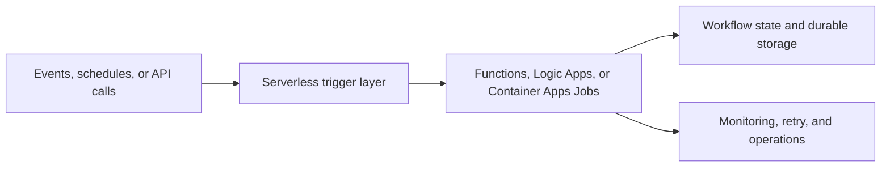

---
content_sources:
  diagrams:
    - id: serverless-processing-scope
      type: flowchart
      source: mslearn-adapted
      mslearn_url: https://learn.microsoft.com/en-us/azure/architecture/reference-architectures/serverless/web-app
---
# Serverless Processing

Use this workload family when business value comes from event-driven execution, short-lived orchestration, or background automation that should scale with incoming demand rather than run as a permanently allocated application tier. [Documented]

## When to use this workload type

Choose this family when most of the following are true:

- Work arrives through events, timers, queues, or API-triggered jobs instead of a steady interactive session model. [Documented]
- Demand is bursty, intermittent, or hard to forecast, so elastic execution is more valuable than fixed server capacity. [Observed]
- The team prefers managed triggers, bindings, and workflow primitives over building custom polling and scheduler infrastructure. [Inferred]
- Processing can tolerate platform-managed scale behavior and service-specific execution boundaries. [Validated]

Do not start here only because “serverless” sounds cheaper. Stable, latency-sensitive, long-running workloads often fit other baselines better. [Correlated]

## Audience

- Architects selecting an Azure runtime for event-driven processing. [Documented]
- Integration and automation teams designing background workflows. [Observed]
- Reviewers assessing scaling, state, and reliability trade-offs in serverless systems. [Validated]

## Prerequisites

- A clear understanding of trigger sources, backlog tolerance, and completion expectations. [Assumed]
- Agreement on whether workflow state is ephemeral, durable, or externally managed. [Validated]
- Defined observability and retry ownership for failed executions. [Observed]

## What this family optimizes for

| Priority | Why it matters |
|---|---|
| Elastic execution | Scale can track queue depth, events, or scheduled bursts. [Documented] |
| Managed integration | Triggers, bindings, and workflow steps reduce undifferentiated plumbing work. [Observed] |
| Fast automation delivery | Teams can ship handlers and orchestrations without operating full servers. [Inferred] |
| Cost alignment | Consumption-based execution can fit intermittent demand well when idle time dominates. [Correlated] |

## Common Azure service patterns

- **Azure Functions** for code-first event handlers, API-triggered jobs, queue consumers, and Durable Functions orchestrations. [Documented]
- **Azure Logic Apps** for connector-heavy workflows, SaaS integration, and declarative business process automation. [Documented]
- **Azure Container Apps Jobs** for container-packaged tasks, batch jobs, and event-driven work that needs custom runtimes or longer process control. [Documented]
- **Storage, Service Bus, Event Grid, and Cosmos DB or Azure SQL Database** for trigger delivery, workflow state, and durable outputs. [Documented]

<!-- diagram-id: serverless-processing-scope -->

## Azure runtime comparison

| Service | Best fit | Strength | Main limitation |
|---|---|---|---|
| Azure Functions | Code-centric event processing and orchestrations | Broad trigger model and tight Azure integration. [Documented] | Cold start and execution model boundaries require planning. [Observed] |
| Azure Logic Apps | Connector-driven workflows and low-code integration | Fast delivery for business workflows and SaaS connectivity. [Documented] | Complex custom logic can become harder to test and version. [Observed] |
| Azure Container Apps Jobs | Containerized batch or event-triggered jobs | Full container packaging and runtime control. [Documented] | More operational surface than functions-first approaches. [Correlated] |

## Architectural assumptions

- Processing should be idempotent because retries and duplicate delivery are normal design conditions. [Validated]
- State should be explicit and externalized unless an orchestration framework owns it deliberately. [Documented]
- Trigger sources and downstream dependencies will often fail independently, so buffering matters. [Observed]

## Key decisions you will make in this family

1. Azure Functions versus Logic Apps versus Container Apps Jobs based on code ownership, connectors, and runtime control. [Documented]
2. Queue, event, schedule, or HTTP trigger patterns based on delivery guarantees and workload shape. [Documented]
3. Durable Functions, external state stores, or stateless handlers based on workflow complexity. [Correlated]
4. Consumption versus premium or dedicated hosting based on latency, throughput, and network needs. [Documented]

## Signals that this is the wrong family

- A continuously running service with strong affinity to in-memory state is the real requirement. [Observed]
- End-to-end latency must stay highly predictable under every request, including from idle state. [Correlated]
- The main architecture problem is user-facing web delivery rather than background processing. [Inferred]

## Trade-offs to keep visible

- Less infrastructure management often means more dependence on platform execution semantics. [Observed]
- Consumption billing is attractive only when invocation patterns, memory use, and retries stay aligned with expectations. [Correlated]
- Workflow simplicity matters; serverless can amplify poor event and state design very quickly. [Validated]

## Architecture review checklist

- Is the trigger model aligned with the real business completion expectation?
- Is state externalized or deliberately managed by an orchestration framework?
- Are idempotency and retry behavior explicit for every important execution path?

## Revisit triggers

- Execution duration, startup latency, or packaging needs are pushing beyond the selected runtime model. [Observed]
- Workflow complexity is growing faster than the current state management approach can support. [Correlated]
- Steady traffic now justifies reserved capacity or a different workload family. [Inferred]

## Decision takeaway

This family fits when event-driven execution, managed scaling, and explicit workflow state matter more than owning long-lived servers or a permanent application tier. [Validated]

## Microsoft Learn references

- [Azure Functions overview](https://learn.microsoft.com/en-us/azure/azure-functions/functions-overview)
- [Logic Apps overview](https://learn.microsoft.com/en-us/azure/logic-apps/logic-apps-overview)
- [Azure Functions scale and hosting](https://learn.microsoft.com/en-us/azure/azure-functions/functions-scale)
- [Serverless web application reference architecture](https://learn.microsoft.com/en-us/azure/architecture/reference-architectures/serverless/web-app)

## Next reading

- [Baseline architecture](baseline.md)
- [Triggers, state, and storage](triggers-state-and-storage.md)
- [Operations and reliability](operations-and-reliability.md)
