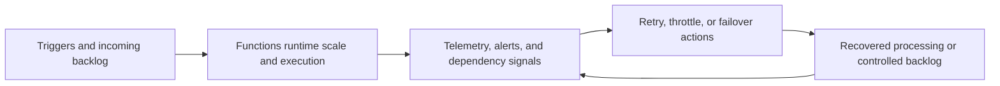

---
content_sources:
  diagrams:
    - id: serverless-processing-reliability-loop
      type: flowchart
      source: mslearn-adapted
      mslearn_url: https://learn.microsoft.com/en-us/azure/azure-functions/functions-scale
---
# Serverless Processing Operations and Reliability

Reliable serverless operations depend less on keeping hosts alive and more on controlling backlog, startup latency, retries, downstream protection, and recovery paths. [Validated]

## Cold start and execution readiness

Cold start is not a myth and not always a crisis. It matters most for latency-sensitive HTTP paths, infrequent workloads, and burst patterns that arrive after idle periods. [Observed]

- Consumption-oriented hosting can introduce startup delay after idle time. [Documented]
- Premium hosting or always-ready capacity can reduce latency variance when response-time objectives require it. [Documented]
- Queue and event triggers often tolerate cold starts better than synchronous request paths, but backlog drain still needs measurement. [Correlated]

## Scaling guidance

| Concern | Primary control | Watchpoint |
|---|---|---|
| Event bursts | Trigger-driven scale-out | Downstream systems can become the real bottleneck. [Observed] |
| Queue backlog | Concurrency and worker scaling | Fast scale-out without backpressure can amplify failure. [Validated] |
| HTTP latency | Premium or pre-warmed capacity | Cost rises quickly if idle headroom becomes permanent. [Correlated] |
| Long-running workflows | Durable checkpoints and partitioned work | Orchestration history and storage dependencies must stay healthy. [Observed] |

## Monitoring expectations

- Capture invocation count, duration, failures, retries, and dependency latency in Application Insights. [Documented]
- Alert on backlog age and dead-letter growth, not only raw message count. [Validated]
- Correlate trigger metrics with downstream service saturation to avoid blaming the runtime for dependency failures. [Correlated]

## Retry and failure policy

Retry behavior must be intentional per trigger and per dependency. Blind retries can turn a transient problem into a wider outage. [Validated]

Good practice:

- Keep handlers idempotent so retried work is safe. [Validated]
- Prefer queue- or broker-backed redelivery for transient faults instead of hand-rolled sleep loops. [Documented]
- Route poison messages or terminal failures to dead-letter or quarantine paths with ownership. [Documented]
- Use circuit breaker or backpressure patterns when downstream dependencies are degraded. [Correlated]

## Disaster recovery strategy

The right DR pattern depends on whether the workload is stateless execution around durable brokers or stateful orchestration with external stores.

- **Single-region with restore** fits lower-criticality automation and scheduled work. [Inferred]
- **Active-passive regional recovery** fits important queue-driven systems where broker, storage, and application settings can be re-established with tested runbooks. [Correlated]
- **Active-active designs** require careful duplication control, event routing, and state partitioning, so they should be justified by business need. [Observed]

## Reliability control loop

<!-- diagram-id: serverless-processing-reliability-loop -->

## Operational ownership model

| Area | Primary owner |
|---|---|
| Trigger contracts and business completion semantics | Product or integration team. [Validated] |
| Runtime configuration, telemetry baselines, and alert policies | Platform and application teams jointly. [Observed] |
| Dead-letter review and replay decisions | Named operational owner with business context. [Validated] |

## Failure modes to plan for

- Silent backlog growth while invocation success rate looks healthy. [Observed]
- Retry storms caused by downstream throttling or authorization failures. [Correlated]
- Orchestration progress blocked by storage account or state store issues rather than compute limits. [Validated]

## Trade-offs to keep visible

- Faster startup often costs more because it requires reserved or pre-warmed capacity. [Documented]
- Aggressive concurrency improves throughput only when dependencies can absorb it. [Observed]
- DR for event-driven systems is as much about replay and duplicate control as about regional failover. [Correlated]

## Architecture review checklist

- Are alerts tied to backlog age, dead-letter volume, and dependency health?
- Is retry behavior safe for duplicates and downstream protection?
- Has regional recovery been tested with realistic trigger and state conditions?

## Revisit triggers

- Cold start or throughput variance is consuming too much of the latency budget. [Observed]
- Most incidents come from downstream protection failures rather than compute exhaustion. [Correlated]
- Recovery drills reveal unclear ownership for replay, dead-letter, or regional failover. [Validated]

## Decision takeaway

Serverless reliability comes from disciplined backlog management, idempotent execution, and dependency-aware recovery, not from assuming the platform will hide every failure mode. [Validated]

## Microsoft Learn references

- [Azure Functions scale and hosting](https://learn.microsoft.com/en-us/azure/azure-functions/functions-scale)
- [Azure Monitor overview](https://learn.microsoft.com/en-us/azure/azure-monitor/overview)
- [Durable Functions overview](https://learn.microsoft.com/en-us/azure/azure-functions/durable/durable-functions-overview)
