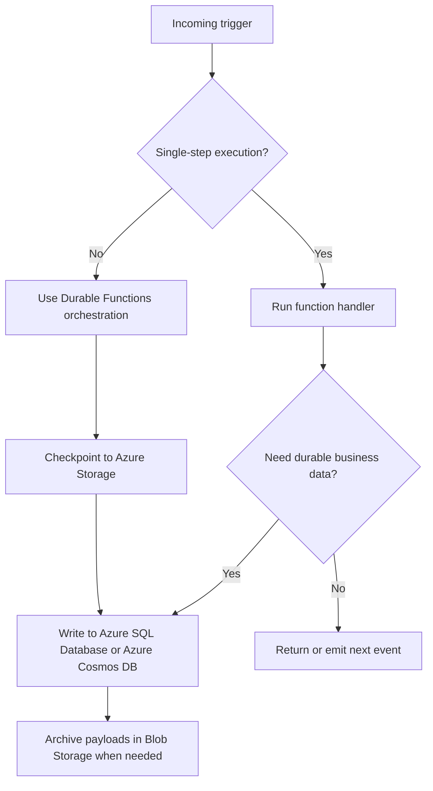

---
content_sources:
  diagrams:
    - id: serverless-processing-state-flow
      type: flowchart
      source: mslearn-adapted
      mslearn_url: https://learn.microsoft.com/en-us/azure/azure-functions/durable/durable-functions-overview
---
# Serverless Processing Triggers, State, and Storage

Trigger choice defines delivery semantics, while state design determines whether the workload can recover, replay, and scale without hidden coupling. Treat both as first-order architecture decisions. [Validated]

## Trigger selection guidance

| Trigger type | Good fit | Main design concern |
|---|---|---|
| HTTP trigger | Synchronous start, webhook intake, or control-plane actions | Caller latency expectations and idempotent retries. [Documented] |
| Queue trigger | Buffered background work and load leveling | Poison handling, backlog visibility, and duplicate delivery. [Documented] |
| Event trigger | Fan-out from source system events and reactive automation | Subscription filtering and event contract ownership. [Documented] |
| Timer trigger | Scheduled maintenance, reconciliation, and periodic jobs | Preventing overlapping runs and ensuring missed schedule recovery. [Observed] |
| Blob trigger | File arrival processing and ingestion pipelines | Large payload handling and partial file lifecycle concerns. [Correlated] |

## Trigger design principles

- Prefer durable brokers or queues when downstream processing can lag behind ingress. [Documented]
- Use HTTP only when the caller truly needs a direct response or immediate acknowledgement path. [Inferred]
- Make replay and dead-letter handling explicit before production adoption. [Validated]

## Durable Functions guidance

Durable Functions is the right fit when the workload needs orchestrated retries, fan-out and fan-in, human interaction checkpoints, or long-running coordination that should survive restarts. [Documented]

Use it carefully:

- Keep orchestrator logic deterministic. [Documented]
- Put side effects in activity functions, not in orchestrators. [Documented]
- Model orchestration state growth and history replay overhead early. [Observed]

Durable Functions is usually unnecessary for simple single-step handlers, short stateless transformations, or workflows that are better expressed through connector-driven logic in Logic Apps. [Correlated]

## State management options

| State need | Preferred pattern | Reason |
|---|---|---|
| Short-lived workflow coordination | Durable Functions with Azure Storage-backed state | Built for checkpoints and resumable orchestration. [Documented] |
| Durable business records | Azure SQL Database | Strong relational control and transactional semantics. [Documented] |
| High-scale partitioned document or event result state | Azure Cosmos DB | Flexible model and scale-aligned partitioning. [Documented] |
| Large payloads, files, or replay archive | Azure Blob Storage | Durable object storage with lifecycle controls. [Documented] |
| Ephemeral deduplication or small coordination data | Cache or short-lived storage pattern with strict TTL | Avoids overloading primary data stores, but must not become the system of record. [Observed] |

## Storage choice guidance

Azure Functions depends on storage for several runtime capabilities, but teams should not confuse platform storage requirements with application data design. Keep these boundaries explicit. [Validated]

- Use **Azure Storage** for checkpoints, leases, payload staging, and blob-backed workflows. [Documented]
- Use **Azure SQL Database** when relational queries, transactions, and operational reporting matter. [Documented]
- Use **Azure Cosmos DB** when partitioned scale, flexible schema, or global distribution is the real need. [Documented]
- Use **Blob Storage** for large payloads and immutable archives instead of passing oversized messages through every trigger path. [Observed]

## Reference state flow

<!-- diagram-id: serverless-processing-state-flow -->

## Common state mistakes

- Treating queue messages or blobs as the only record of business completion. [Observed]
- Storing large payloads directly in messages when blob references would be safer and cheaper. [Correlated]
- Using Durable Functions for every workflow, including trivial one-step processing. [Observed]

## Trade-offs to keep visible

- Buffered triggers improve resilience while adding completion delay and operational backlog management. [Validated]
- Durable orchestration improves recovery but can make debugging and state inspection more complex. [Correlated]
- Flexible storage choices help scale, but only when access patterns and partitioning are deliberate. [Inferred]

## Architecture review checklist

- Does each trigger choice match the required delivery semantics?
- Is the system of record obvious for every workflow outcome?
- Can large payloads be handled without bloating the hot execution path?

## Revisit triggers

- Workflows are accumulating manual recovery steps because state boundaries are unclear. [Observed]
- Queue growth or replay frequency is exposing weak deduplication design. [Correlated]
- Durable history size or orchestration complexity is growing faster than expected. [Observed]

## Decision takeaway

Good serverless designs separate trigger semantics, orchestration mechanics, and durable business data so each can scale and recover on its own terms. [Validated]

## Microsoft Learn references

- [Azure Functions triggers and bindings](https://learn.microsoft.com/en-us/azure/azure-functions/functions-triggers-bindings)
- [Durable Functions overview](https://learn.microsoft.com/en-us/azure/azure-functions/durable/durable-functions-overview)
- [Choose a data store for an application](https://learn.microsoft.com/en-us/azure/architecture/guide/technology-choices/data-store-overview)
